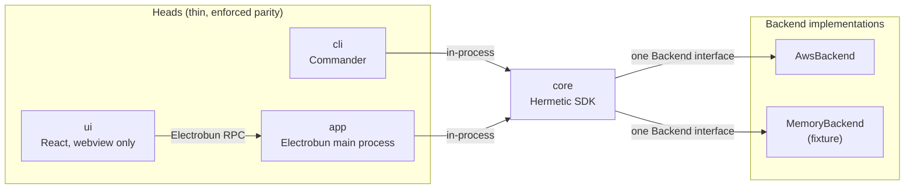

# Architecture

The runtime picture behind `docs/design.md`. Section references below (§n) point there. Per-file detail is deliberately absent: the directory tree and `graft skeleton <file>` answer "what is in this file"; this document answers "where does the work happen".

## Three heads over one core

`cli` and `app` both import `core` in-process and call the same `Hermetic` instance methods; there is no daemon between them. `ui` never imports `core` — it is the page the app loads from a `views://` URL, and it talks to the main process over Electrobun RPC typed by the one shared contract, `HermeticRPC` (`packages/app/src/rpc/schema.ts`), so a field renamed in a core schema fails the UI's typecheck rather than its runtime. There is no socket, no port and no HTTP between the two. `agentd` is not a head over this core at all: it imports only `@hermetic/core/schema` and runs its own loop on the instance (see below).

## Where to start reading, per package

**core** (`packages/core/src/`). The root holds the SDK's entry points: `open.ts` (`openHermetic`/`openForInit`, fleet and directory-region resolution; every head starts here), `hermetic.ts` (assembles the SDK; ~570 lines of wiring), `context.ts` (`CoreContext` — the one object every long operation takes: backend, clock, actor, guards, TTL locks, the §4.3 `transition()`, event and render helpers — built once from `agents/agent-runtime.ts`), `surface.ts` (the parity declaration: `PUBLIC_METHODS`, `STREAMING_METHODS`, the two schema tables — a contract kept apart from the code it constrains), `hermetic-deps.ts` (the public `HermeticDeps` contract) and `reads.ts` (list/get/history/config reads). Everything else is grouped by concern; each long operation is a module taking `{ ctx, ...its own few deps }`:

- `agents/` — lifecycle (`lifecycle.ts` + `lifecycle/` create, recreate, adopt-volume, release, recorded-instance), destroy, power, update, rollback, rollout, attach, handoff, archive, logs, desktop, probe, `agent-set.ts` (`agents.set`), `plans.ts` + `plan-apply.ts`, `state.ts` (the §4.3 machine).
- `fleet/` — fleets, selection and locks, `init.ts` + `init-*.ts` (create/attach branches, freeze, directory, narrated CFN wait, release step), `foundation/` (status, plan, update, change-set, release, rollout) + `foundation-migrations.ts`, network, policy, doctor, teardown, preflight, skew, legacy params, tailnet devices, hujson.
- `release/` — `artifacts.ts` + `artifacts-release.ts`/`artifacts-manifest.ts` (where this build's release comes from; the fleet manifest and its lock), the Hermes and browser mirrors, git, tar; `build-versions.ts` at the root says what this build ships (`hermeticd`, `hermes_ref`, `chrome_ref`).
- `render/` — `render.ts` fanning out to `render-hermes.ts`, `render-system.ts`, `render-units.ts`, `render-browser.ts`, plus cloud-init and create defaults; `schema/hermes.ts` (`splitHermesSettings`) decides which Hermes settings are managed on every apply versus seeded once.
- `profiles/` — `provider-profiles.ts` (the §8.3 CRUD), `profile-binding.ts` (agent → profile rules), `profile-apply.ts` (staged binding → SSM), `profile-migrate.ts`, secrets, settings, model catalog, Bedrock grants. `volumes/` — volumes and claims.
- `chat/` — the chat surface (`chat.ts` + `chat-*.ts`: send, observe wiring, redaction, fence, gate, transport), `observe-pool.ts` (the refcounted one-subscription-many-readers policy the app's `chat-owner.ts` drives), notifications, bot mode, listening; `chat/hermes/` is the adapter (see below).
- `local/db/` — the laptop-side SQLite store (config, runs, pending ops, chat, notifications, migrations), plus `local/profiles.ts` (AWS profile discovery) and `local/recovery.ts` (interrupted ops handed back at boot).
- `schema/` — Zod schemas, the single source of types. `shared/` — the browser-safe subset (naming, providers, targets, box constants, error codes) that `schema/` builds on and that `ui` and `agentd` import through `@hermetic/core/shared`; nothing reachable from it may need node, bun, zod or AWS (`test/shared-browser-safe.test.ts`).
- `backend/` — the `Backend` port contract, `MemoryBackend` and its port modules, and `backend/fixture/` (seeded fleets, the canned chat swarm, staging controls, `fixtureOptionsFromEnv`). `aws/` — the real adapters.

The chat stack (§9.2) has two layers. `chat/hermes/hermes-chat.ts` is the Hermes adapter's facade over `chat/hermes/hermes-chat-*.ts` — connect, roster, sessions, history, one turn, resume, the request-socket pool, the observe socket, the JSON-RPC transport, wire/blocks/activity mapping — and nothing above it knows Hermes's payload shapes. Above it, `chat.ts` is the surface, with `chat-send.ts` (one streamed turn), `chat-transport.ts` (the adapter as wired), `chat-gate.ts` (the delta gate between adapter frames and the caller), `chat-seal.ts`/`chat-redact.ts` (the one door every transcript byte leaves core through), `chat-observe.ts` + `chat-observe-wiring.ts` (watching a conversation for activity nothing here produced), `chat-fence.ts` (the leased in-flight turn fence across local processes). `bot-mode.ts` + `hermes-canonical.ts` are profile-scoped Bot Mode on the same adapter. The fixture side mirrors this: `backend/memory.ts` composes `memory-store.ts`/`memory-compute.ts`/`memory-foundation.ts`/`memory-simulation.ts`, seeded by `memory-fixture.ts`; `backend/fixture-chat*.ts`, `fixture-bot-mode.ts`, `fixture-controls.ts` fake the swarm and its fixture-only control surface.

**app** (`packages/app/src/`). The Electrobun main process, built as a Hutch project (`packages/app/hutch.config.ts`, `electrobun.config.ts`, `hooks/pre-build.ts`). `main/` is the desktop shell: `index.ts` (launch, single instance, wiring), `windows.ts`, `menu.ts` (including **Install Command Line Tool…**, `cli-install.ts`), `paths.ts`, `log.ts`, `close-guard.ts` (quitting with an op in flight is denied natively and prompts), `updates.ts` (the release-feed check at launch and every six hours), `notify.ts` (the `app.notify` bridge — the web `Notification` API is dead in the webview) and `dev-probe.ts`. `rpc/` is the seam: `schema.ts` holds `HermeticRPC`, `bind.ts` binds it to the webview, `registry.ts` exposes `RPC_DECLARATIONS` and `MACHINERY_RPC` for the parity test and the UI. `declare.ts` records each request as its handler is built (`declareRpc`, `declareMachineryRpc`). Handlers live one file per noun in `handlers/` (agents, lifecycle, plans, fleet, providers, secrets, chat, bot-mode, ops, meta, init, app, fixture, plus `streams.ts` for the long-lived pushes), each built from `handlers/shared.ts` — `teardownBlocked` and the validation wrappers every handler uses — over the `HandlerContext` in `handlers/ctx.ts`; `handlers/dispatch.ts` routes a request name to its handler. `state.ts` and `ops.ts` are described below; `chat-owner.ts`/`chat-stream.ts` hold the main-process-owned chat observations and multiplex them onto one subscription; `target.ts` binds a request to the fleet the operator meant (`withTarget`/`requireTarget`, over the `{account_id, region, fleet_id}` envelope on the request's params); `resume.ts` restarts interrupted ops at launch; `shutdown.ts` is what the close guard drives; `log.ts` is the file log `AGENTS.md` describes under "Watching a running app" (`~/.hermetic/app.log`, `app-fixture.log` in fixture mode).

**cli** (`packages/cli/src/`). `program.ts` is the Commander tree; `declare.ts` records each command for the parity test. Commands live one file per noun in `commands/` (`agent`, `chat`, `fleet` for fleet-wide reads and `teardown`, `fleets` for `fleet ls/use/alias`, `plan` for plan-then-apply, `foundation`, `providers`, `secrets`, `volume`, and the rest). `confirm.ts` holds the typed-account-id and plan-confirmation prompts; `exit-codes.ts`/`help.ts` back `hermetic help exit-codes` and the `ErrorCode → exit code` mapping.

**agentd** (`packages/agentd/src/`). `main.ts` → `cli.ts` (subcommand parsing, the one-shot commands) → `daemon.ts` (`hermeticd serve`: the three resident loops). `bootstrap.ts` + `stages.ts` run first boot; `apply/` is `hermeticd apply` (`index.ts` composes `apt`, `hermes`, `accounts`, `node-web`, `secrets`); `update/` is the nightly self-update (`install`, `state`, `swap`); `heartbeat.ts`, `rpc.ts`, `converge.ts`, `request-gate.ts` and `install-lock.ts` are covered under "agentd's loop". `host.ts` is the `Host` seam that `test/fake-host.ts` doubles.

**ui** (`packages/ui/src/`). The app's page — `packages/ui/index.html`, loaded from a `views://` URL, with its fonts vendored in `packages/ui/fonts/` so nothing is fetched at render time. `api/` is the typed door to the main process (`transport.ts` is the seam, `transport-rpc.ts` the Electrobun RPC implementation of it, `client.ts` the per-method calls over it, `streams.ts` the readers for the open/close subscription pairs, `fleet.ts`/`chat.ts` the per-area calls). Rules live in pure, DOM-free modules — `volume-logic.ts`, `loading.ts`, `chat-logic.ts`, `chat-turns.ts`, `notification-logic.ts`, `settings-logic.ts`, `provider-logic.ts`, `selectors.ts`, `create-form.ts`, `destroy-plan.ts` — and rendering in `components/` (`agent/`, `chat/`, `settings/`, `notify/`, plus the fleet board, drawers, `InitWizard`, `TeardownDrawer` and the `Loading` vocabulary). `loading.ts` is the rule that an empty list is never rendered as "nothing there" until a read has actually come back.

## The `Backend` interface

Everything core can do to the outside world is one interface (`packages/core/src/backend/types.ts`), grouped to mirror §4.1's stores plus the two things that are neither a store nor CloudFormation:

- `identity` — STS/IAM/Organizations reads (caller identity, account alias, org id)
- `store` — `agents` (conditional-write DynamoDB table), `events` (append-only), `fleet` (the `_fleet` singleton row)
- `secrets` — SSM slot lifecycle (`ensureSlot`/`put`/`exists`/`isPlaceholder`/`list`/`deleteByPrefix`)
- `artifacts` — S3 (`putObject`/`exists`/`getText`/`deleteByPrefix`/`emptyBucket`/`presign`)
- `compute` — EC2 (volumes, instances, the security-group inbound check, AMI resolution, `listManagedInstances`)
- `foundation` — CloudFormation (`describeStack`/`createStack`/`deleteStack`)
- `tailscale` — auth key minting, device listing
- `rpc` — the hermeticd `logs`/`health` RPC over Tailscale
- `clock` — `now()`, for testable time

Core never imports an AWS SDK client outside `packages/core/src/aws/` — every side effect goes through this interface first. Two implementations exist: `AwsBackend` (`packages/core/src/aws/`, real calls) and `MemoryBackend` (`packages/core/src/backend/memory.ts` and its `memory-*.ts` ports, in-memory, used by `--fixture`/`HERMETIC_FIXTURE=1` and by every unit test). The same lifecycle code — `agents.create`, `agents.rerun`, `doctor`, all of it — runs unmodified against either.

## Ops registry and streams

Long operations (`STREAMING_METHODS` in `packages/core/src/surface.ts`: `init`, `teardown`, `apply`, `upgrade`, `agents.create/destroy/recreate/stop/start`, and their kin) return `AsyncIterable<OpEvent>` from core. `agents.rerun` is not among them — it just writes a `command` onto the agent's row and returns. The handlers for these don't stream from the request itself — they start a background op in `OpRegistry` (`packages/app/src/ops.ts`) and answer `{ op_id }` immediately. The page reads progress by opening a subscription (`ops.subscribe`, closed with `ops.unsubscribe`; `packages/app/src/handlers/streams.ts` names each one and tags its pushes), which can be reattached to at any time — closing the window does not kill a create, and reopening the agent's drawer re-subscribes to the same op's history. `fleet.subscribe` is the separate feed for `FleetPoller` (`packages/app/src/poller.ts`): it scans DynamoDB on an interval into an in-memory snapshot and emits `snapshot`/`agent`/`removed`/`poll` events — polling is fine at this scale, so there is no DynamoDB Streams push. Chat turn deltas and observed-conversation events are the same shape again (`chat.turn`, `chat.subscribe`), so every stream in the product is an open/close pair of RPC requests and a tagged push.

## App state machine

The app has to work on a laptop that has never run `init` — that's what the in-app wizard is for. `AppState` (`openState` in `packages/app/src/state.ts`) is the launch-level state machine every handler reads from per request, never something captured once at startup, so a captured reference can't keep answering `NOT_INITIALIZED` forever. Its states:

1. **initialized** — `openHermetic()` succeeded; every request works normally.
2. **uninitialized** — `openHermetic()` answered `NOT_INITIALIZED`; the app holds a pre-init `InitSession` (`openForInit()` in `packages/core/src/open.ts`) instead. Its `hermetic` instance refuses every method except `init.listProfiles`, `init.resolveIdentity`, and `init` itself — a `notInitializedBackend()` (all methods throw `NOT_INITIALIZED`) stands in for the real backend so nothing can accidentally reach AWS or freeze a config before the operator has chosen a profile.
3. **uninitialized against fixture** — same shape, but `openForInit({ fixture: true })` returns an in-memory session with three fake profiles (`FIXTURE_PROFILES`) and no real foundation, so the wizard's create-a-new-foundation branch can be developed and demoed with no AWS account (`bun run dev:wizard`).

Transitions:

- **uninitialized → initialized**: the `init` request runs core's `init` op (single-flight: `beginInit()` in `init-op.ts` claims a sentinel op id synchronously, before the first `await`, so two concurrent calls can't both start). On success `AppState.adopt()` calls the session's `reopen()`, swaps the live `Hermetic` instance in place, and starts the poller. If `adopt()` throws, the app stays uninitialized but records `adoptError`, which `meta.get` and the `init.*` requests surface as a `CONFLICT` rather than silently re-offering a wizard that would refreeze a fleet that already exists.
- **initialized → uninitialized**: a successful teardown with `reset_local: true` calls `AppState.resetToUninitialized()` — stops the poller, drops the live instance, records `lastTeardown`, and opens a fresh pre-init session, so the app is back to exactly the state a laptop that never ran `init` would be in.
- **sideways**: `switchFleet(name)` reuses `adopt()`'s own swap — reopen core against the new fleet, replace the live instance, rekey the poller — since switching to a fleet this home already has frozen is the same "get a fresh instance live" operation. It is refused with `CONFLICT` while any op is in flight: swapping the instance a request is mid-flight against would strand that request on neither fleet.

Two guards keep the transitions from racing each other or themselves: `initBlocked` (`packages/app/src/handlers/init.ts`) rejects the `init.*` requests with `ALREADY_INITIALIZED` (or the `adoptError` conflict) once initialized; `teardownBlocked` (`packages/app/src/handlers/shared.ts`) rejects essentially every mutating request, teardown included, with `CONFLICT — teardown in progress` for as long as `state.teardownOpId` is set — held via `finally` until `resetToUninitialized` itself finishes, closing the window where a request could otherwise land on a deleted-foundation instance.

## The account guard

Every AWS SDK v3 client core constructs goes through `aws.client()` (`packages/core/src/aws/client.ts`), never directly. The factory wraps `send` so that every call first awaits `assertAccount()`, which compares the frozen `config.account_id` against a cached STS result (re-verified periodically, not once at boot) — a process running against the wrong credentials fails closed on its very first AWS call with `ACCOUNT_MISMATCH`, before it can mutate anything. A client built any other way (e.g. inside `dynamo.ts`'s or `s3.ts`'s lower-level helpers) is checked for a guard symbol (`ACCOUNT_GUARD`) and throws `INTERNAL` immediately if it's missing — there is no path to an unguarded client reaching `send`. `FLEET_MISMATCH` is the sibling check: the foundation stack's own tag is compared against `config.fleet_id`, catching the case where STS agrees on the account but the stack is a different fleet than the one this home froze (e.g. two fleets in one account).

The fleet directory (`aws/directory.ts`, §4.8 of design.md) is a second factory under the same guard, not an exception to it: `createAwsBackend` builds a second `makeClientFactory` scoped to the directory region rather than the fleet's own region, but it is still `aws.client()` underneath, so a directory read or write is still checked against the frozen `account_id` before it can touch `hermetic-directory`. The directory region and the fleet's own region are independent — a fleet in `us-west-2` still registers into the directory's `us-east-1` table by default — so this second factory is keyed on region alone, not on any per-fleet state.

## Foundation update, archive, and the tailnet policy

`foundation/` (`createFoundation` in `index.ts`) is `foundation.status`/`plan.foundation`/`foundation.update` — the §6.6 change-set update to the one-time `hermetic` CloudFormation stack, one file per step (`status`, `plan`, `change-set`, `update`, `release`, `rollout`). Before an update is applied, `archive.ts` takes the §6.6 recovery archive: one previous version, kept both remotely (a bucket prefix) and locally (`$HERMETIC_HOME/archive/`), so a bad update has something to roll back to. `foundation-migrations.ts` holds `FOUNDATION_MIGRATIONS` — ordered, idempotent steps keyed by `FOUNDATION_VERSION` (`packages/core/src/version.ts`) — for the cases where the update needs to move state, not just the template. `init.ts` (`createInit`) is `init` itself, its branches and steps in `init-*.ts`.

Alongside the foundation, `policy.ts` is `policy.status`/`plan.policy`/the `apply` case for kind `policy`: the hermetic-managed entries in the tailnet's ACL file — `tagOwners` (only when the operator doesn't already own the tag), an `ssh` rule, and `acls` — written through the Tailscale API with ETag/If-Match after an `/acl/validate` call. `hujson.ts` is the HuJSON-preserving editor behind it: everything between `// hermetic:managed begin/end` markers is hermetic's, every other byte round-trips unchanged. `policy-scope.ts` (`probePolicyScope`) is the one place that decides `none`/`read`/`write` for the OAuth client's `policy_file` scope, used by both `policy.ts` and the §4.7 preflight. `init` writes the policy last (`--skip-policy` to opt out); `teardown` removes it.

## Preflight

`preflight.ts` runs the §4.7 Tailscale checks that `init --create` gates on: the local daemon via `tailscale status --json`, and the OAuth client via a mint-and-revoke round trip — no AWS calls. Rule 6 under "Rules for core" in `AGENTS.md` covers why this defaults to the real probes rather than an absent dependency silently disabling the gate.

## Volumes and rollback

`volumes.ts` is the §9.1 volume surface (`volumes.list`/`get`/`delete`) — the EC2×DynamoDB join that decides which data volume has no agent reading it, and the refusals that keep `agent create --volume` from guessing wrong. `rollback.ts` (`rollbackCreate`) is the opt-in `--rollback-on-failure` unwind for a failed `create`: only what that failed run itself created, unwound in reverse, each step caught separately — never a volume or instance merely found by tag — and the row is kept if any unwind step itself fails, rather than papering over a partial rollback as a clean one.

## doctor

`runDoctor()` (`packages/core/src/fleet/doctor.ts`) is a pure read that reconciles the sources that can silently disagree; `hermetic.ts`'s own `doctor()` method is a thin wrapper over it. Its report covers the account/fleet guard status, env-var overrides, unparseable local rows, per-agent heartbeat freshness, and two drift sections: `instance_drift` (`instance_missing`/`orphan_instance`/`instance_mismatch`/`instance_unrecorded`/`instance_duplicate`, comparing the DynamoDB `agents` scan against EC2's `hermetic:managed=true` view — `instance_unrecorded` is a row that never captured the id of an instance already tagged for it, the shape a create leaves behind when it dies between `RunInstances` and the row update; `instance_duplicate` is a *second* live instance wearing an active agent's tag, billed and on the tailnet with no row naming it, which `agent recreate` sweeps) and `tailscale` (comparing the same scan against the tailnet's device list; `available: false` when the Tailscale API call itself is degraded, reported informationally rather than folded into drift).

## The create sequence (§6.2)

`lifecycle/create-agent.ts`, driven by `lifecycle.ts`:

1. Validate the name (`agents.create`, the only place names are validated). Conditional `PutItem` on the `agents` store with `status = creating` — fails if the name exists. → **DynamoDB agents table**
2. Create the SSM slot `/hermes/<fleet_id>/<name>/ts-key` with a placeholder value. → **SSM**
3. Mint a Tailscale auth key (tagged, single-use, one-hour expiry, pre-authorized, `--ssh` capable) and push it into that slot. → **Tailscale API, then SSM**
4. Only if `secrets_mode: bitwarden`: create `/hermes/<fleet_id>/<name>/bws-token` and push a machine-account token. → **SSM** (unimplemented today, see status doc)
5. Render `manifest.json` plus final config files (no templates), tar it, upload to `s3://<bucket>/config/<name>/<hash>.tgz`, record `config_hash` on the row. → **S3, then DynamoDB**
6. `CreateVolume` for the data volume (default 100 GiB gp3), tagged. → **EC2/EBS**
7. Mint a one-hour presigned URL for `artifacts/<version>/hermeticd`; `RunInstances` with the pinned AMI, public subnet, shared instance profile, `agent=<name>` tag, and user-data carrying only the name, the bucket, the presigned `hermeticd_url`, and its `hermeticd_sha256` (one `userDataFor` helper builds this for both create and recreate — the parameter path prefix and table names are gone, the box reads them from the fleet manifest instead). Launch and attach are two steps, not one: the instance id is written onto the agent row between them, because `AttachVolume` can fail after `RunInstances` has already spent the money and an id that only lived in the EC2 response would be invisible to every later resume. The attach itself (`core/attach.ts`) then waits without a deadline for the instance to reach `running` and for the volume to come free, renewing the agent's TTL lock as it polls — a fresh instance taking two minutes to boot is not a failed create. An op interrupted mid-wait is recorded in the local `pending_ops` table and restarted by the app at its next launch (`packages/app/src/resume.ts`). `agents.recreate` (`lifecycle/recreate-agent.ts`) runs this same sequence against the existing volume, clearing the row's `bootstrap` and `command` first (a new instance gets a fresh bootstrap, not a resumed one) and setting `hermeticd_version` from the fleet manifest's current pointer. → **EC2**
8. Release the lock. The instance takes over reporting from here via its own heartbeat.

Steps 2–7 are idempotent on retry; the conditional put in step 1 is what makes re-running `create` on the same name safe.

## agentd's loop

`hermeticd` (`packages/agentd/`) is a separate Bun-compiled binary, `linux-arm64` always, sharing only `@hermetic/core/schema` with the rest of the tool (never core's AWS/command layers — `tests/boundaries.test.ts` enforces this). On the instance:

1. **Bootstrap** (`stages.ts` + `bootstrap.ts`; installed as a oneshot systemd unit by `hermeticd bootstrap --install`, run from cloud-init, executed by `hermeticd-bootstrap.service`): fetch the fleet manifest (`fleet.ts`, fetched from the bucket named in user-data first and only falling back to the `/var/lib/hermeticd/fleet.json` cache — treating a corrupt cache as absent — if that fetch fails; also home to `agentParamPrefix`/`paramPath` SSM helpers), fetch and verify the ordered bash stages for the pinned release (pruning any file or completion marker left over from a prior release), then run them in order — Tailscale up, data volume, config fetch, apply, service enable, verify (design.md §6.3). A failure at any point — fetching the fleet manifest, downloading or verifying a stage, or an actual stage script — moves the row to `error` the same way; the runner stays resident polling its own row for an `agent rerun` command (refusing it with `CONFLICT` if a prior rerun is unacknowledged, or `LOCKED` if another operator holds the lock) and resumes from the failed stage on receipt, carrying the old failure message forward on the row until the stage runs again.
2. **Apply primitives** (`apply/`, invoked by the `04-apply.sh` stage): four idempotent operations — `packages` (`apply/apt.ts`, `apply/hermes.ts`; Hermes fetched from the fleet bucket's mirrored bundle when the manifest names one for the pinned `hermes_ref`, else a direct GitHub clone, `hermes-source.ts`/design.md §3.6, §6.4), `files` (write only if hash differs), `units` (`daemon-reload`, restart only what changed — plus `hermes-gateway.service` on the apply that installed it, since upstream's installer wrote and enabled that one; `apply-pending.ts` writes the restart obligations down before incurring them), `commands` (short idempotent post-steps). `apply/secrets.ts` materialises the env file the manifest describes, unconditionally, so a provider switch clears the previous provider's line. No templating on the box; core renders final files on the laptop. On a `browser: true` agent, `packages` is followed by a Chrome unpack step — `browser-source.ts` extracts the fleet manifest's mirrored, digest-verified Chrome for Testing build to `/opt/hermetic/chrome/<chrome_ref>/` — before `units` brings up the five browser-stack template units (design.md §7.3).
3. **Heartbeat** (`heartbeat.ts`), every 30s: writes `last_heartbeat`, `health{hermes,tailscale,disk}` and `metrics{cpu_pct,mem_pct,disk_pct,root_disk_pct?}` to the agent's own row, deriving `degraded`/recovery. Two filesystems are sampled — `/data` and `/` — and the one `disk` check fails on either, since a full root disk stops the self-update (§6.4) as surely as a full `/data` stops the agent's memory. The `hermes` check's own liveness probe hits Hermes's real `GET /api/health` and reads `gateway_state.json` for `exit_reason` (design.md §6.4). The heartbeat already reads the row every 30s, so the row-borne requests a `ready` box acts on — §6.5's converge (`converge.ts`, "apply the configuration your row names, now") and §6.6's `update_request` (`update-request.ts`) — are noticed there and handed to their loop through `request-gate.ts`; `install-lock.ts` is the one on-box lock those loops share.
4. **Nightly update** (`update/`, replaces the old converge + self-upgrade loops), at a minute in the 03:00–03:59 UTC window derived from a hash of the agent's own name (so the fleet doesn't all hit S3 in the same minute): re-reads the fleet manifest the same way bootstrap does (bucket first, `fleet.json` cache only as a fallback on a failed fetch, corrupt cache treated as absent) and compares the sha256 of the installed binary against `hermeticd.files.hermeticd.sha256` — the trigger is the digest, not the version label. A mismatch downloads and verifies the new binary first (`update/install.ts`), then the stages, then restarts `hermeticd.service` last (`update/swap.ts` is the boot-time swap protocol that checks what the last swap left behind; `update/state.ts` is the updater's records between processes); a stage-only change does not restart. `update --check` reports without writing anything, including the `fleet.json` cache. `serve`'s start-up update check is skipped while `hermeticd-bootstrap.service` is still active, so bootstrap and update never race to install stages at once. A rollout request wakes this loop immediately rather than waiting for the box's own window.
5. **RPC over Tailscale** (`rpc.ts`): listens on the Tailscale interface for `logs` and `health` requests, authenticating each caller with `tailscale whois` on the peer address — the tailnet ACL is the authorization layer for these RPCs, same as for SSH. There is no `converge` RPC; converge arrives on the row, like everything else.

`hermeticd` can write only its own row (`LeadingKeys` = its own tag) and read only its own S3 prefix and SSM path — it has no view of the fleet and cannot affect another agent. `disk.ts` (data-volume prepare), `tailscale.ts` (`tailscaleIpv4`) and `account-dirs.ts` (every directory created under `/data/hermes`, and the drop-privileges rule for them) round out the loop above.

## Data flow of a secret

Mint → SSM → instance → tmpfs, never anywhere else:

1. A Tailscale auth key (or a Bitwarden machine-account token) is minted by core during `create` or `secrets push`.
2. It is written to an SSM Parameter Store slot (`SecureString`) that hermetic owns the existence of, never logging or persisting the value itself.
3. The instance role reads the slot at boot (bootstrap) or on demand (`hermeticd secrets materialise`).
4. Runtime secrets are materialized into a tmpfs `EnvironmentFile`, mode 600, consumed only by the process that needs them.

**Never:** in git, in a tfvars file, in user-data (which carries only the parameter *path*, never a value — user-data is world-readable on the box), in an AMI, in hermetic's local SQLite file, on `/data` (the persistent, snapshotted volume), or in any captured command output (a leak-grep test asserts this for every fixture secret value).
