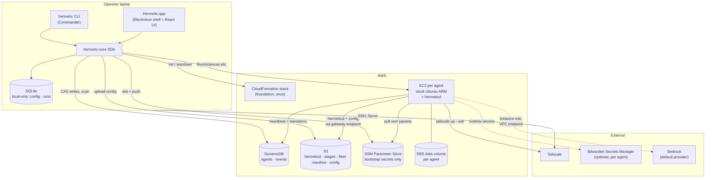

# hermetic — Design Document

**Status:** living specification, authoritative for behaviour.

hermetic manages a fleet of Hermes agents on AWS. The name is the promise: every agent is sealed — no public ports, all access over Tailscale, every secret behind an IAM boundary — and the tooling should make the sealed path the easy path.

---

## 1. Principles

**Sealed inbound, open outbound.** No inbound ports, ever — Tailscale is the only way in, and it is required. Agents have outbound internet for search and browser tools — from their own public IP in the default `public` mode, or through fck-nat in `nat` mode (§5); inbound is closed by a security group with zero inbound rules and by nftables on the box, never by the subnet. hermetic's own code is never published to a package manager: `hermeticd` and per-agent config come only from the fleet's S3 bucket. Standard packages (Ubuntu, Docker, Tailscale, Hermes) install from their public sources over that same egress path.

**Instances are disposable, volumes are precious.** Anything the agent has learned lives on a separate EBS volume that outlives the instance. Rebuilding a box is a routine operation.

**Zero-secret minimal path.** Bedrock through the instance role means a working agent needs only AWS credentials and a Tailscale OAuth client. Bitwarden is opt-in per agent.

**If it isn't in core, it doesn't exist.** All logic lives in one SDK. The CLI and the GUI are thin heads with enforced parity. Nothing is CLI-only or GUI-only. The box runs `hermeticd`, built from the same repo and validating the same schemas — one language end to end.

**Imperative operations, declarative foundation.** The one-time AWS foundation is a CloudFormation stack. Everything per-agent is an SDK call recorded in DynamoDB. No general-purpose IaC engine.

**Light.** Two small binaries plus one app — `hermetic`, the Hermetic desktop app, and, on the box, `hermeticd` (§3.6). DynamoDB and S3 are the only cloud state and are read directly; SQLite holds only what this laptop knows. No Packer, no Terraform, no daemon required for the CLI.

**One home, one account, frozen.** `init` binds a hermetic home directory to a single AWS account and profile, verified against STS, and every subsequent call re-verifies before touching AWS. Deploying or destroying in the wrong account is a build error, not a bad afternoon.

---

## 2. System overview



---

## 3. Software architecture

### 3.1 Packages

Bun workspaces monorepo. The workspace boundaries are the architecture — they make "just add it to the CLI" a build error.

```
packages/
  core/     the SDK — all logic, all AWS, all SQLite, all DynamoDB
  cli/      Commander head, imports core in-process
  app/      Electrobun head — the desktop shell's main process, imports core, answers RPC, loads ui
  ui/       React, runs in the app's webview, talks only to the app over RPC
  agentd/   hermeticd — the node agent, imports core's schemas, compiled for linux-arm64
```

`ui` cannot import `core` (it runs in a webview and couldn't anyway). `cli` cannot import `app`, and `app` cannot import `cli`. `agentd` imports only core's schema package, never its AWS-client or command layers — it must not be able to reach fleet-level operations.

The rule is one table — the `From \ May import` matrix under "Layout" in `AGENTS.md`, which also describes how `tests/boundaries.test.ts` resolves every specifier (including `import type` and escaping paths) to a cell, and asserts the matrix has no exceptions left in it — no package source may import an HTML document, because the page reaches the app through Electrobun's view bundle rather than a module specifier; the test is the truth where the two disagree.

The CLI needs no daemon — it uses core in-process. The desktop app is simply another process using the same core, launched from the Dock rather than by the CLI. Two processes on one laptop are two players in the multiplayer model and need nothing special.

### 3.2 Rules for core

These keep core head-agnostic. Each is easy to break under time pressure. Rules 1 and 4 are gated mechanically (`scripts/lint.ts`, `tests/parity.test.ts`); rules 2 and 3 are held by review and by each operation's own tests.

1. **Core never talks to a human.** No `console.log`, no `process.exit`, no prompts. It returns typed results and typed errors with codes. The CLI maps codes to exit statuses; the app maps them to typed RPC failures.
2. **Long operations yield events.** `agents.create()` returns an async event stream: `{ phase, progress, message }`. The CLI renders a spinner, the app forwards each event over the RPC bridge, the UI draws a progress bar — one source, three renderings. Every long operation accepts an `AbortSignal`.
3. **Plan, then apply.** Core never asks "are you sure." It exposes `plan.destroy(name)` returning what would happen, and `apply(plan)`. Heads confirm. Dry-run is free.
4. **Parity is testable.** Every public core method has exactly one CLI command and one RPC handler. `tests/parity.test.ts` asserts this and fails the build on drift.

### 3.3 Types flow from one place

Request and response shapes are Zod schemas in core. Every RPC handler validates against them. One TypeScript type, `HermeticRPC` (`packages/app/src/rpc/schema.ts`), names every request and its answer, and both sides are declared against it with no codegen: the page's transport (`packages/ui/src/api/transport-rpc.ts`) and the app's handler table are the same type, so `rpc.request("agents.get", …)` resolves to the same `Agent` type core uses. Change a field in core and the UI fails to typecheck.

### 3.4 Heads

**CLI (Commander).** Chosen for ubiquity: stable API, and orders of magnitude more prior art for an agent writing the code. Commander parses flags as strings, so each command validates its parsed options against the same Zod schema core uses for the corresponding method (§3.3) before calling it — that closes the typed-flag gap without a framework, and keeps the CLI unable to pass core anything the app's handler couldn't. oclif was rejected (plugin architecture solves a problem hermetic doesn't have). Interactive confirmations via `@clack/prompts`. Shelling out to `tailscale` and `bws` via `Bun.$`.

**App (Electrobun).** The desktop shell's main process: thin handlers over core, one per request name, wired up by `bind` and answered through `dispatch` (`packages/app/src/handlers/`). Owns the polling loop: scan DynamoDB once a minute (`POLL_INTERVAL_MS`, `packages/app/src/poller.ts`) into an in-memory snapshot, emit change events. It opens no socket and listens on no port — the page reaches it over Electrobun's RPC channel and nothing else can. Single operator per app — see §4.4 for why.

A stream is an RPC open/close pair rather than a connection: the page asks to watch an op, the handler pushes each frame as it arrives, and closing the subscription is what ends it. Every frame carries `<generation>:<sequence>`, and a page resubscribing sends the last one back as its cursor. The sequence is a cursor into one attempt; the generation says which attempt. They are separate because a resumed operation keeps its op id — that is what lets a view reattach to the run it was watching — while its events are numbered from zero again, so the cursor a view held across the restart is ahead of everything the new attempt will ever send. A cursor from another generation is obsolete: the attempt is replayed whole rather than skipped past. And the terminal frame is never withheld for a cursor at all. A stream ends exactly once, the client is waiting for that frame in order to stop waiting, and a sequence number is not reason enough to leave a finished operation looking like a running one.

**UI (React).** The app's page, loaded from a `views://` URL out of the bundle rather than fetched over the network. It talks only to the main process, over the typed RPC bridge. `packages/ui/index.html` links `./entry-app.css` explicitly, because the view bundler emits a stylesheet beside `index.js` and injects nothing; fonts are vendored under `packages/ui/fonts/` and CSS `url()` fonts are inlined as base64, so the page pulls nothing from a CDN. First-class: everything the CLI can do, the UI can do, including an embedded view of each agent's noVNC desktop over Tailscale Serve — a separate sandboxed `<electrobun-webview>` with no RPC bridge, held by its own navigation rules to the box's origin, never an `<iframe>` in the app's own webview, whose navigation is held to `views://main/*` — while the Hermes dashboard opens in the operator's browser.

### 3.5 Dev loop

`bun run dev` starts the desktop app against the real backend; `dev:fixture` and `dev:wizard` start it against the in-memory fixture, the second forcing the init wizard. All three run `hutch run dev …` in `packages/app` through `scripts/dev-app.ts`, which also ends the session when the app is quit, so there is one launcher and no second way to start a head.

Hutch is pinned by `.hutch-version` (0.26.0, Electrobun 2.0.1, Cottontail 0.6.0). `bun run app:prepare` (`hutch electrobun prepare`) materialises the toolchain into `packages/app/.hutch/devkit`, and `scripts/typecheck.ts` refuses to run without it rather than typechecking against a shape it cannot see. A dev run rebuilds the view bundle and restarts the app on a source change; the page is inspected with Safari's Web Inspector, which attaches to the webview directly.

`HERMETIC_DEV_SCRIPT` drives a dev-only probe (`packages/app/src/main/dev-probe.ts`): a script the main process runs against the live app, so a flow can be exercised without a person clicking it. It exists only in a dev run.

There is no stale-asset hazard to guard against — the bundle is rebuilt whole and the app restarts with it, so no module's top-level code is re-run inside a process that still holds the previous one's pollers.

### 3.6 Packaging

There are two things to ship and they are built by different tools. `bun build --compile --target=bun` produces the `hermetic` CLI, cross-compiled for Linux and macOS, arm64 and x64. Hutch builds the desktop app: `bun run app:build` (`app:build:stable`, with `app:build:canary` for verifying an update before it is published) emits `macos-arm64-Hermetic.dmg`, `stable-macos-arm64-Hermetic.app.tar.zst` and `stable-macos-arm64-update.json` into `packages/app/artifacts/`, plus a `stable-macos-arm64-<prevhash>.patch` once there is a previous release to diff against.

The app carries its sidecars. `scripts/app-stage.ts` stages the `hermetic` CLI, `hermeticd`, both of `hermeticd`'s stamps and the `stages/` directory into `Hermetic.app/Contents/Resources/app/bin/`, so an installed app is a complete install by the rule below and needs nothing beside it. The CLI reaches `PATH` through the app's **Install Command Line Tool…** menu item, which writes a shim at `/usr/local/bin/hermetic`; there is no shell installer to pipe into. The two are still launched independently — the CLI has no subcommand that opens the app and does not exec it — so stopping one is not a question about the other's process tree.

Distribution is GitHub Releases on `esopian/hermetic` (<https://github.com/esopian/hermetic/releases/latest>); `.github/workflows/release.yml` fires on a `v*` tag and builds on `macos-14`. The app checks for an update at launch and every six hours (skipped while an op is running) by reading the release's `update.json`, and never downloads or applies one itself: Electrobun's updater verifies a release by TLS alone (its manifest `hash` is a cache key, not a digest or signature), so a newer version is a footer notice and a dialog that opens the release page, and the operator installs the DMG by hand. In-place updates return only with signed releases — a minisign signature per artifact, verified against a key compiled into the app before anything is applied. The check is unauthenticated, so it only finds a release while the repository is public. Builds are unsigned for now, so a first launch needs `xattr -dr com.apple.quarantine /Applications/Hermetic.app`; setting `ELECTROBUN_DEVELOPER_ID`, `ELECTROBUN_APPLEID`, `ELECTROBUN_APPLEIDPASS` and `ELECTROBUN_TEAMID` turns signing and notarisation on with no configuration change. The release *procedure* — what to tag, in what order — is "Cutting a release" in `CONTRIBUTING.md`.

**Every distributed target directory is a complete install.** `dist/<target>/` holds `hermetic`, the `stages/` directory, and `hermeticd` with both of its stamps (`hermeticd.version`, `hermeticd.build`) beside it — the same linux-arm64 agent binary in each, compiled once and copied, since it runs on the box and never on the laptop. The reason is the lookup order below: `resolveHermeticd` and `locateStages` check an explicit environment variable, then the directory beside the running executable, then a *source checkout*. A target directory missing the agent or its stages is therefore not a smaller install but a broken one that works on exactly one machine — the one that built it, where the checkout fallback covers for it — and fails everywhere it is actually unpacked, with `HERMETICD_UNAVAILABLE` from a `hermetic` that otherwise runs fine. `scripts/build.ts` ships all three things into every target directory for that reason, and `copyAgentd`/`copyStages` refuse a missing file rather than warning (`tests/build-stamp.test.ts`, `tests/build-stages.test.ts`); `packages/core/test/artifacts.test.ts` resolves a release out of an unpacked bundle with no checkout reachable, which is the operator's case rather than the build machine's.

`hermeticd` is built the same way with `--target=bun-linux-arm64`, its version compiled in via `bun build --define process.env.HERMETIC_VERSION=<version>`. That version is `BUILD_VERSIONS.hermeticd` — the **release** this build of hermetic ships — and deliberately *not* the laptop package's own version, which is what both heads are stamped with and what `HERMETIC_VERSION` means everywhere else. The two are separate because they answer different questions and move on different schedules: the release version is what the laptop writes into the fleet manifest and what every box compares itself against, while the tool version is `0.0.0-dev` on any source checkout — and `compareVersions` orders a pre-release below everything, so stamping a box with the tool's version would make `init --attach`'s "never repoint the fleet backwards" gate refuse every dev checkout against a fleet a release build had pushed. `scripts/agentd-build.ts` owns the one argv that stamps it, so the compile and the `hermeticd.version` sidecar beside it cannot disagree (`tests/build-stamp.test.ts`); they did, and a `hermeticd` built by `bun run build` reported a version no manifest ever named, which read as every agent in the fleet being permanently out of date. There is still no *second* agentd literal — `packages/agentd/src/version.ts` reads the one constant the define wrote — and whatever `hermeticd` reports as its version (heartbeat, `agent get`) comes straight out of it. What that label cannot express is *which bytes* a box is running, since a release can change the binary without anyone editing `BUILD_VERSIONS.hermeticd`; the box therefore also reports `running_hermeticd_sha256`, the digest of the binary its process was launched from, and that is what §6.6's rollout confirms against — never the label, which is a constant compared with itself. It is never published to GitHub releases or any package registry: `hermetic init` and `hermetic upgrade --hermeticd` push a **release**, and a release is an immutable *generation* addressed by its own content. `releaseGeneration` digests every file's name and sha256 into a 16-hex-digit id, and every object of the push goes to `s3://<bucket>/artifacts/<version>/<generation>/stages/NN-<name>.sh` and `s3://<bucket>/artifacts/<version>/<generation>/hermeticd`, with instances fetching both from there through the S3 gateway endpoint. The version alone cannot address a release: a version label is a constant a build shares with every other build that did not edit it, so two pushes of `0.5.0` used to write the same keys and the second overwrote the first in place. Because the old binary was then already present before the push began, its presence proved nothing about the stages beside it — an interrupted republish left new stages paired with an old binary under exactly the keys the live manifest, and any bootstrap URL already presigned from it, still named. A generation cannot be reached by a push with different content, and a push with identical content is genuinely idempotent: a `release.json` that already describes exactly this generation and file set is left where it is, and the provenance the fleet manifest then records for the release — `build`, `build_number`, `commit`, `capabilities` — is read back out of that marker rather than taken from the push making it, so `release.json` and `manifest.json` never disagree about which commit the bytes the fleet is running were built from. A republish is not a claim on bytes it did not create. Only a field the marker does not carry falls back to the pushing checkout's answer, since an older marker recording none of this would otherwise turn a known provenance into a blank. Within a generation the ordering still holds — every stage first, the binary next — and a `release.json` naming the generation's files is written **last**, after every uploaded key has been confirmed present in the bucket. That marker, and nothing else, is what makes a generation a release: `describeRelease` (the path `upgrade --hermeticd <ver>` takes to point a fleet at a release some other laptop pushed) considers only generations that carry one, newest `created_at` first, so an interrupted push leaves an unreferenced directory of bytes that nothing can be pointed at. Flat `artifacts/<version>/…` keys written before generations existed are still read, by that same fallback and by every manifest already in a bucket, since nothing rebuilds a key that a manifest records. A box still running a pre-generation `hermeticd` does rebuild one, though, so the first push of a generation into an existing fleet is a fleet the running boxes cannot update themselves into: each rebuilds the flat key, finds the release it was already on, and refuses on `CHECKSUM_MISMATCH` rather than installing bytes the manifest does not name. That is the safe half of the tradeoff and it is deliberate — the alternative is a mutable key, which is the defect. The remedy is `hermetic agent recreate`, which launches a box from the presigned URL core mints for the key the manifest actually records; `hermetic agent rerun` is not a remedy, since it re-runs stages under the hermeticd the box is already running. A release push always ends by writing the root `s3://<bucket>/manifest.json` (the fleet manifest, schema `FleetManifest`) last: it names the release version and generation, lists every pushed file with its **key**, sha256 and size, and records the fleet's own AWS resource names (bucket, tables, VPC, IAM). Every consumer fetches the objects that manifest records and no others — the presigned bootstrap URL, `hermeticd`'s stage install, its nightly binary swap — rather than rebuilding a key from the version label; a recorded key that is not an object of the release the manifest names is refused rather than fetched, with `MANIFEST_REFUSED`. The scope is the release, not merely `artifacts/`: `artifacts/<version>/<generation>/` for a manifest that records a generation, and `artifacts/<version>/` for one written before generations existed. A manifest that claims one version or one generation while naming another's objects is describing two releases at once, and the honest answer to which one the fleet is on is neither. The refusal is made on **both** sides of the document. `hermeticd` makes it before it fetches (`releaseObjectKey`), and core makes it in `readFleetManifest` — the one function every core caller reaches the manifest through — because the manifest's keys are instructions on the laptop too: `create` presigns `files["hermeticd"].key` into a booting instance's user-data as a one-hour bearer credential. The box and the fleet role can also read `config/*` and `hermes/*` in the same bucket, and a manifest must not be able to point either at them: a config tarball fetched under the name of a binary about to be executed is another agent's rendered secrets. The manifest's own `hermes` block is deliberately exempt, since `hermes/<ref>.bundle` is its namespace by design — a different lifetime and a different reader. A refused manifest is not the same fact as an absent one, and is never quietly read as one: the two writers that *replace* the `hermeticd` block outright — `artifacts push` and `upgrade --hermeticd` — carry the untouched `foundation` and `hermes` blocks across and repair the manifest, which is what makes them the remedy the refusal names, while `upgrade --hermes`, which would copy the refused block forward unchanged, refuses with it. There is no separate `.sha256` sidecar file; digests live in the fleet manifest. A foundation update (§6.6) additionally writes the manifest's optional `foundation` block — `{ version, template_sha256, applied_at, applied_by }` — recording the foundation contract version applied alongside the release; absent on a manifest no foundation update has ever touched. A release also carries the Hermes source itself: `hermes-mirror.ts` maintains a bare mirror of upstream's repo on the laptop, synthesizes a single-commit repository at the pinned `hermes_ref` (a shallow bundle claims history it does not have, and every traversal — `git describe` included — fails on the missing parent; the real commit is recorded separately as `upstream_sha`), and uploads it to `hermes/<ref>.bundle` at the bucket root — deliberately outside `artifacts/`, since the release prune below deletes whole release prefixes and a bundle a running agent still reinstalls from must not become collateral of an unrelated `hermeticd` upgrade. The bundle is always uploaded before the fleet manifest that names it, in the manifest's optional `hermes` block (keyed by ref: `{ key, sha256, size, upstream_sha }`, one entry per ref since `upgrade --hermes` moves agents one at a time), so a half-uploaded bundle is invisible to any box reading the manifest. The mirror step is soft-failing: a laptop that cannot reach GitHub warns and leaves the manifest's `hermes` block untouched rather than blocking `init` or `artifacts push`, and a box whose manifest names no bundle for its `hermes_ref` falls back to the documented direct clone (§6.4). `core/artifacts.ts` locates a release the same way for both binary and stages: `HERMETIC_HERMETICD`/`HERMETIC_STAGES` win if set; otherwise the `hermeticd` binary and `stages/` directory next to the running executable (the build puts them side by side); otherwise, on a source checkout, the binary is compiled on demand into `packages/agentd/dist/` (cached by a fingerprint of `packages/agentd/src`, core's schema, the bootstrap stages, and the pinned toolchain — `.bun-version`/`bun.lock`; the stages belong in it because `releaseDrift`'s warning names them, and while they were outside it the most ordinary forgotten push there is produced an identical fingerprint and no warning at all) and the stages are read straight from `packages/agentd/stages/`. Stage file names are validated (`orderStages`: two-digit ordinal prefix, no duplicates, and an empty set is rejected outright — a stage-less release can never be published or pointed at) before anything is uploaded. `init` ends with a `ready` phase that re-checks the release, the pinned AMI and the OAuth client, so "done" means "run `agent create`". Standard packages come from their normal public sources.

A release also carries the pinned browser: `browser-mirror.ts` verifies the Chrome for Testing zip against the digest and length pinned in `BUILD_VERSIONS`, uploads it under `browser/`, and records `{ key, sha256, size, url }` in the fleet manifest before any box can name it. The browser mirror is soft-failing like the Hermes mirror, but reports its own `browser_warning`; `init`, `artifacts push` and `foundation update` all run it, and boxes verify the recorded object before extracting it (§6.4, §7.3).

**The build number.** Beside `build`, the manifest's `hermeticd` block records `build_number` — `git rev-list --count HEAD` in the checkout the release was pushed from — and `commit`, the short sha it resolves back to. The fingerprint answers *are these the same bytes*; the number answers *which one is newer*, and only the second tells an operator whether they are about to publish their work or overwrite a colleague's with something older. `plan foundation` and the app's update drawer read both: `0.5.0 build 35 → 0.5.0 build 36` where the version alone would read `0.5.0 → 0.5.0` however much changed, and a local number *below* the published one is a warning, since applying would move the fleet backwards onto older code with an identical version string on both sides saying nothing. Newer commits that touch nothing `hermeticd` ships move the number and not the fingerprint, which is reported as "newer commit, same binary" rather than as pending work.

The number counts *commits*, so it means nothing unless the tree is committed — and that is enforced rather than assumed: `releaseFiles` refuses with `WORKING_TREE_DIRTY` when the checkout a release would be built from has uncommitted or untracked files. It is the backstop every publisher passes through (`init`, `artifacts push`, `foundation update`), so none of them has to remember to ask, and it refuses *before* anything is read or compiled, so a dirty tree never pays for a cross-compile it is not allowed to upload. A caller with mutations of its own to spend before it reaches the push asks **earlier as well**, through the same `assertPublishableTree`: `foundation update` does so as the first statement of its preflight, before `guardFleet` and therefore before any network call at all (§6.6). Extracting that rather than restating it is the point — a second copy resolving the git info differently could refuse a tree the push would accept, and in fixture mode, where both read `null`, it would refuse every update. Without it the number would repeat the failure it was introduced to fix: contents changing under an identifier that did not. It is also the more useful half on its own — a release pushed from a dirty tree cannot be rebuilt by anyone, including the operator who pushed it, because `git checkout <commit>` does not bring back what the fleet is actually running. `HERMETIC_ALLOW_DIRTY=1` overrides, knowingly; it is an environment variable rather than a flag on three commands precisely so it does not end up in a script. The refusal is made only on a *definite* dirty tree: no repository, no `git`, a shallow clone, or a `status` that failed all read as **unknown** and proceed, because turning "cannot tell" into "no" would refuse every release pushed from a built binary or a container. A shallow clone is read as unknown rather than trusted for the same reason it must be: `rev-list --count` answers `1` on a `--depth=1` checkout, which is not a smaller number but a wrong one, and `actions/checkout@v4` shallow-clones by default.

`init --attach` always rewrites the fleet manifest even when the release is unchanged — the fleet's own resource facts (bucket, tables, VPC ids) may have moved since it was last written, and there is no cheaper way to know that than to write it again. The fleet manifest's `hermeticd` block also records `build`, the source fingerprint the release was pushed from (the same fingerprint the on-demand source build is cached by; `scripts/build.ts` writes it beside a shipped binary as `hermeticd.build`, and `describeRelease` leaves it absent because `upgrade --hermeticd <ver>` points at a release some other laptop pushed). `agent create` and `agent rerun` warn when this checkout's build differs from the published one at the same version: a version cannot tell two builds apart, and a manifest rendered by a newer core can list units only a newer `hermeticd` knows how to install — so the remedy the warning names is `hermetic artifacts push` followed by `hermetic agent rerun <name>` for any box that then fails to apply. The field is optional and additive: absent on every manifest written before it, and `schema_version` stays `1`. Beside it, `hermeticd.capabilities` records what the pushed binary can be *asked* to do (`AGENT_CONFIG_CAPABILITIES`, §6.3): a rendered config that needs a capability the published release does not list is refused on the laptop, before anything is created, naming `hermetic artifacts push` — the box's own refusal cannot help `agent create`, where by the time a box exists to refuse it there is an instance running and billing. Absent reads as *cannot tell*, never as *implements nothing*, so a fleet that has not been re-pushed keeps working; `describeRelease` leaves it absent for the same reason it leaves `build` absent.

---

## 4. State model

### 4.1 Stores

| Store | Holds | Character |
|---|---|---|
| DynamoDB | Agent records, locks, event log | Source of truth. Small, hot, transactional. |
| S3 | The fleet manifest (`manifest.json`, root of the bucket), immutable release generations of the `hermeticd` binary and its stages under `artifacts/<version>/<generation>/`, rendered per-agent config tarballs under `config/<name>/` | Blobs, content-hashed. The only source for hermetic's own code. The fleet manifest is the only source of table names and other fleet resource facts on the box. |
| SSM Parameter Store | Bootstrap secrets (per agent: `ts-key`, `bws-token`, and the provider key — `provider-key` on a row written before profiles, one `provider-key-<profile_id>-r<revision>` per profile revision the agent has been bound to since, §8.3), and fleet-level slots under `/hermetic/<fleet_id>/` no instance role can read: the Tailscale OAuth client, and the fleet's shared provider keys (§8.2) | Slots owned by hermetic; values written at create or pushed later, never read back. |
| SQLite (`~/.hermetic/hermetic.db`) | Frozen local config, operator preferences, command run log | Local-only. Never mirrors cloud state (§4.5). |

### 4.2 DynamoDB schema

```
agents   pk: name
         status, version, lock{owner, expires}, size, region,
         instance_id, volume_id, hermes_version, config_hash,
         provider, profile_id, profile_revision, credential_ref,
         pending{profile_id, profile_revision, provider, model, credential_ref?, staged_at, staged_by},
         secrets_mode, browser, tailscale_ip, tailscale_dns_name, tailscale_version,
         resources{volume_id, instance_id, ssm_paths, config_key},
         hermeticd_version, running_hermeticd_sha256, running_hermes_version, last_heartbeat,
         health{hermes, tailscale, disk, dashboard?},
         metrics{cpu_pct, mem_pct, disk_pct, root_disk_pct?, root_free_mib?},
         bootstrap{hermeticd_version, stages[], current, started_at, updated_at, last_command_id},
         command{id, action, issued_by, issued_at},
         update_request{id, hermeticd_version, issued_at, issued_by},
         created_by, created_at, updated_at

events   pk: name   sk: timestamp
         actor, action, from_status, to_status, detail, log_tail?

_fleet   pk: "_fleet"                                  (reserved; names cannot start with _)
         fleet_id, defaults{size: named CPU/GPU profile, provider, volume_gib, secrets},
         ubuntu_release, ami_id, min_hermetic_version, created_by, created_at,
         bedrock_model_ids[],
         foundation_version, foundation_template_sha256, lock{owner, expires},
         foundation_updated_at, foundation_updated_by,
         settings{version, defaults, agent_defaults?,
                  profiles{<profile_id>: ProviderProfile}, default_profile?,
                  providers{<provider>: {enabled, default_model?, secret?}},
                  secrets[{slug, label?, created_at, last_set_at}],
                  updated_at, updated_by}
```

`events.log_tail` is present on one kind of event only: a `stage` event that reports a failure. `detail` is the headline — one line, the last thing the stage said on stderr, bounded at 512 characters — and `log_tail` is the evidence under it: the last 120 lines (16 KiB, whichever binds first) of *that attempt*, redacted line by line at capture like everything else `hermeticd` records (§8.3). It exists because the full log is at `/var/log/hermetic/stages/<id>.log` on the box, and a boot that fails usually fails before `hermeticd`'s RPC is up, so the laptop has no way to read it — carrying the tail on the event is what lets `hermetic agent history <name>` and the app's agent drawer show why a stage failed with no connection to the box at all. The full log stays there regardless; this is the part an operator would have scrolled to. Every other event has no such attribute, which is also what an event written before the field existed looks like.

Both tables pay-per-request. TTL enabled on `agents.lock.expires`. The `_fleet` item is written once by `init --create` and is the fleet's shared settings — what a new operator or a new machine attaches to.

`profile_id`/`profile_revision`/`credential_ref`/`pending` are the agent's half of §8.3's provider profiles, and all four are optional because every row written before profiles existed has none of them. `profile_id` and `profile_revision` say which profile the *running* configuration came from and which revision of it was resolved; `provider` stays beside them as the resolved provider, since that is what every renderer and `hermeticd` actually read. `credential_ref` names the instance slot the running configuration's key was materialised from — `provider-key` on a legacy row, `provider-key-<profile_id>-r<revision>` on a bound one. It is **nullable rather than merely optional**: an apply has to be able to *clear* it, because an agent moved onto Bedrock authenticates as the instance role with no key at all, and a row still naming the slot its previous binding filled would keep a stale credential alive in every reading of the fleet — and DynamoDB cannot remove an attribute by writing `undefined`, so the cleared state has to be a value. `pending` is a profile change saved but not yet applied, carrying the whole next binding plus `staged_at`/`staged_by`; `agents.set` writes it and `apply`/`recreate` consume it (§8.3).

`_fleet.bedrock_model_ids` is the Bedrock model grant the fleet's stack actually holds, recorded from foundation contract version 10 onward so the laptop can answer "may this fleet invoke that model" without a `DescribeStacks` on every read (§8.3). Absent means *not recorded* — a fleet the v10 migration has not reached — and never a fleet whose role may invoke nothing.

`settings` is that shared object made writable (§4.6). It is optional for the same reason `foundation_version` is: an item written before it existed must keep parsing, so "absent" is a fact `settings.get` reports (`persisted: false`, answering with the settings that fleet would have — `_fleet.defaults` plus the provider catalog, every provider enabled and none overridden) rather than a parse failure. `providers` is a *partial* record: a provider added in a later hermetic release must not make every `_fleet` written before it unreadable, so a missing entry means an enabled provider with no override. `secrets` holds slot names and timestamps and never a value (§8.3).

`settings.version` is an optimistic-concurrency counter — the one `_fleet` has, since the item carries no row version the way an agent does. Every write goes through one path (`FleetStore.putSettings`) and is conditional twice over: on `settings.version = :expected` (`attribute_not_exists(settings)` for the first write on an old fleet, so two laptops racing to be first cannot both win) **and** on the fleet lock being free, because a `foundation update` rewrites the whole item and a settings write landing mid-update would be discarded moments later. A lost race is `CONFLICT` ("re-read and retry"), a live lock is `LOCKED`. There is one exception to the lock condition, and it is narrow: a writer that holds the fleet lock *itself* passes its owner, and the condition then also accepts a lock whose `owner` matches. That exists for the `providers.*` writes, which hold the lock across their own settings write and the SSM write that follows it (§4.4). It is re-entry for that run's own lock and nothing wider — a lock that expired under such a run and was taken by somebody else is a different owner, so the write is still refused, which is what makes a lost lock surface as a failure instead of as a silent overwrite. The write mirrors `settings.defaults` into `_fleet.defaults`, so nothing has to read two places. Foundation version 2 seeds `settings` onto a fleet that predates it (§6.6); `init` writes it on a fresh fleet.

### 4.3 Status state machine

```
creating → bootstrapping → ready
ready ⇄ degraded
ready → stopping → stopped → (start) → bootstrapping
bootstrapping → error → (rerun) → bootstrapping
any   → destroying → destroyed
any   → error
```

Every transition is a conditional update on the current status, so a stale writer cannot move a `destroying` agent back to `ready`. `hermeticd` writes the instance's own transitions (`bootstrapping`, `ready`, `degraded` and back, and `bootstrapping → error` when a stage fails) plus a periodic heartbeat; the operator writes the rest, including `error → bootstrapping` indirectly by issuing `agent rerun` (which writes a `command` for `hermeticd` to notice and act on, not the transition itself). A failure before any stage even runs — the fleet-manifest fetch, a stage download or digest check, or a read of the runner's own row — is `bootstrapping → error` too, with the same shape of message and event a failed stage would produce; there is no third "couldn't even start" state. An agent whose heartbeat is older than three intervals is shown as `unreachable` by `ps` — a derived display state, not a stored one. `unreachable` is one word for four different situations, so `hermetic agent probe <name>` (§9) is its active counterpart: it asks EC2 for the instance's state and status checks, `hermeticd` for its own `/healthz` over the tailnet, and the agent's dashboard over HTTPS — in parallel, each with its own timeout — and reads the three answers against the row to say which of "the box is stopped", "the box is up and hermeticd is dead", "hermeticd is alive but its heartbeat writes are failing" and "this laptop is off the tailnet" is actually true. A probe writes nothing: no row update, no event, no lock, and a layer that does not answer is reported rather than raised.

### 4.4 Concurrency and multiplayer

- **Optimistic concurrency.** Every item carries `version`; updates use `ConditionExpression: version = :expected`. On conflict: re-sync, show diff, retry or abort. That includes `_fleet`, which was written whole for long enough that it acquired its counter late: `_fleet.version` is optional and **absent means 0**, so every item written before the field existed keeps parsing and every writer treats the two as the same value — there is nothing to migrate. It counts changes to the fleet's *content*; the lock is not content, and `settings` keeps its own counter (`settings.version`) because a settings write is guarded on that one.
- **TTL locks.** `create`, `upgrade`, `destroy` acquire `lock` via conditional update, heartbeat while running, and expire on their own if the operator's laptop dies. `foundation update` and an `apply` of a network change take the one fleet-wide lock on `_fleet` the same way, for the same ten minutes, with the same heartbeat. The **volume reservation** of §9.1 is that TTL at a third scope: `agent create --volume` and `volume delete` act on a disk no row owns yet, so there is no row for them to lock and no fleet-wide operation to serialise them against — what they contend over is the volume id, so that is what they reserve, for the same ten minutes, and the holder is shown on the volume (`reserved by <holder>`). Taking, renewing and releasing that lock write the `lock` attribute **alone** and never move `version`, and both halves of that matter: a lock take carries no copy of the item, so it can revert nothing that landed since the taker's last read; and because a renew leaves the counter alone, the revision an operation captured when it took the lock is still the right one ten minutes and four phases later. The order is therefore **acquire, then read** — the checks a long operation makes before the lock can stand on the read it already had, but the revision it will commit against must come from a read taken with the door shut, since that is the only reading nothing else can move.
- **Teardown holds the fleet lock for its whole run.** Teardown is the operation with nothing left to check afterwards, so its checks are worth only as much as what holds them. It takes the fleet-wide lock on `_fleet` *before* its agent check and keeps it, with the same heartbeat — renewed from *inside* the bucket sweep and the stack wait rather than only between them, because a versioned bucket pages and a stack delete takes minutes, and either can outlive the ten-minute TTL on its own. Reading the lock and then going on was not enough: an `agents.create` on another laptop could pass its own gate, claim a name and push a configuration prefix into the bucket in the window between the scan and the sweep, and the sweep would take that configuration with it while the teardown carried on believing the fleet was empty. Every fleet-scoped mutation that starts after the lock is taken is refused `LOCKED` naming the teardown: the agent lifecycle through `acquireLock`, and `agents.set`, `agent rerun`, `agent reboot` and `volume delete` — which take no lock of their own and so used to walk straight past this one — through the same `assertFleetUnlocked` the rest of the surface goes through. The refusal says the fleet is being torn down rather than telling the operator that operations resume when it finishes, which for this holder they do not. Reads are untouched, as under any fleet lock. The plan the operator reviews says the fleet will be locked for the duration. The lock is given back on every path out — the refusals, and a run whose consumer walks away mid-stream, which is why the release is in a `finally` and not after the last phase — so a teardown that ends does not leave the next attempt waiting out the TTL. The heartbeat *renews*; it never re-acquires, because acquiring takes back a lock that has expired and hides the gap somebody else may already have walked through. The one lost lock a teardown reads as its own success is one whose **table** has gone: `_fleet` is a row in the `agents` table, the table is in the stack, and a lock nobody can find is not a lock somebody holds. Having called `DeleteStack` is not that proof — a stack that ends `DELETE_FAILED` still has its tables — so a renew refused by another operator's lock stops the run at any point in it, and a store that merely failed to answer is neither a loss nor a licence to continue. A lock refused with no `_fleet` behind it at all is `NOT_FOUND` pointing at `hermetic doctor`, not `LOCKED` pointing at an operator who does not exist. Both ways in take it, because both reach the same core operation: `hermetic teardown` and an `apply` of a teardown plan, so a reviewed plan is not the way around the lock.
- **`_fleet` has two write doors, and neither of them is the lock.** (Three, counting its creation: `init --create` writes the item whole, conditional on there being no such row, and a `_fleet` that already exists refuses with `CONFLICT` rather than losing its lock, its settings and its counter in one write.) A *patch* sets the top-level attributes it names and nothing else, bumping `version` as it goes: it is how `secrets push` records the Tailscale OAuth client id, and it is attribute-level for the reason the settings write is, since a whole-item `Put` composed from a copy read some awaits earlier silently reverts whatever `settings`, `bedrock_model_ids` or profile write landed in between, and an expression naming three attributes cannot. A *replacement* rewrites the whole item, and exactly two operations use it — `foundation update`'s stamp and an `apply` of a network change — because both accumulate changes across phases that no short patch describes: a migration may seed `settings`, the Bedrock grant is recorded, the network mode is reconciled. What makes a replacement safe is that it states what it believes: the `version` and the `settings.version` the run read when it took the lock. Anything that moved since refuses the write rather than being overwritten, and the caller reports `CONFLICT` naming the step that was interrupted. A patch names top-level attributes only, and `settings` is not one of them: it has `putSettings`, which is the only write guarded on `settings.version`, and a second door onto the sub-document with none of that guard would revert a concurrent `settings.set` wholesale. A patch that names nothing at all is not a write — it moves no counter and reads the row back instead, since a no-op that bumped `version` would refuse somebody else's commit point for nothing. Both doors carry the same four-way lock condition the lock itself is taken under — absent, null, expired, or already ours — because a fleet-wide operation takes the lock precisely so the item stops changing underneath it. A write refused by either is re-read before it is reported, and the three answers are different: `NOT_FOUND` when there is no `_fleet` row at all (a broken fleet, and `hermetic doctor`'s business), `LOCKED` naming the holder and what they are doing when a foreign lock is live, and `CONFLICT` otherwise. A commit point that is refused is never a silent no-op: ignoring one is what once left a fleet whose stack and release were updated, whose `_fleet` was not stamped, and which reported "update available" forever.
- **Profile writes hold the fleet lock too, for thirty seconds and without a heartbeat.** `providers.create`, `providers.update` and `providers.delete` are each *two* writes — the settings record and the profile's SSM slot — and the pair is not atomic. Two operators rotating one profile's key at once can therefore interleave into a state neither run could produce alone: both commits land, so the record says revision N+1, while the slot ends up holding whichever key was written second, which may be revision N's. Nothing reports it, because both commands succeed and the record is internally consistent. So each of the three takes the fleet-wide lock before its first write and releases it in a `finally`, and a second operator is refused `LOCKED` naming the first and re-runs. The TTL is thirty seconds rather than ten minutes and there is no heartbeat, and the two go together: a heartbeat only earns its keep on an operation with long phases to renew from inside, and these have nothing slow between their two writes — so the cost of a laptop dying mid-rotation is that nobody can touch this fleet's profiles until the lock expires, which at thirty seconds is a wait an operator sits through. If one of them somehow outran its TTL and another operator took the lock, each of the two writes refuses on its own terms rather than overwriting, and they do it differently. The settings write is refused by its own condition (§4.2), which accepts the lock only while the owner is still this run. The SSM slot has no such condition, so a rotation fences its slot write by re-acquiring the lock immediately before the `put` and immediately after it: a lock lost before the write means another operator may already have rotated the same slot, so nothing is written; a lock lost across the write means the slot may hold a key the record does not describe. Either is `CONFLICT`, naming the slot and asking for the rotation to be re-run. A create needs no such fence, because its slot write comes first, lands on a slug nothing else names yet, and is undone by the commit that follows it failing. These writes were the first to take the lock by writing the `lock` attribute alone — profile writes are frequent, and a lock taken by putting back a copy of `_fleet` read moments earlier would silently revert a `settings.set` that landed in the gap — and it is now how *every* caller takes it, for that reason and the one above it in this section.
- **Shared settings are versioned too.** `settings.set`, the `providers.*` writes and `secrets push _fleet --shared` write `_fleet.settings` conditional on `settings.version`, and refuse `LOCKED` while anything holds the fleet lock — a `foundation update`, or one of the profile writes above (§4.2). The refusal says what the holder is doing, which it reads from the lock's owner, so an agent operation stopped by a key rotation is not told a foundation update is running. The same rule reaches the fleet's *metadata*, not only its settings: `secrets push _fleet --tailscale-oauth` records the new client id on `_fleet` under the fleet lock as well (§8.2), since a metadata write landing mid-update would cost that update its commit point. Refusing the cheap half is better than losing the expensive one, and refusing it costs nothing, because the secret is already stored and the push is re-runnable. `--expected-version` lets a script or an open form say which version it read, so a stale write fails instead of overwriting.
- **A fleet-scoped mutation names the fleet it means.** Fleet selection in the app is a property of the *main process*, not of the request: `fleets.switch` repoints the whole process and every view open against it. A view that has been showing one fleet since before a switch is still showing it, and the request it sends next used to be executed against wherever the main process had moved to. So every fleet-scoped mutation carries the immutable target triple — `{account_id, region, fleet_id}` — on its RPC params, and `withTarget`/`requireTarget` (`packages/app/src/target.ts`) refuse it with `FLEET_MISMATCH` when that is not the fleet the app is serving. It is §4.7's guard one round trip earlier, before anything has been spent, and it is checked *synchronously*, before the handler's first `await`, so a switch landing mid-request cannot move the fleet out from under a decision already taken; the instance that matched is the instance the whole request uses. `apply` is bound the same way through the plan's own summary, which records the fleet the plan was computed against: a plan computed against one fleet is never applied to another, however it reached the handler. Reads are deliberately not covered — a stale view reading the wrong fleet shows the wrong thing, a stale view mutating it deletes the wrong thing. The CLI needs none of this, because it resolves its fleet before it opens core at all.
- **Ownership is acquired before planning, not after it.** `teardown` reserves the fleet the instant the request is accepted, before it computes what it would delete. Planning is a round trip, and a switch that landed inside it used to leave the plan describing one fleet while the operation tore down another — which typing the account ID cannot distinguish, because both fleets may be in the same account. The reservation is replaced by the real op id once the op starts, and released if planning throws, so a plan that fails leaves the app usable rather than wedged.
- **Identity is free.** `sts get-caller-identity` supplies the actor ARN for every event. No login system.
- **Each operator runs their own hermetic.** DynamoDB is where they meet. Joining a fleet is `hermetic init` on the same account: it detects the existing foundation and attaches (§4.7). The app is single-operator by construction rather than by policy: it is one desktop process with no socket and no port, so there is nothing to share and nothing to collide with. A second launch does not start a second instance — LaunchServices activates the one already running. Quitting while an operation is in flight is denied natively and prompts instead (`packages/app/src/main/close-guard.ts`), because an op abandoned mid-flight leaves a fleet part-changed. A head reachable by a colleague would act on AWS with its owner's credentials on others' behalf and corrupt the audit trail, which is why there has never been one.

### 4.5 Read path

There is no local mirror of cloud state. Fleets are tens to hundreds of items; a full `Scan` is 50–100 ms, which is what a cache would cost to refresh anyway. So:

- `ps`, `status`, `history` read DynamoDB directly (`Scan` or `Query`), then filter and sort in memory. Consistent reads after a write, so a command never fails to see its own write.
- The app holds an in-memory fleet snapshot refreshed by its poller and pushes diffs to the page over the RPC bridge. It never touches SQLite.
- Crash recovery lives on the agent record, not on the laptop. `resources` records what each create step produced, and every step is idempotent — it checks reality (a volume tagged `agent=<name>`?) before acting. If a laptop dies mid-create, any operator can re-run `create` to finish, or `destroy` to clean up, because everything needed is in DynamoDB.
- A failed operation leaves the row in the transient status it had reached, because that is the truth: a `destroy` that terminated the instance and then failed really is part-destroyed, and moving the row back to `ready` would be a lie. Re-running the same command is therefore how a stuck agent is fixed, and that works because DynamoDB is the source of truth and any request to move a row to the status it **already holds** is treated as a resync, not an error: being asked for a move that has already happened means our picture of the row was stale, so the operation takes the store's row as its picture and carries on from whichever step is still undone. The same answer covers a version-conditional write that comes back in conflict: if the store has already reached the status that write was aiming for, the run adopts the row rather than failing; if the store went somewhere else, that is a real conflict and surfaces. Adopting is taking reality *in*, not pushing intent out — the run's own pending patch is discarded, since it describes the world as it was before somebody else moved the row, and the only write adoption makes is re-taking the lock in the adopting run's name, because the operation continues and must continue locked. The exception is the part of a patch that is not a picture of the old world but a record of what this run *built* — the instance it launched, the config it uploaded, the previous boot's unacked command it cleared — which is true whoever moved the status and is therefore written either way. A lock another run still holds is never crossed (an expired one is free, exactly as §4.4 already has it), since that is precisely the takeover the TTL lock exists to prevent. A re-entry is not a transition and gets no self-edge in §4.3, and it writes no history event, because nothing moved. The failure itself is recorded on the agent's history as `failed (<code>)`; the error's free-text message is not, since it is unclassified text from an AWS response and §8.3 keeps that off disk.

Revisit only if the fleet passes a few thousand agents.

### 4.6 Local configuration

Local state lives in `~/.hermetic/` (overridable with `HERMETIC_HOME`), never in a repository. The SQLite file holds only what this laptop knows; nothing in it mirrors DynamoDB.

```
fleets   fleet_id, name, schema_version, account_id, account_alias, org_id,
         profile, region, frozen_at, frozen_by          (one row per fleet frozen in this home,
                                                          keyed by fleet_id; `name` caches the
                                                          directory's display alias — §4.8)

prefs    key, value                                    (laptop-shaped preferences only, including
                                                         `default_fleet` and `create.presets` — see below)

runs     id, command, args, agent, started_at, finished_at, exit_code, log,
         fleet, account_id, region, fleet_name
         (every command this laptop ran, with captured output — `hermetic runs --last`;
          the last four are the target it resolved, written once it is known — see below)

teardowns id, at, fleet_id, account_id, region, stack_name, outcome, receipt
         (one receipt per teardown, event log included — `hermetic teardowns`)
```

**Shared settings, and what is left on the laptop.** Anything an agent inherits is *shared*: it lives in `_fleet.settings` (§4.2), so a second machine that attaches to the fleet reads the same answers, and `hermetic settings show|set` and the `hermetic providers` commands are how it is written. That covers the fleet defaults a create falls back to (size, default profile, volume, secrets mode), the fleet-wide Hermes settings a create seeds (`agent_defaults`: model, terminal backend, max turns, reasoning effort), which providers this fleet offers and what each defaults to, and the names — never the values — of the shared secret slots of §8.2.

`prefs` is what is left: laptop-shaped things nothing else needs to agree about, such as output format or the last view. It is **not** an override layer over the fleet's settings. A per-laptop answer to "which provider does a create use" would mean two operators on one fleet building different agents from the same command, so anything a fleet setting covers is read from the fleet and from nowhere else; a per-command flag is still how one create differs.

**Create presets are the one laptop answer a create reads.** `prefs.create.presets` holds this laptop's machine bundles and which four of them the New agent panel offers: one JSON document, `{ version: 1, loadout, default, custom }`, validated by `StoredCreatePresets` (`packages/core/src/schema/presets.ts`). A preset is a machine and nothing else — a size, a data volume and a system disk — so it covers none of what a fleet setting covers: the provider profile, the model, secrets, approvals and the Hermes seeds still come from `_fleet.settings` or the create itself. The built-ins are fixed in this build (`BUILTIN_PRESETS` in `@hermetic/core/shared`): CPU — Micro, Scratch, Light, Standard, Heavy, Big context, XXL — and GPU — GPU, GPU S, GPU M, GPU L, GPU XL on the `gpu-*` sizes. `loadout` is exactly four slots, left to right, any of which may be empty; `default` names a filled slot, or is `null` only when every slot is empty; `custom` is the operator's own presets. No row means the built-in document: Light · **Standard** · Heavy · GPU, with Standard (medium, 100 GiB, 40 GiB) the default. A read heals rather than refuses — a loadout of the wrong length, a slot naming a preset that is gone, a default outside the loadout — and an unreadable row reads as the built-ins; a custom preset whose size this build does not know is kept and reported unusable rather than dropped. Both heads resolve a preset into explicit `size`, `volume_gib` and `root_gib` before the request is built, so `CreateAgentInput` never names a preset and core never learns one was involved. The consequence is deliberate and is the trade the machine fields make: two operators on one fleet may build different *machines* from the same bare `agent create`, exactly as they would from the same panel, while everything an agent inherits is still the fleet's. The fleet's own `defaults.size`, `volume_gib` and `root_gib` stay in `_fleet.settings` and are what a create falls back to when this laptop's loadout is empty; the app no longer shows or edits them.

**The `teardowns` table is the one thing nothing clears.** `init --reset` archives `runs`; `teardown --reset-local` drops that fleet's `fleets` row (and the `default_fleet` pref, if it was the default) and returns the home to uninitialized only when no fleet row is left. Both leave `teardowns` alone, and deliberately: the moment a home forgets which account it was pointed at is exactly the moment the record of what is still *in* that account matters most. A receipt is written whether the teardown succeeded or failed — a teardown that died after emptying the bucket is not a no-op, and the receipt says what it had already done. A *refusal* (`AGENTS_EXIST`, a mistyped account id) touches nothing and is not recorded.

The app follows that rule rather than assuming the answer. When a teardown it ran finishes with `--reset-local`, it re-runs fleet selection (§4.6's chain) over what is left: a surviving fleet is adopted and served, a home that still holds fleets but can no longer choose between them becomes the same "pick a fleet" state a boot would produce — the fleet switcher, which is the control that resolves it — and only a home with no fleet row left goes to the init wizard. The teardown receipt is shown once in every one of those cases, because the fleet that is gone is gone whichever fleet the app is serving afterwards.

The receipt is the same run as data rather than prose: one `ResourceOutcome` per thing, each `removed`, `retained`, `skipped`, `manual` or `failed`, with a count where one is meaningful and, for anything retained, which flag would have removed it, if one exists. After the stack is gone, teardown also asks EC2 for any Elastic IP still tagged with this fleet's id — the `nat` mode egress address (§5) whose release can fail if its association outlived the instance — and lists it under `addresses`: released when `--purge` could take it, `retained` under `--no-purge` with the flag named, `manual` when it is still associated, since that is a console job and $3.65 a month until it is done. Tailnet policy is always left unchanged: its retained notice explains that the rules may serve other fleets and that any cleanup is an optional manual action, not a teardown flag (§5.2). `hermetic teardowns [--last] [--events]` prints it; the app shows the same three lists in a modal the moment a teardown finishes — raised over the init wizard, because by then `--reset-local` has already swapped the view for step one of setup. Closing it leaves the operator there.

Nothing in a receipt is a secret: every field is a name, a count or an event message, and core puts values in none of them (§8.3).

Deleting the file forces re-`init`; hermetic refuses to run without at least one `fleets` row. Everything in a `fleets` row except the profile name is recoverable from the account, so a lost or corrupt file costs only the `runs` log and the teardown receipts. `bun:sqlite` is built in, so this costs no dependency; a TOML file plus a logs directory would be an acceptable substitute if a database feels heavy for the job.

`fleet_id` is minted at `init` and stamped as a tag on the CloudFormation stack. It ties one `fleets` row to one specific foundation, not just one account. It is also the fleet's **sole operational identity**: every local row, the default-fleet preference, run records, pending operation records, app state, poller keys and resume filtering store the id and nothing else.

**A run is attributed to what it resolved, after it has resolved it.** Every row in `runs` carries the immutable target of the command that wrote it — `account_id`, `region` and `fleet_id` — plus `fleet_name`, the display alias that fleet answered to at the time. The target is recorded *after* selection (§4.6's chain above), not from what the operator typed: a row opened before core is open can only repeat the argument, so an alias, `HERMETIC_FLEET` and the persisted default would all record nothing at all. The head opens the row when the command starts, so an interrupted command is still logged, and stamps the target on it the moment core has one. Attribution and filtering key on `fleet_id` alone — never on the alias, which may since have moved to another fleet — and `fleet_name` is display only. A run that never resolved a fleet (a refusal, a home with nothing frozen, a `--fleet` nothing answers to) keeps no identity, and every reader shows it as **unknown**: it is not part of any fleet's history, and reading it as the fleet that happens to be open would make the same row belong to a different fleet depending on who was looking.

**A pending operation is bound to the fleet and the agent it was claimed against.** A resumable op (§4.5) writes a `pending_ops` row when it starts and deletes it when it settles, so the next boot can finish work a closed laptop left in flight. That row carries the same immutable triple a run does — `account_id`, `region`, `fleet_id` — and a boot replays only the rows that name **all three** as the fleet it opened. A `fleet_id` on its own is not identity: it is eight characters, and two accounts may each mint the same eight, so a row that can name only part of its fleet is nobody's and is replayed by no boot at all. Those rows are not deleted either — a row is the only local record that the command was ever given — but they are reported, so an operator can re-run the command themselves.

A row also records what its target *was*: for the methods whose target is an agent that can be destroyed and made again, the `instance_id` and the `created_at` the agent row held at the moment the op was claimed. An agent name is a reusable label, so a destroy confirmed against one `atlas` and replayed a boot later would otherwise land on whatever `atlas` exists by then. A boot compares the two before it replays, and a disagreement leaves the row pending rather than acting on it.

**A pending record without trustworthy identity requires reconfirmation, not automatic replay.** A row can carry no identity at all: the read at confirmation time is best effort — an unreadable agent row is not a reason to refuse a destroy the operator has already asked for — and a row written before the column existed carries none either. What that absence costs depends on what replaying the row would *do*. For a method that only builds, nothing: the row is replayed exactly as it was, because "cannot say" is not "has moved". For a method whose replay *destroys* the agent it names, it is the whole of the protection, since there is nothing left to compare and a name is not proof. Such a row is neither replayed nor dropped — it is reported to the operator with the command that finishes the job, the way an interrupted `agents.recreate` is (§4.5), and the decision goes back to the person who made the first one.

A read that fails *at boot* is a different fact from a row that never recorded one, and it is not treated the same way. A row that names an identity and meets a table it cannot read is replayed, destructive or not: the failure is this boot's, not the operator's, an unreachable table must not silently cancel work that was asked for, and the resumed op will meet the same table a moment later and report it properly.

**A row records where it stopped, and being refused by a live lock is not a failure.** Each row also carries the last `phase` its event stream reported, so an interrupted operation can say where it got to rather than only that it started. It never says what was *done* — that is still read back out of AWS by whatever finishes the work (§4.5). The other field is `retry_after`, and it exists because the ordinary crash window and the lock TTL are the same window: a lock outlives the process that took it by up to ten minutes (§4.4), so a boot a minute after a crash routinely meets its own predecessor's lease. That refusal — `LOCKED`, or the `NAME_TAKEN` a live create lock produces — says nothing about the work, and clearing the row on it lost the operator's instruction for good, since the lease lapsing later triggered nothing. The row is kept instead, stamped with the moment the lease it met runs out, and retried then. Waiting, never taking: nothing here overrides an owner, and a refusal that names no holder is a refusal like any other and does clear the row.

**Some interrupted work is handed back rather than finished.** A boot replays only methods that are idempotent against reality. `agents.recreate` is not one: it replaces a live instance unconditionally, so replaying an interrupted one can terminate the replacement the first attempt had already launched and build a third in its place. Its row is still written and still read — as something to report, not to re-run. Both heads say the same sentence, from one place in core: which agent, how far it got, and the `hermetic agent recreate <name>` to run once the operator has looked. The app says it in its log at boot and `hermetic runs` says it on the terminal, and the row stays on disk, because it is the only local record that the command was ever given. This adds no command to §9: the recovery action is a command that already exists.

**A fleet's name is an optional display alias.** It is unset when a fleet is created, assigned later with `hermetic fleet alias <fleet-id> <alias>`, and cleared with `hermetic fleet alias <fleet-id> --clear` — none of which changes the fleet, its foundation, or any cloud identifier. The alias is account-global and unique, and its uniqueness includes tombstoned directory entries (§4.7), so a label an old fleet carried cannot quietly start meaning a different one. Wherever a fleet has no alias, every head displays its `fleet_id`: a fleet without an alias is not an unnamed fleet, its id is simply what it is called.

**One home = one account, any number of fleets.** A home still freezes to exactly one AWS account (§4.7) — that boundary hasn't moved. What has moved is that a home may now freeze more than one fleet inside it: `fleets` is a table, not a single row, keyed by `fleet_id`, so one home can hold several fleets side by side, each with its own account, region and profile. Its `name` column is a *cache* of the directory's display alias and carries no local uniqueness rule: two homes may briefly hold the same cached label while another laptop moves it, and two fleets may have no label at all. A legacy home migrated by the v4 and v5 schema migrations keeps working with no operator action: the single legacy `config` row becomes one `fleets` row whose alias is `main`, and `prefs.default_fleet` is re-recorded as that row's `fleet_id`, so a migrated home behaves exactly as it did before — one fleet, and it is the default.

`prefs.default_fleet` holds the `fleet_id` a command uses when none is stated. Selection is a strict order, cheapest override first:

1. an explicit `--fleet <fleet-id|alias>` (either side of the subcommand, exactly like `--fixture`);
2. else the `HERMETIC_FLEET` environment variable;
3. else `prefs.default_fleet`, but only while it still matches a frozen row — a default pointing at a fleet that was reset or torn down locally is not silently promoted to "the" fleet;
4. else, if exactly one fleet is frozen in this home, that fleet;
5. else `FLEET_REQUIRED` — two or more fleets are frozen and none is selected, and the error names the ones it knows rather than guessing.

**A fleet answers to its display alias as well as to its `fleet_id`, at every one of the first three steps, and the resolver's answer is always the id.** `matchFleet` is the single rule both `--fleet` and `fleet use` resolve through, and it tries `fleet_id` **before** the alias: a fleet id is 8 lowercase Crockford base32 characters and an alias may legally be the same 8, so a home *can* hold a fleet aliased `k7m2x9qa` that is not fleet `k7m2x9qa`, and identity wins that collision. `resolveFleetId` returns a `fleet_id` and nothing else, because everything downstream — `prefs.default_fleet`, the `fleets` table's key, the run log's `fleet` column, the app's poller keys and its resume filter — is keyed on the id. An alias is convenience input and a display label; it is never an answer.

Alias input is resolved at the *directory*, never from the local cache, because another laptop may have moved the label since this home last looked. A tombstoned entry keeps its alias reserved but must never be selected by it, so `--fleet staging` against a torn-down `staging` is a miss rather than a landing on whichever fleet used to be called that; and an alias whose fleet this home has not frozen is `NOT_FOUND` naming the `fleet_id` to attach to.

Zero fleets frozen is `NOT_INITIALIZED`, as before; a token that matches neither an id nor an alias of any frozen row is `NOT_FOUND`, with a hint to `hermetic init --attach --fleet <fleet-id>`; refusals name each fleet as `fleet_id (alias)`, with the alias omitted when there is none, so the id — the spelling that always works — is in front of whoever has to retype one. `hermetic fleet use <fleet-id|alias>` resolves its argument and writes the resulting `fleet_id` to `prefs.default_fleet`, so a later `fleet alias` cannot move the default; `hermetic fleet ls` lists every fleet this home knows, frozen or merely registered elsewhere in the account (§4.8, §9).

The safety story this replaces is not "there is no second fleet" — there can be several — so it moves to two places instead of one rule. First, visibility: the header line on every command leads with the fleet, ahead of account and region — `▸ main · acme-dev · 123456789012 · us-west-2 · profile acme-dev`, and `▸ k7m2x9qa · …` for a fleet with no alias — so which fleet a command is about to touch is unmissable in the same glance that already showed which account. Second, `teardown` carries its own guard on top of the selection rule: once two or more fleets are frozen in this home, it refuses to fall through to the default at all and requires an explicit `--fleet <fleet-id>`, because the one command that deletes a foundation is exactly the one command a stale or wrong default must never reach silently.

### 4.7 Account safety

`init` is the only command that reads AWS profile configuration, and it does so interactively:

1. Load profiles from `~/.aws/config` and `~/.aws/credentials` via the SDK's shared-ini loader (covers SSO and assumed-role profiles). Present a picker: profile name, region, credential type. No identity is resolved at list time — that would trigger SSO logins for every profile.
2. For the chosen profile only: `sts get-caller-identity` → account ID and caller ARN. `iam list-account-aliases` for a human-readable alias (best effort). `organizations describe-organization` for the org ID (best effort; member accounts often lack permission — stored as null, never blocking).
3. Display all of it and require the operator to **type the account ID** to confirm. Not `y`. The twelve digits.
4. **Directory.** Ensure the account-global fleet directory table exists (§4.8: `backend.directory.ensure()`), in the directory region (default `us-east-1`, or `--directory-region`/`HERMETIC_DIRECTORY_REGION`) — a fixed, cheap step that runs whether this account already has a foundation or not. A failure here is `DIRECTORY_UNAVAILABLE` and stops `init` before any stack work: a fleet this build cannot register is a fleet no other laptop will ever find, so it is worth refusing before `DescribeStacks` rather than creating a foundation the directory doesn't know about.
5. Look for an existing foundation: `DescribeStacks` in the profile's region (or `--region`; if absent, offer to scan enabled regions), keeping the stacks tagged `hermetic:fleet_id` — there is no fixed name to ask for, because a foundation is named for its fleet (§5). A `DELETE_COMPLETE` stack, which CloudFormation lists for 90 days after a teardown, is not a foundation.
   - **Found → attach.** Read `fleet_id` and region from the stack tags, read the `_fleet` item, verify the two `fleet_id`s agree, and look the stack's `fleet_id` up in the directory. **Attach never renames.** The display alias belongs to the account's directory, and joining a new laptop to a fleet the rest of the team already calls something is not an occasion to relabel it; `hermetic fleet alias` is the one command that does that (§4.6). `--fleet <id|alias>` is an optional *selector*, for the case where several candidate foundations or registered fleets are visible; it resolves to exactly one fleet or refuses, and a token nothing in the account answers to is `NOT_FOUND` rather than a silent attach to whichever foundation happened to be live. A tombstoned entry keeps its alias reserved but is never selected by it. The id is tried against CloudFormation *before* the directory is consulted, which is what makes a foundation that is genuinely in this account but missing from the directory — created before §4.8, or in an account whose table was deleted — still attachable by the id stamped on its own stack. No directory entry at all means this is the entry to create, and it is created with **no alias**: `init` has no business inventing a label, and a fleet without one displays as its own `fleet_id` everywhere (§4.6), which is what the operator attaching by id already typed. `register()` it (`status: active`, `foundation_version` from `_fleet.foundation_version ?? 0`). Either way, write the fleet's row to the local `fleets` table keyed by `fleet_id`, caching whatever alias the directory has, and set it as the local default if this home has no default yet. This is the new-machine, corrupt-state, and new-teammate path — all three are the same command, and it is also how a second fleet already known to the account joins this laptop.
   - **Not found → create.** A create mints a `fleet_id` and leaves the display alias **unset**; `--name` is refused with a `VALIDATION` error naming `hermetic fleet alias <fleet-id> <alias>`, which is how a label is assigned once the fleet exists. Nothing about a create therefore needs a name from the operator, and two unlabelled fleets in one account is the normal state rather than an ambiguity — identity is the id (§4.6). Run the Tailscale preflight below first. Walk the operator through the admin console in the only order that works: first the **one `tagOwners` line** the tailnet needs (`"tag:hermetic": ["autogroup:admin"]`), with a link to the policy editor (`TAILSCALE_ADMIN_ACL_URL`) — that line and nothing else, because the OAuth client form only offers tags that already have an owner and because hermetic writes the rest itself once it has a credential (§5.2); then the OAuth client, with a link to the OAuth clients page (`TAILSCALE_ADMIN_OAUTH_URL`) and the fields it asks for (description; scopes `auth_keys` **write** and `devices:core` **read + write**, both tagged `tag:hermetic`, plus `policy_file`, which is tailnet-wide because Tailscale will not restrict it to a tag, and which Tailscale attaches `devices:posture_attributes` and `devices:core:read` to); then HTTPS certificates, with a link to the DNS page (`TAILSCALE_ADMIN_DNS_URL`), because every agent's dashboard is served with `tailscale serve --https` and the tailnet must be allowed to issue certificates (MagicDNS must be on first; the preflight of §4.7 reads `CertDomains` to confirm). There is no API to create the client, so links are the ceiling of what hermetic can automate there — but the *policy* has one, so once the secret is stored `init` writes hermetic's own `ssh` and `acls` entries into the policy file itself (§5.2), and `--skip-policy` turns that off for a policy deployed from git. The paste-ready snippet remains, printed by `hermetic policy`, for a client without the scope. Prompt for the secret; the wizard verifies a pasted secret without a further click. Before the first mutation, locate the `hermeticd` binary to push (§3.6: `HERMETIC_HERMETICD`, the sibling of the running executable, or a source build) and refuse with `HERMETICD_UNAVAILABLE` if there is none — a fleet whose bucket will never hold it cannot launch an agent; `--skip-artifacts` is the headless escape hatch and is recorded on the op. Create the stack, narrating it: a `start` event, each resource as it lands (`Vpc CREATE_COMPLETE (3/31)`, from `DescribeStackEvents`), a heartbeat after 30 s of silence, a `done` with the outputs; a failure names the first `CREATE_FAILED` resource and CloudFormation's reason. Push the secret to SSM, and record the client id parsed from it in its own SSM slot and on `_fleet` (§5). Mint a `fleet_id`, create the stack (§5), write the `_fleet` item, `register()` the fleet in the directory — the fleet-id row and, when a label is supplied, its alias reservation, in one conditional write, so two operators racing the same label get one fleet and one `NAME_TAKEN` before either reservation can be observed as complete — write the local `fleets` row, and set it as the local default if this home has no default yet.
   - `--attach` and `--create` force one branch and fail if the other applies, for scripts.

`init` of a second fleet in an already-initialized home is now the normal path for both branches above, not a special case: nothing about steps 1–5 changes when this home already has one or more `fleets` rows, because `--reset` is for replacing which account this home targets, not for adding a fleet within the one it already has.

6. If `hermetic.db` already exists but is unreadable or has no readable `fleets` row, it is renamed `hermetic.db.corrupt-<timestamp>` before step 5 and `init` continues. Only the `runs` log is lost.

**Tailscale preflight (create branch).** Tailscale is the only way in and it is required (§1), so a foundation created from a machine that is not on a tailnet is a fleet its own operator cannot reach — and nothing about the stack, the `_fleet` item or the frozen config says so. Before the first mutation, `init` therefore reads `tailscale status --json` from this machine (`core/preflight.ts`, spawned with a 3 s timeout; the macOS App Store bundle is probed alongside `PATH`) and refuses with `TAILSCALE_UNAVAILABLE` unless the daemon is running, logged in, and reporting a MagicDNS suffix. The same read also decides whether the tailnet issues HTTPS certificates — `CertDomains` is a list when the admin console's "HTTPS Certificates" is on and `null` when it is off — and an empty one is the same refusal, because every agent's `hermeticd apply` ends in `tailscale serve --https=443`, which without a certificate fails on the booted box some twenty minutes into provisioning rather than here; the message points at the DNS page (`TAILSCALE_ADMIN_DNS_URL`, <https://login.tailscale.com/admin/dns>). `--skip-tailscale-check` is the headless escape hatch and is recorded on the op.

The refusal is actionable, and which action depends on `installed`. Nothing installed → the message and the wizard's primary button point at `TAILSCALE_DOWNLOAD_URL` (<https://tailscale.com/download>), and the error carries it as `details.download_url`. Installed but logged out or stopped → the first step is `tailscale up`, and the download link stays present but demoted; telling someone who already has Tailscale to go download it is noise. The URL is a constant on both sides rather than a field on the wire — a response should not get to decide what the UI links to — and `tests/boundaries.test.ts` fails if the UI's copy drifts from core's.

The same read supplies the tailnet. It is **detected, not typed**: the tailnet this machine is on is the tailnet the fleet belongs to, and the operator confirms the detected name rather than spelling it. This closed the one free-text field in the flow that nothing validated — a typo in it reached `_fleet`, every rendered Serve config, and every agent's URL, and only surfaced minutes later on a booted box. `--tailnet` still overrides, and a disagreement with the detected value is a warning on the op, not a refusal (§3.2 rule 1).

The OAuth client is verified the same way — by using it. `init.verifyTailscaleOauth` exchanges the secret for a token, mints a `tag:hermetic` auth key with a five-minute expiry, revokes it, lists the tailnet's devices, and finally reads the tailnet policy and asks `/acl/validate` to check it unchanged. The first chain proves the secret is valid, that the client carries `auth_keys` write, and that the tailnet policy has a `tagOwners` entry for `tag:hermetic` (a tagged key cannot be minted without one). The device listing proves the second scope, `devices:core` read — what `doctor` needs for device drift (§9) and what `recreate`/`destroy` need to delete an agent's stale device (§6.5). The two verdicts are separate on purpose: `ok` means *can mint*, because that is what gates agent creation, and `can_list_devices: false` is a non-fatal note rather than a refusal — every fleet created before hermetic asked for the second scope carries a mint-only client, and Tailscale cannot add a scope to a client that exists, so refusing one would refuse the status quo. The policy pair is the third verdict, `policy_scope`, on exactly the same footing: the read proves `policy_file:read`, a 200 from validating the *unchanged* policy proves `policy_file` (the validate endpoint sits behind the write scope and stores nothing) while any other answer proves only that the question could not be settled and is reported as `read` with the reason, and neither flips `ok` — the policy file is one hermetic managed nothing in until this build, so refusing a client without the scope would refuse every fleet that exists. What it costs is named instead: the three entries stay yours to paste and to keep in step. A mint failure is reported, not fatal either: `init` already tolerates no secret at all. Nothing about the check returns or logs the secret (§8.3).

Widening a client is therefore always a *new* client plus a rotation, which is `hermetic secrets push _fleet --tailscale-oauth` (§8.2). That is also how a fleet created before this build gains `policy_file`.

**Attach is warned, not gated.** Attach is the new-machine, corrupt-state and new-teammate path — the one reached for when something is already wrong — so the same reading is reported and the command proceeds. Being on a *different* tailnet than the fleet is warned about too; it is the quieter way to be unable to reach an agent.

From then on, every AWS client in core is constructed through one function, `aws.client()`, which:

- Uses `fromIni({ profile })` with the frozen profile explicitly. `AWS_PROFILE`, `AWS_ACCESS_KEY_ID`, and the rest of the environment credential chain are ignored, and a warning is printed if any are set — because otherwise the SDK's default chain would silently prefer them.
- On the first AWS call in each process, runs `sts get-caller-identity` and compares `Account` to the frozen `account_id`. Mismatch → typed error `ACCOUNT_MISMATCH`, process exits, no further AWS calls. This catches an edited profile, a switched SSO session, or a changed role assumption. Cost: one STS call per process, ~50 ms.
- Before any mutating command, additionally verifies the foundation stack exists and carries this home's `fleet_id` tag. Mismatch → `FLEET_MISMATCH`. `doctor` extends this to a three-way check: stack tag, `_fleet` item, local config.

The guard is the **triple**, not the account and not a name: `account_id`, `region` and `fleet_id` together are what a fleet is called in terms nothing can rename. The account alone cannot tell two fleets in one account apart, and the display alias is an account-global label that moves (§4.6), so neither is something a destructive request may be resolved through. Everything that has to say which fleet it means says all three: the request the app accepts (§4.4), the plan an `apply` executes, the row a run is attributed to and the row a pending operation is replayed from (§4.6). Where the check can be made before anything is spent — in the head, against the fleet it is serving — it is, and the AWS-side check above stays where it is as the one that cannot be skipped. One request is a known hole rather than a covered case: `chat.turn` is a second dispatch entry validating with `chatSendSchema`, which carries no `target` field, so a window left open across a fleet switch can land a turn on the fleet the app has moved to — pinned by a `test.failing` at `packages/app/test/fleet-target.test.ts:457` and carrying a `TODO(evan)` there.

The account ID is the invariant, not the org ID. Developers commonly hold dev, staging, and prod as separate accounts inside one organisation, and an org-level check would pass across all three. The org ID is recorded for display and for `doctor`, but the guard is the account.

Every command prints a one-line header to stderr — `▸ main · acme-prod · 123456789012 · us-east-1 · profile acme-prod`, leading with the fleet's display alias or, when it has none, its `fleet_id` — so `--json` on stdout stays clean and the target is always visible. The UI shows the same line persistently in its header bar. Destructive confirmations repeat it.

Changing the target account is `hermetic init --reset --yes`: it requires the same typed confirmation, archives the `runs` table, and mints a new `fleet_id`. It does not touch the old account.

### 4.8 Fleet directory

Nothing before §4.6's `fleets` table could answer "what fleets exist in this account" from a laptop that had never attached to some of them — each home only ever knew what it had personally frozen. The **fleet directory** is the account-global record that closes that gap: one DynamoDB table, `hermetic-directory`, that every fleet in the account registers into at `init`, living in one region for the whole account — the **directory region**, default `us-east-1`, overridable with `HERMETIC_DIRECTORY_REGION` or `init --directory-region <r>` and persisted locally in `prefs.directory_region` once `init` succeeds. A laptop that knows only its account credentials and the directory region can therefore find every fleet in the account, whether or not this home has ever attached to it.

**Provisioned by the SDK, not CloudFormation.** Every other piece of a foundation lives in the per-fleet stack of §5 and is deleted with it. The directory cannot be: it is the one thing that has to outlive any single fleet, including a fleet that has just been torn down, so it is created directly by `init` (`CreateTableCommand`, waited on with `waitUntilTableExists`) the first time any fleet in the account needs it, and never appears in a stack template that a `teardown` could delete out from under every other fleet.

**Cost and backup stance.** `PAY_PER_REQUEST` billing, `STANDARD` table class, AWS-owned encryption key — near-zero cost at rest for a table that a laptop reads a handful of times per session. The only backup is point-in-time recovery, bounded to a **7-day** recovery window (`UpdateContinuousBackupsCommand` with `RecoveryPeriodInDays: 7`), on purpose rather than by omission: this table's rows are cheap to reconstruct from each fleet's own `_fleet` item, so a full AWS Backup plan would be paying an ongoing cost to protect data that is itself just a cache of the source of truth. Deletion protection is on, so an operator cannot `DeleteTable` this by accident the way a single fleet's own tables go with its stack.

**Item shape** (`DirectoryEntry`, `packages/core/src/schema/directory.ts`), one item per `fleet_id`. The table's partition key is a prefixed string: a fleet row is keyed `fleet/<fleet_id>` and carries its display label in an `alias` attribute, while each label in use also has a reservation row of its own, keyed `alias/<alias>` and holding nothing but the `fleet_id` it belongs to. DynamoDB has no unique constraint on a non-key attribute, so a reservation row is the only way to make "this label belongs to exactly one fleet" atomic — the fleet row and its reservation are written in one `TransactWriteItems`, each conditional, and two operators racing a label therefore produce one winner and one `NAME_TAKEN`.

The fields of a fleet row:

| Field | Meaning |
|---|---|
| `fleet_id` | the stack's `fleet_id` tag (§5); the row's identity and its key |
| `alias` | the optional display label, absent when the fleet has none (§4.6) |
| `account_id` | the account the fleet's stack lives in (always this account — the directory is account-global, not cross-account) |
| `region` | the fleet's own region, independent of the directory region |
| `status` | `active` \| `tearing_down` \| `torn_down` |
| `stack_id` | the CloudFormation stack ARN |
| `foundation_version` | this fleet's `_fleet.foundation_version` as of the last write here |
| `hermetic_version` | the hermetic build that last wrote this item |
| `tailnet` | the fleet's tailnet, or `null` |
| `created_at`/`created_by`, `updated_at`/`updated_by` | provenance |
| `torn_down_at` | set, never cleared, once `status` reaches `torn_down` |

**A torn-down fleet keeps its item, and its label.** `teardown` flips `status` to `torn_down` and stamps `torn_down_at`; it never deletes the row, and the alias reservation stays with it. The directory is a history of every fleet the account has ever had, not a live registry that forgets one the moment it's gone — an operator asking "what happened to `staging` last quarter" needs the row to still be there, and needs `staging` to still mean that fleet. So alias uniqueness spans tombstones: a label an old fleet carried cannot be assigned to a new one until `hermetic fleet alias <that fleet-id> --clear` releases it. A tombstoned row is *never* selectable, though — `--fleet staging` against a torn-down `staging` is a miss, not a landing on the fleet that used to be called that.

**Local and directory rows merge by `fleet_id`, never by label.** A fleet list renders `alias ?? fleet_id` while carrying `fleet_id` as the row key and the action target; current/default comparisons, switch requests, attach hints and error details all use the id, and a message may carry the alias as a human-readable parenthetical. A missing alias never means an unnamed or half-initialized fleet — it means the fleet's id is its display label.

**Who writes it, and when.** `init` ensures the table exists (§4.7, right after identity is resolved) and registers or looks up this fleet's entry as part of freezing local config. `fleets.alias` is the only write that changes a fleet's label: it takes a `fleet_id` — and only a `fleet_id`, because relabelling *by the label being replaced* is how the wrong fleet gets relabelled — moves the reservation and the row together in one conditional transaction, and refreshes the local row's cached label only once that write has been won. `foundation.update` stamps the directory's `foundation_version` best-effort after its own commit point (§6.6) — a failure there is a warning on the op, never a failed update, because the fleet's own `_fleet` item is still the source of truth for that fleet's own status. `teardown` flips `status` between `active`/`tearing_down`/`torn_down` at the same points it touches everything else foundation-shaped. `doctor` reads the directory to report whether this fleet is registered and whether its recorded `foundation_version` agrees with `_fleet`'s. `doctor` reconciles `_fleet.network` against the CloudFormation stack's `Network` parameter the same shape, since that cache can go stale exactly the way `foundation_version` can (§5).

**IAM.** The operator's own credentials need `dynamodb:CreateTable`, `DescribeTable`, `UpdateContinuousBackups`, `DescribeContinuousBackups`, `ListTagsOfResource`, `TagResource`, `GetItem`, `PutItem`, `DeleteItem` and `Scan` on `arn:aws:dynamodb:<directory-region>:<account>:table/hermetic-directory`. `Scan`, `PutItem` and `DeleteItem` are not optional and are not only for `fleet ls`: `ensure()` runs the v9 rekey on every `init`, which scans the table and rewrites rows through `TransactWriteItems` — an API authorised by the *item-level* actions it performs, not by an action of its own — so credentials scoped to `GetItem`/`PutItem` alone stop at `DIRECTORY_UNAVAILABLE`. That is deliberate: a directory half-rekeyed, or one an `init` believed it had rekeyed and had not, is worse than an `init` that refuses and says which grant is missing — the same operator-run posture every other mutating hermetic command already assumes (§4.7); no instance role ever touches this table. Put plainly: **every** operator now needs these grants in the directory region, not just the one who first ran `init --create` — `init`'s directory-ensure step (§4.7 step 4) runs before `DescribeStacks` on both branches, so a teammate re-attaching from a fresh laptop with credentials scoped only to the per-fleet stack and its own tables stops at `DIRECTORY_UNAVAILABLE` before `init` ever gets far enough to tell them which fleet they were trying to join.

A directory that cannot be reached — no permission, a transient AWS error, the table mid-creation — fails `init` before any stack work with `DIRECTORY_UNAVAILABLE`, but does not fail `fleets.list`: that method still returns every locally frozen fleet, with `directory_error` set, because a laptop that already knows its own fleets should not lose that view to an unrelated outage. `fleet use <alias>` is the one selection that genuinely needs the directory — a label has to be resolved where it is authoritative — and it says so (`DIRECTORY_UNAVAILABLE`, pointing at the fleet id); `fleet use <fleet-id>` works offline.

**Foundation v9 moves the table onto this shape.** Rows written before it are keyed by the fleet's *name* and carry no `alias`, which is why a fleet could not be renamed without moving its row, two fleets could not both be unlabelled, and a label was free the moment its fleet was torn down. `directory.migrate()` rewrites each such row under `fleet/<fleet_id>`, reserves the label it carried, and drops the old key — one transaction per row, so a failure part-way leaves the old row intact and the fleet findable. It is idempotent by construction (rows already in the new shape are skipped), which is what lets `init` run it from `ensure()` on every account and the v9 migration run it again from `foundation update`. An interrupted pre-v9 rename can leave two rows for one fleet; the canonical row already carries the fleet, so the other is marked `legacy_duplicate` and kept as history rather than deleted.

### 4.9 Notifications

A notification is about *who is watching*, not about the fleet, so rows live in the laptop's local SQLite (`hermetic.db`, §4.6) beside `runs`, never in DynamoDB. Two laptops watching one fleet keep separate inboxes: acking a row on one does not touch the other's copy, and muting an agent or a source on one silences nothing for the other.

**Fields** (`Notification`, `packages/core/src/schema/notification.ts`). `source` (`operation`, `agent`, `fleet`, `chat`, and `budget` reserved for a later phase) names which part of hermetic raised the row; `kind` (`operation.failed`, `operation.done`, `agent.health`, `fleet.advisory`, `chat.message`, `chat.error`) is the granularity a head renders against; `class` (`ok`, `info`, `warn`, `bad`, `needs_action`) is the colour a head gives the row and whether it wants an answer. `ref` is whatever the row is about — an op id, a run id, a volume id, or a chat thread as `<instance>/<bot>` — and `actions` is a closed list of buttons, each naming a target (`agent`, `op`, `run`, `foundation`, `volumes`, `settings`, `chat`) a head can route without guessing; a target nothing in the account answers to cannot reach the wire, because the enum is closed in core. `read_at` is the operator's acknowledgement that they saw a row; `cleared_at` and `snoozed_until` are the two ways they move it out of the way (below). `muted` is derived at list time by joining the mute table, never stored — a stored copy would be right only until the next `inbox mute`. `fleet_id` is nullable: a row raised before a fleet was chosen, or about the laptop itself, belongs to no fleet, and `notifications.list` returns the active fleet's rows plus those.

**Events versus conditions.** An event notifies once when it happens; a condition notifies once *while it holds*. `key` is what tells them apart: nullable, and unique among unresolved rows, so a rescan that still sees the condition finds the row it already wrote instead of writing a second one. A scan that no longer sees the condition sets `resolved_at`, closing the row, and a later recurrence of the same condition is a new row, not a reopened one.

**The sources shipped so far.** `operation.failed` / `operation.done` are written at `RunRecorder.finish` (`packages/core/src/local/db/index.ts`): `OpRegistry` lives in the app, so a `hermetic agent create` run from the CLI would otherwise raise nothing, and both heads pass an op's outcome through `finish` instead. Core still owns the row and its wording; the head only says which op settled. `agent.health` comes from `agents.list` diffing each agent's live status against a persisted `agent_status_seen` table, because core's fleet scan is itself stateless and an app-only "previous status" would leave the CLI blind and lose transitions across a restart. A transition into `degraded`, `error` or `unreachable` notifies at class `bad`; a transition back to `ready` from one of those notifies at class `ok`; lifecycle statuses (`creating`, `stopping`, `destroyed`, …) are op outcomes already covered by the source above and do not notify again here; first sighting of an agent is recorded silently; a flap produces two rows, with no debounce. `fleet.advisory` covers four conditions, each raised where the fleet already computes it and reconciled by one function, `observeAdvisories` (`packages/core/src/chat/notifications.ts`). `foundation.status` (`packages/core/src/fleet/foundation/index.ts`) raises a foundation update available and a stale Bedrock grant — both class `needs_action`, because the fix for each is a command only a person runs and nothing else moves them. `volumes.list` (`packages/core/src/volumes/volumes.ts`) raises a loose volume, free and named by no live agent row, and `agents.list` (`packages/core/src/hermetic.ts`) raises an unrolled profile revision, an agent still pinned to a revision its profile has since moved past — both class `info`, because neither is broken and neither is waiting on a person, only a standing fact worth listing. A key is `fleet.advisory:<family>` for a condition the fleet has at most one of, or `fleet.advisory:<family>:<item>` for one row per item; a family owns every key equal to its own name or beginning with it plus a `:`, which is why the separator is required rather than a bare prefix match — `loose_volume` must not own `loose_volumes`. `observeAdvisories` reconciles both directions in one pass: every condition the calling scan reports as held is inserted, a no-op for one with an open row already, and every open key that family owns which the scan did not report is resolved. Default delivery for `fleet.advisory` stays *inbox*, never toast, because a condition is not the kind of thing a toast should announce once and let scroll away.

**Chat is two sources, and they are deliberately asymmetric** (§9.2). `chat.error` is raised from `chat.send` itself, in `packages/core/src/chat/chat.ts`, whenever a turn ends in a failure — an error frame from the adapter or a throw beneath it, which are the same event as far as the inbox is concerned. It is a *condition*, keyed `chat.error:<fleet_id>:<instance>/<bot>:<code>`, so a laptop that has fallen off the tailnet and is being retried writes one row per bot rather than one per attempt, and a later turn against the same bot that gets an answer resolves every open failure against it at once. A turn is only counted as having got through if it produced a `done`: a stream that ended having said nothing has disproved nothing, and resolving on it would clear the inbox on exactly the evidence that should fill it. An error frame followed by a `done` is not a failed turn either — upstream reports recoverable problems mid-run, and a turn that ends with the answer in the operator's hands succeeded however loudly it complained on the way.

`chat.message` is **not** raised from a turn at all: a reply hermetic is streaming is already in the hands of whoever asked for it, and a notification about it would be a notification about something the operator is by construction watching. It comes instead from `chat.swarms`, the roster read, by diffing each bot's `last_message_at` against a watermark this laptop keeps in the same `agent_status_seen` table the health source uses (under a `chat:<instance>/<bot>` subject, which cannot collide with an agent name because `AGENT_NAME_RE` admits no `:` or `/`). That is precisely the case the feature exists for — a cron routine, a messaging channel, a peer bot or another Hermes client moved the transcript on, and nobody here asked — and it is also the only case hermetic can observe, since it is not attached to a turn it did not start. Saying that is not the same as making it true: a turn the operator watched also moves the box's transcript on, so `chat.send` advances the watermark itself when it completes, and the roster read that follows finds nothing new. Without that the source would contradict its own rule once per turn, forever, with the toast rule suppressing only the toast and not the row or the unread count. The watermark is only ever a box coordinate. A turn hermetic drives records, at its end, the bot's `last_message_at` as the roster read reports it — and only when the roster attributes that stamp to the turn's own session (`last_message_session`); otherwise it leaves the watermark alone and the next roster read classifies the activity, at the cost of one row about the operator's own reply, never a swallowed one. While a turn is in flight, a leased fence in the local db (`chat_turn_fence`, shared by CLI and app, 90 s lease renewed every 30 s so a crashed process holds it for at most one lease) makes the roster read skip that bot, so a CLI turn observed by the app's roster tick is not reported as news either. Laptop and box clocks are never compared: the laptop's own clock stamps nothing that is later diffed against a timestamp the box wrote. A bot seen for the first time records where it is up to and says nothing; a bot seen for the first time *having said nothing* records a sentinel instead, so that the first thing it ever says is a transition rather than another first sighting — which is the one message a newly created bot has. The watermark only ever advances, and timestamps are compared as times rather than as strings, so neither a box whose clock lags nor one that runs ahead can lower it or skip past real messages. The key carries the timestamp so two heads reading one roster write one row, and nothing resolves these: reading the thread is what clears them, and reading is `read_at`. Neither kind ever carries message text; a `chat.message` row says which bot on which box spoke and when, and a `chat.error` row carries a code and the failure's own message, already masked by `chat-redact.ts` before it reaches the inbox.

**Every chat key names its fleet, because `key` is global.** The store dedupes on `WHERE key = ? AND resolved_at IS NULL` with no fleet clause, and `resolve(key)` closes every row holding that key wherever it came from. Two fleets each running an agent called `atlas` would otherwise share one `chat.error:atlas/default:CHAT_UNREACHABLE` — the second fleet's failure swallowed while the first fleet's row was open, and a recovery in the first resolving the second's — and going off the tailnet breaks every fleet at once, so that is reachable on the first outage. The `fleet.advisory` families predate this and carry the same exposure; fixing them means changing a key scheme that has rows in it already, and is not done here.

**Instance listening is opt-in, local, and scoped by fleet id.** A new laptop watches no instances. `chat.listening` reads the set; `chat.listen` updates one instance with `{instance, listening}`. The preference persists in SQLite and survives app restarts. Only listened-to instances contribute bots to chat or instance notifications to the inbox and its counts. Fleet-wide advisories remain visible. Roster reads never contact an unlistened instance, direct chat reads and writes refuse it, and unlistening cancels active local chat requests. The fleet home advises listening to an instance when none are selected.

**The chat source needs its own tick, for the advisory tick's reason.** `chat.swarms` is where the row is raised, so something has to call it: `CHAT_INTERVAL_MS` in `packages/app/src/poller.ts`, two minutes, beside `ADVISORY_INTERVAL_MS`. It belongs in the poller and not in the page — a tick in the chat view's own store fires only while that view is open, which is exactly when the operator does not need telling, and a tick in the inbox's store fires only while the chat view is on screen at all. It is slower than the advisory tick because it is a fan-out over the tailnet rather than two AWS calls, and it is **skipped entirely unless the fleet scan that tick just made found at least one box that could plausibly answer**: a stopped box does not refuse a roster read, it times out, so a switched-off fleet would spend a full timeout sweep every two minutes for an answer known in advance.

**Whether a chat row may *interrupt* is the page's question, not core's.** A reply that lands in the thread the operator has open and focused does not toast and does not raise a desktop banner; it still goes in the inbox, because the record is worth keeping and `read_at` is what says it was seen. Everything else interrupts, including a reply into any other thread. That rule is `isWatchingThread` in `packages/ui/src/logic/notification-logic.ts`, pure and tested, and it lives there rather than in core for the reason it has to: which conversation the page is showing, and whether its window has focus, are facts no process on the other side of the RPC boundary can know. Core's half of the same question is the coarser, structural one above — a turn hermetic streamed to a caller raises no row at all — and the two halves are in the two places that can answer them.

**A resolved row leaves the counts, not the list.** `notifications.list` still returns it — the row is the record that the condition happened and cleared — but `unread` and `needs_action` exclude it, because the bell is about what still holds and a fixed condition has nothing left to demand. Resolving does not set `read_at`: `read_at` is the operator's acknowledgement and `resolved_at` is the world's, and §7.1 item 6 keeps the two deliberately separate. Both heads render a resolved row as history rather than as done-and-gone — the app greys it and says when it resolved, `hermetic inbox` prints `resolved` in its state column.

**Clearing and snoozing are the operator's, and they are stored.** `cleared_at` says the operator took the row out of the inbox: it moves to History and stays there until retention deletes it. Clearing an unread row also stamps `read_at`, so a cleared row can never be what keeps the bell lit. `snoozed_until` hides a row until that moment; nothing moves the row when the moment passes, because the views are derived from the clock at read time, and `notifications.list` reports `next_snooze_at` — the earliest snooze still in the future — so the page can refetch exactly then. The four views are `inbox` (not cleared, and not snoozed into the future; the default), `snoozed` (not cleared, snoozed into the future), `history` (cleared, or resolved) and `all`. A resolved row nobody has cleared is in both `inbox` and `history`: still in front of the operator, and already part of the record. `unread` and `needs_action` count only the inbox view, so a cleared or actively snoozed row leaves the counts along with a resolved one; `snoozed` and `history` are counted in the same fleet and listening scope. `notifications.clear` takes named ids, or `read` (every read row in the inbox view) or `resolved` (every resolved row in it); `restore` puts named rows back, nulling both `cleared_at` and `snoozed_until` and stamping an internal `restored_at` (below, under auto-clear), which is what the page's undo sends. `notifications.ack` takes one id, a batch of ids, or `all`, and `unread` reverses it for named rows. Each batch is a single statement of at most 500 ids. Every write by id is held to the same fleet scope as `list`, so a window on one fleet cannot clear, snooze or ack another fleet's rows by naming their ids.

**Clearing a condition that still holds hides it until it changes.** A held condition keeps finding the row it already wrote, and that row is now cleared, so the rescan writes nothing and the inbox stays quiet. When the condition resolves and later recurs, the recurrence is a new row (above), and it arrives in the inbox like any other. The page's "Until it changes" snooze item is therefore a plain `clear`; no third state was needed for it.

**Resolving needs a rescan, and raising one is not enough to guarantee it.** A condition is raised wherever it is computed — `foundation.status`, `volumes.list`, `agents.list` above — but it only resolves when that same computation runs again and reports the condition gone, and the app's one-minute fleet tick calls just `agents.list`. So the poller carries a second, slower tick, `ADVISORY_INTERVAL_MS` in `packages/app/src/poller.ts` (60 seconds, the same as the fleet tick, but its own number — these are real AWS reads on a real account, and none of the four conditions can change without a person doing something), whose only job is to call `foundation.status` and `volumes.list` so their observers run. It runs on the poller's first tick, and each of its two reads is wrapped on its own, so an unreachable account degrades how fresh an advisory is rather than costing the fleet view. That tick exists only inside the app, though: a laptop running the CLI alone has nothing playing this role, so a condition only a CLI command computes sits open until the operator happens to run that command again. That is a real limit of the design, not a bug, and worth knowing before reading a stale advisory as current.

**Where preferences live.** Mute is shared with the CLI, so it lives in core: `notification_mutes`, target `agent:<name>` or `source:<source>`, written by `notifications.mute` and read back by `notifications.list` to derive `muted`. The auto-clear rules (below) decide which rows the CLI sees as much as which ones the page shows, so they live in core too: two `prefs` rows, read and written by `notifications.settings`. Delivery mode per source and quiet hours only change what the *page* does with a row already in the inbox, so they live in the page's `localStorage` beside `hermetic.theme` — not in core, and not in `_fleet.settings`, which is fleet-shared and would make one operator's quiet hours everyone's. The test for which side a preference belongs on is whether the CLI has to honour it.

**Delivery to the page** rides a `notification` frame on the existing fleet stream rather than a stream of its own: the poller reads rows newer than the last one it sent on every tick and emits each unmuted one, plus an updated unread/needs-action count. No event bus was added to core for this.

**A desktop banner is raised by the main process, not by the page.** The web `Notification` API does not work in the webview — `requestPermission()` resolves `denied` and `new Notification()` silently does nothing — so a page that called it would suppress nothing and deliver nothing, and would have no permission state to offer the operator either. The page therefore decides *whether* a row interrupts, by the rules above, and asks the main process to show it: `app.notify` (`packages/app/src/main/notify.ts`, `Utils.showNotification`). The suppression rules do not move; only the delivery does.

**Retention.** Rows older than 30 days are deleted as a new one is written — enforced on write, not by a background sweep, so an inbox nobody is writing to never spends a cycle cleaning itself. That 30 days is also how long a cleared row stays in History.

**Auto-clear.** Two laptop settings, `notifications.settings`, decide which read rows leave the inbox on their own. `auto_clear_read` (`never`, `1d`, `7d` or `30d`; default `7d`) clears a row whose `read_at` is older than that. `clear_resolved_on_read` (default on) clears a row that is both read and resolved, since then neither the operator nor the world has anything left to say about it. Only read rows ever qualify. The rules are enforced by one idempotent `UPDATE` that runs on insert, ack, resolve and list, the last so that an idle inbox still converges when a head merely reads it. It does not run on `clear` or `snooze`, so the request that restores a row is never the one that clears it again. The next sweep does not undo it either. A restore stamps `restored_at`, a column the store keeps and `Notification` does not carry. The age rule measures from the later of `read_at` and `restored_at`, so a restored row gets the full window again. The resolved rule skips a restored row until it is read again after the restore, so reading it once more may clear it again. The page's undo of "mark read" therefore also restores the rows it marks unread, because the read may already have swept them. The sweep is a laptop rule rather than a fleet one, and it runs over every fleet's rows. Upgrading to a build with these rules changes nothing until the first list, which sweeps at once: every row read more than 7 days ago, and every row both read and resolved, moves to History in one step. Nothing is deleted, and `history` and `clear --restore` bring them back.

---

## 5. AWS foundation

`hermetic init` first establishes local configuration and the frozen target account (§4.6–4.7). If no foundation exists it creates one CloudFormation stack — named `hermetic-<fleet_id>` — from a template embedded in the binary (~120 lines), tags it with `fleet_id` and hermetic version, mints the Tailscale credential, and stores it in SSM. If a foundation exists, `init` attaches to it instead (§4.7).

**Every foundation resource is named for its stack, and the stack is named for its fleet.** The stack is `hermetic-<fleet_id>`; the tables are `hermetic-<fleet_id>-agents` and `hermetic-<fleet_id>-events`; the bucket is `hermetic-<fleet_id>-<account>-<region>`; the agent role, its instance profile and the DLM role are all `${AWS::StackName}`-derived. Nothing carries a name a second fleet in the same account could also want, so a leftover from a torn-down fleet can neither block the next `init --create` nor be reached by another fleet's `teardown`. Core never rebuilds that convention at runtime: the table and bucket names are stack *outputs*, recorded in the fleet manifest (§3.6) that `hermeticd` reads at boot (§6.3), which is what lets a foundation created before this rule keep working under its old names.

A stack created before the rename is called plain `hermetic`, and its tables `hermetic-agents`/`hermetic-events`. It is still found — by hermetic's own `hermetic:fleet_id` tag rather than by name — and still operable; nothing is ever created under those names again.

**The same rule extends to every instance and volume an agent creates.** Neither is part of the CloudFormation stack — they come and go with `agents.create`/`recreate`/`destroy`, long after the foundation exists — but they carry the identical stamp: the instance's `Name` tag is `<fleet_id>-<agent>` and the volume's is `<fleet_id>-<agent>-data` (§6.1's cloud name), and both also carry `hermetic:fleet_id=<fleet_id>` alongside the existing `agent=<name>` tag. Every lookup that finds an instance or volume by its agent tag — `agents.create`'s pre-flight, `recreate`, `destroy`, `doctor`'s drift check, `volume ls`, the rollback unwind of §6.2 — filters on `hermetic:fleet_id` as well as `agent=<name>`, for the same reason the stack, table and bucket names carry it: `DescribeInstances`/`DescribeVolumes` see every resource in the account, not just this fleet's slice of it, so two fleets that happen to create an agent with the same name must never let one fleet's tag scan return the other's instance. The foundation's own Data Lifecycle Manager policy (§7.1) is the same story from the other direction: it is a per-*account-region* resource that selects volumes by tag, not one scoped to its own stack the way a DynamoDB table or an S3 bucket is, so a target of `hermetic:role=data` alone would have one fleet's DLM policy snapshotting every fleet's data volumes in the region. Its `TargetTags` therefore require `hermetic:role=data` **and** `hermetic:fleet_id=<fleet_id>` together (§6.6's v3 entry) — a volume the v3 migration hasn't yet retagged with `hermetic:fleet_id` falls out of its own fleet's DLM policy until that retagging runs, which is exactly the ordering step 2 of that migration exists to close.

**Stack contents:**
- A dedicated hermetic VPC with public subnets (dual-stack, IPv6 enabled) and an internet gateway. In `public` mode — the default — agents get an auto-assigned public IPv4 and there is no NAT gateway.
- Gateway endpoints for S3 and DynamoDB — free, and they keep artifact and state traffic on AWS's network.
- **Network mode is fleet state, not a one-time `init` flag.** `init --network nat` builds private subnets behind a `fck-nat` instance on `t4g.nano` instead of the managed NAT gateway, which is the most expensive way to reach the internet from a small fleet — but the choice does not freeze there: `hermetic plan network --to <mode>` → `apply` moves an existing fleet between `public` and `nat` later (§6.6, §9). The mode lives in three places that must agree — the CloudFormation stack parameter `Network` (authoritative; CloudFormation owns the subnets, so it owns the answer), `_fleet.network` (a cache, read without a `DescribeStacks`), and the fleet manifest's `resources.network` (so the box can see its own mode without an AWS call) — and `foundation.status`/`network.status` report all three and whether they agree. **Absent on `_fleet.network` does not mean `public`**: it means the fleet predates this field and has not yet been back-filled from the stack's real parameter, which the v6 foundation migration does (§6.6); treating absence as public would render an already-`nat` fleet's firewall and status wrong for no reason but a missing cache entry.
- The `nat` branch now has a stable egress IP — an `AWS::EC2::EIP` associated with the NAT instance (`NatEip`/`NatEipAssociation`, output as `NatEgressIp`) — and keeps IPv6 egress for private subnets through an egress-only internet gateway and a `::/0` route, so `nat` mode is no longer IPv4-only. It is still one `fck-nat` instance with no ASG or ENI failover — a fleet-wide single point of failure that `doctor` watches (§9) but does not self-heal; full fck-nat HA is future work, its own plan. The stack also outputs `Network`, which is what `_fleet.network` and `network.status` read back.
- Security group for agents: no inbound rules at all. Outbound open. `doctor` verifies this and `create` refuses to run if an inbound rule has been added.
- One IAM role and instance profile, shared by all agents, scoped to the fleet's own resources (§5.1).
- S3 bucket, versioned, private, bucket policy limited to the VPC endpoint and the operator; a lifecycle configuration expires noncurrent versions (7 days under `artifacts/`, 30 days elsewhere) and expired delete markers, so versioning bounds the bill instead of growing it.
- DynamoDB tables `<stack>-agents` and `<stack>-events`, both deleted with the stack.

The stack is larger than a default-VPC design, and deliberately so: having the VPC, security group, and endpoints in one template makes the inbound boundary auditable. In the default network mode the foundation has no always-on cost of its own; the only network charge is the public IPv4 on each agent.

**Why CloudFormation:** no binary to install, no state file to own, `DescribeStacks` answers "is the foundation healthy" in one call, drift detection built in. Foundation upgrades are versioned, operator-triggered `UpdateStack` change sets, guarded against replacing a stateful resource (§6.6). `hermetic teardown` is `DeleteStack`. Its known weaknesses — slowness, cryptic errors — bite on large templates under iteration, not a tiny stable one.

**Not in CloudFormation:** the Tailscale OAuth client. It is created by hand in the admin console (§4.7) and carries three scopes: `auth_keys` **write** and `devices:core` **read + write**, both restricted to `tag:hermetic` — the first mints each agent's join key, the second lets `doctor` read the tailnet's devices and lets `recreate`/`destroy` delete an agent's stale one — and `policy_file`, which lets hermetic keep its own entries in the tailnet policy current (§5.2). Tailscale will not restrict `policy_file` to a tag and attaches `devices:posture_attributes` and `devices:core:read` alongside it. `init` stores the secret in SSM via slot-and-push (`/hermetic/<fleet_id>/tailscale/oauth-secret`) and records the client id — parsed from the secret, never asked for — both in its companion slot (`/hermetic/<fleet_id>/tailscale/oauth-client-id`) and on the `_fleet` item as `tailscale_oauth_client_id`, so any operator can find, rotate or revoke the client later. The id is not a secret; the secret never leaves SSM (§8.3). Tailscale cannot edit an existing client's scopes, so a fleet whose client predates a scope moves onto one by creating a new client and rotating: `hermetic secrets push _fleet --tailscale-oauth` (§8.2).

### 5.1 Fleet-scoped IAM

One role, one instance profile, no IAM churn per agent:

- SSM: `parameter/hermes/${FleetId}/*` — narrowed from the fleet-less `/hermes/*` of earlier versions (§6.6's v3 entry) specifically so a second fleet's role can no longer read a name-colliding agent's slots in another fleet's tree. Nothing under `/hermetic/` is granted, and nothing needs to be: a shared slot reaches a box only by the laptop copying it into that box's own `/hermes/` path (§8.3), and the one parameter read from a box is `hermeticd` fetching its own agent's slots.
- SSM agent and Session Manager: the role carries the SSM agent's own permissions — registration and inventory (`ssm:UpdateInstanceInformation`, `ssm:ListInstanceAssociations`, `ssm:PutInventory`, and the rest), the Session Manager channels (`ssmmessages:*Control/DataChannel`) and the legacy `ec2messages:*` transport — written out inline, each on `Resource: "*"` because none of them is resource-scopable. **It does not attach `AmazonSSMManagedInstanceCore`, and has not since `FOUNDATION_VERSION` 12.** That managed policy is the same document minus nothing: it also allows `ssm:GetParameter` and `ssm:GetParameters` on `Resource: "*"`, and IAM unions an attached policy with an inline one — so for as long as it was attached, the fleet-scoped bullet above bounded nothing. A compromised box could read any parameter name it could guess in the account, starting with its own fleet's Tailscale OAuth secret at `/hermetic/<fleet_id>/tailscale/oauth-secret` and every other fleet's `/hermes/<other>/…` slots, which is exactly the boundary v3 was bumped to draw. Stating the permissions inline also means a future revision of AWS's document cannot widen this role without a template edit. Break-glass Session Manager (§6.3) is unaffected: none of the actions it needs reads a parameter.
- KMS: `kms:Decrypt` on `Resource: "*"`, conditioned on `kms:ViaService` being this region's SSM endpoint. The wildcard is not a hole and naming key ARNs is not possible in a template — the account default key `alias/aws/ssm` is the usual holder, and a fleet may later move a slot onto a customer-managed key the stack never hears about. The condition makes the grant *useless except through SSM*, and since v12 the only ciphertext SSM will hand this role is a parameter under the fleet's own `/hermes/${FleetId}/*` tree. The decrypt is therefore effectively scoped by the SSM statement above, and widening one without the other cannot widen what a box can read.
- DynamoDB: `GetItem`/`PutItem`/`UpdateItem`/`Query` on `agents` and `events` — never `Scan`
- S3: `config/*`, `artifacts/*`, `hermes/*`, `browser/*`, plus `s3:GetObject` on the root `manifest.json` (every agent needs the fleet manifest; the `ListBucket` prefix condition covers all five). `hermes/*` (`FOUNDATION_VERSION` 7) is what lets a box fetch the Hermes bundle the laptop mirrors into the bucket (§3.6) instead of cloning github.com, and `browser/*` (`FOUNDATION_VERSION` 12) does the same for the pinned Chrome for Testing build (§7.3). Both sit outside `artifacts/` deliberately: the §6.6 release prune deletes unkept `artifacts/<version>/` prefixes, and a live agent can be pinned to a `hermes_ref` or a `chrome_ref` older than any kept hermeticd release.
- Bedrock: `InvokeModel` on the model ARNs the stack's `BedrockModelArns` parameter names — resolved for the region at `init`, **reconciled by every `foundation update` from contract version 10 onward** (this build's defaults plus every Bedrock profile's and agent's model, union-only, §8.3) and recorded on `_fleet.bedrock_model_ids` — plus — in a separate statement on `Resource: "*"`, since neither call is resource-scoped — `bedrock:ListFoundationModels` and `bedrock:ListInferenceProfiles` (`FOUNDATION_VERSION` 7), so upstream's own diagnostics work: `hermes doctor`'s Bedrock check lists foundation models, and the model picker's live discovery needs both to build its catalog

The instance is still tagged `agent=<name>` at launch, and `hermeticd` still addresses only its own name — every row key, SSM path and config prefix it builds is `<its own name>`. IAM no longer enforces that.

**Why not ABAC.** This section used to read "tag-scoped", with every statement conditioned on `${aws:PrincipalTag/agent}` and the instance's `agent=<name>` tag named as the identity. That is not how IAM works: an EC2 instance's tags do not reach IAM as principal tags. Only tags on the *role* do, and this role is shared by the whole fleet, so the variable resolved to nothing and every conditioned statement was an implicit deny. The symptom was total: a first boot died on its own `dynamodb:GetItem`, which is also the call `reportBootFailure` makes, so the box could not even say why — the agent sat in `creating` with an empty checklist and no events while `agents.create` reported `ok`, because create's contract ends at handoff (§6.3).

The cost of the fix is real and is accepted for now: a compromised agent box can read every agent's SSM parameters, rows and config prefix, not just its own. Restoring the isolation means a role per agent, tagged `agent=<name>` — role tags *are* principal tags — created and deleted alongside the instance, and the statements above go back to their conditioned form unchanged.

Say plainly who "the box" is there, because it is not `hermeticd`. **IMDS is unrestricted**, so any process on the instance — the Hermes gateway, a terminal-tool command, anything the agent installed — can reach `169.254.169.254` and mint the instance role's credentials. Running Hermes as a non-root `hermes` user does not narrow that: the unix user is not the boundary, the instance is (§7.1, §6.4). Narrowing it is the one cheap lever that would actually change the blast radius — drop the IMDS hop limit, or block `169.254.169.254` from the Hermes cgroup so the credentials are reachable only by hermeticd — and it is future work with its own plan, not something any decision here already does.

### 5.2 Tailnet policy

Everything a hermetic agent needs from the tailnet is three entries: an owner for `tag:hermetic`, an `ssh` rule saying who may `tailscale ssh` to tagged nodes, and an `acls` rule saying who may reach those nodes at all — SSH (22), each agent's Serve URL (443) and hermeticd's RPC (7434). The 22 is not a duplicate of the `ssh` rule: Tailscale checks the network ACL first, so an operator the `ssh` block allows still gets a refused connection when nothing opens the port. The three used to be printed and pasted, which meant every fleet's copy aged separately: when hermeticd grew its RPC port, no existing tailnet learned about 7434 until somebody read a release note — and the missing 22 was the same failure a second time.

**The 443 entry is now interactive, not just readable.** Serve's 443 route carries both the dashboard and `/vnc` (§7.3) behind one port, so the ACL rule that admits `tag:hermetic:443` grants both at once — there is no gate finer than the node. An operator who may read an agent's dashboard may also drive its browser and, through it, reach `file:///data/hermes/.hermes/.env`. That widening is accepted for the reasons §8 states about the browser profile; a finer gate would need Hermes itself to see who is asking, which is the `Tailscale-User-Login` auth shim named there as a follow-up rather than built.

So hermetic manages them, through `GET`/`POST /api/v2/tailnet/-/acl` — and manages **only** them. The policy file is the operator's: it is usually in git, its comments say why each rule exists, and its key order is how its author thinks. `core/hujson.ts` therefore never re-serializes the document. It parses HuJSON (comments, trailing commas), locates the byte range between a pair of `// hermetic:managed` marker comments inside a top-level container, and splices text into or out of exactly that range. Every other byte comes back the way it went in. Three documented exceptions, all in that module's header: inserting after an entry with no trailing comma adds one; removing hermetic's block from a container that then holds *nothing at all* removes the container too; and inserting into a container written on one line (`"grants": [ {…} ],`) opens it onto its own lines and removal does not close it back up. A leading byte-order mark is read and written back rather than refused or stripped.

```
"acls": [
  { "action": "accept", "src": ["group:ops"], "dst": ["tag:build:22"] },
  // hermetic:managed begin
  { "action": "accept", "src": ["autogroup:member"], "dst": ["tag:hermetic:22", "tag:hermetic:443", "tag:hermetic:7434"] },
  // hermetic:managed end
],
```

**What stays manual.** The `tagOwners` line, whenever anything outside a hermetic block already owns `tag:hermetic`. The operator has to write it before the OAuth client can exist at all — the client form only offers tags that already have an owner — so by the time hermetic has a credential the line is normally already there, and a second `"tag:hermetic"` key in one object is invalid HuJSON rather than an improvement. `policy.status` reports that block `skipped`, with the reason. On a policy where nobody owns the tag, hermetic writes it like the other two.

**The surface.** `hermetic policy` (`policy.status`) reports the scope, each block's state (`absent`/`current`/`drifted`/`skipped`), the ETag and a diff of what a write would change. That diff covers hermetic's marker-to-marker ranges and nothing else — not even the lines around them: it travels into a plan warning, an RPC answer and whatever a head prints, and a policy file names people (§8.3), so three lines of context is three lines of somebody's `groups`. Hunks are headed `@@ <key> @@`, or `@@ <key> (new block at end of container) @@` for a block that does not exist yet. `hermetic plan policy` turns the same reading into a `Plan` whose steps are one per block plus the write, with the diff in `warnings` so the confirmation shows it; `hermetic apply` executes it, and refuses a plan carrying no ETag rather than writing unconditionally. `init --create` does the first write itself as its last phase, after the `_fleet` item, the artifacts and the config freeze, so a failure earlier in setup leaves the policy unchanged. Nothing about the policy is ever a `doctor` finding — it rides beside the device list, informational, for the same reason: an operator whose client lacks the scope would otherwise read PROBLEMS for ever.

**One-directional lifecycle.** hermetic installs and updates its managed policy entries but never removes them automatically when agents or fleets are destroyed. `teardown`, including a teardown executed through `apply`, leaves the entire tailnet policy unchanged even when the fleet appears to be the last one, and `--purge` does not change this rule. The entries may serve other fleets or accounts sharing the tailnet; their lifetime is not the lifetime of one foundation. `plan.teardown`, the teardown event stream, and the retained-resource receipt state: "Tailnet policy left unchanged; managed rules may serve other fleets. Review them manually in the Tailscale admin console if cleanup is desired." All three quote it verbatim, from one exported constant, so the words an operator confirmed in the plan are the words they read back on the receipt months later: the plan carries it as the `tailscale` step's description and as a warning, the run emits it as the `tailscale` phase's one event at `info`, and the receipt carries it as a `ResourceOutcome` with disposition `retained` against "the hermetic entries in the tailnet policy". This is an informational notice, not a failure or a required cleanup step, and does not require reading or writing the policy API — the notice is identical on a fleet whose OAuth client has no `policy_file` scope and on one whose tailnet API cannot be reached at all, because neither is consulted. Any removal is an explicit manual policy edit after the operator checks for other consumers. Agent-specific device cleanup (§6.5, §6.7) is unchanged; devices are not policy entries.

**What is hermetic's, inside the markers, is hermetic's.** A hand edit *between* the markers is drift, not a customisation: `policy.status` reports the block `drifted`, the diff shows exactly what would go and what would come, and the next `apply` overwrites it. Drift is decided by meaning and never by bytes — Tailscale normalises the file on save, storing what it parsed re-printed in its own style, so hermetic's block never reads back as the line it posted; each block body is parsed and compared canonically, and one whose formatting moved but whose rule did not is reported `current`, left out of the diff and left byte for byte as the tailnet has it. Everything outside them is never touched, which is the trade: the way to change what hermetic writes is to change hermetic, and the way to keep an edit is to make it outside the block.

**The embedded tests run on Tailscale's side.** `policy.status`, `plan.policy` and `doctor` all reach `POST /acl/validate`, which parses the candidate *and* runs the policy's own embedded ACL tests. That is remote computation and no storage — the endpoint keeps nothing — and it is also how the write scope is told from the read scope without writing: reading the policy proves `policy_file:read`, and only a 200 from validating that same policy unchanged proves `policy_file`. Any other answer — a 400 from the operator's own tests failing, a 429, a 5xx — proves nothing, so it is reported as `read` with the answer Tailscale gave rather than as a scope hermetic cannot demonstrate. One helper answers this for both callers (`policy-scope.ts`), because the wizard and the fleet used to disagree about the same client.

**The trade-off, and what is done about it.** `policy_file` is the one scope Tailscale will not restrict to a tag: a client that can edit hermetic's three entries can edit the whole policy, including the rules that keep everyone else out. That is a real widening of what a compromised fleet credential reaches, and it is accepted for five reasons that are all mechanical rather than promises:

- **Never touch unmarked lines.** `applyManagedBlocks`/`removeManagedBlocks` splice byte ranges; there is no code path that rewrites the document as a whole.
- **Validate before writing.** Every candidate goes to `POST /acl/validate` first, which runs the policy's own embedded tests. A policy Tailscale would reject never reaches the tailnet.
- **`If-Match`.** The write carries the ETag of the policy the plan was made against. A policy edited in the admin console in between answers 412 and hermetic reports `CONFLICT` rather than overwriting it. A read that returned no ETag refuses to write at all.
- **Plan, diff, confirm.** The change is shown as a unified diff before anyone is asked, like every other destructive command (§3.2 rule 3).
- **A record.** Every write appends a `policy.apply` event to `_fleet` with the ETag before and after — never the policy text, which can name people (§8.3).

An operator who would rather not grant the scope keeps the old behaviour exactly: `hermetic policy` prints what is missing, `hermetic init --skip-policy` writes nothing, and the paste-ready snippet is still generated from the same entries the managed blocks are, so the two cannot disagree.

---

---

## 6. Agent lifecycle

### 6.1 Naming

The *agent* name — what an operator types at `agents.create` and every command after — threads through DynamoDB keys and the fleet-scoped SSM path (§5.1, §8.2). It must be valid there: lowercase alphanumerics and hyphens, no leading hyphen, under 32 characters. Validated in exactly one place — `agents.create` — and assumed everywhere else.

The *cloud name* is a different string: `cloudName(fleetId, agent) = "<fleet_id>-<agent>"` (`packages/core/src/schema/fleet.ts`, exported from `@hermetic/core/schema` so `hermeticd` can compute it too), and it is what actually lands on the EC2/EBS `Name` tag and the Tailscale/OS hostname (§5, §6.4). It exists because the agent name alone is not unique across fleets in one account.

**It is keyed on the fleet's id and not its alias, since `FOUNDATION_VERSION` 4.** A fleet id is assigned once at `init --create` and never moves. Its optional alias is an account-global display label, assigned later with `hermetic fleet alias <fleet-id> <alias>` and cleared with `hermetic fleet alias <fleet-id> --clear`; it never selects a resource or changes a cloud name. Creation leaves the alias unset, and `init --attach --fleet <id|alias>` only selects an existing foundation — it never changes that alias. SQLite rows, defaults, run records, pending operations, app state and poller keys store fleet IDs. Selection accepts an ID or alias at the boundary, with ID precedence, then resolves to an ID before work begins. Alias reservations include torn-down entries; an alias remains unavailable until explicitly cleared. The strings this function feeds cannot be restamped without a reboot: an OS hostname is written by cloud-init at first boot and the tailnet device is registered under it at the same moment. `_fleet.fleet_name` remains legacy cloud-name provenance only, so editing an alias cannot make old nodes appear foreign. `FleetIdSchema` is 8 characters and the agent name is capped at 31, so the joined name is at most 40 — comfortably inside the 63-character MagicDNS label limit. Nothing truncates, because nothing can overflow, and a pinned test holds the arithmetic.

**Existing nodes are never renamed, and are not faults.** Because a hostname is fixed at boot, every naming change leaves running boxes wearing the older spelling until they are recreated. `legacyCloudNames(fleetName, agent)` is the list of spellings hermetic itself has handed out — the v3 `<fleet name>-<agent>` and the pre-v3 bare `<agent>` — and `agentHostnameMismatch` uses it to return a `kind` alongside the two names:

- **`legacy`** — the node wears a spelling from that list. It is this agent's own machine, correct, reachable, and it adopts the current spelling the next time `agent recreate` rebuilds it. Reported by `doctor` and `agent probe`, never a finding, never a warn, and *never* accompanied by an instruction to delete a device: that device is the box the agent is running on.
- **`stale`** — the node wears something hermetic would never have chosen, which in practice is Tailscale's `-2`/`-4` suffix. The canonical name was taken when this node joined, by the device a `recreate` failed to delete (§6.5). That device is a corpse and deleting it in the admin console is the fix.

Conflating the two is how a head comes to tell an operator to evict a live agent, so the two sentences are written once (`staleDeviceNote`) and every head prints that one.

**Operators never type the cloud name.** `hermetic ssh atlas` and every dashboard link resolve through the agent's own row — `tailscale_dns_name` when hermeticd has reported one (§6.4's stale-device note), else the canonical `cloudName.tailnet` — never the bare agent name typed at the command line. A rename of what the cloud calls a box (this section) therefore changes no command an operator runs; it only changes what `doctor` and the tailnet admin console show underneath.

### 6.2 Create

1. Validate name. Conditional `PutItem` on `agents` with `status = creating` — fails if the name exists. Acquire lock.
2. Create the SSM slot `/hermes/<fleet_id>/<name>/ts-key` (placeholder value).
3. Mint a Tailscale auth key: tagged, single-use, one-hour expiry, pre-authorised, `--ssh` capable. Push to the slot.
4. Only if `secrets_mode = bitwarden`: create the `/hermes/<fleet_id>/<name>/bws-token` slot and push the machine-account token (prompt, or mirror from the admin project, §8.2). Otherwise no Bitwarden slot exists for this agent.
5. Render config: an *agent manifest* — a `manifest.json` inside the config tarball, validated against core's `AgentConfig` schema — plus the *final* files for this agent — systemd units, Hermes config, package list — no templates. (This is a different document from the root `manifest.json` in the bucket, the *fleet manifest*; the two are never both called bare "manifest".) Tailscale Serve is not among those files: it is published by the manifest's post-step `commands` — a `serve reset` followed by one `tailscale serve --bg --yes --https=443 …` per route — so the manifest stays authoritative over what the node publishes, in both directions. Tarball → `s3://…/config/<name>/<hash>.tgz`. Record `config_hash` *and* the object's key on the row, here rather than at the handoff (see below).
6. `CreateVolume` for the data volume (default 100 GiB gp3), tagged.
7. Mint a presigned URL (one-hour expiry) for the `hermeticd` key the fleet manifest records — `artifacts/<version>/<generation>/hermeticd` for any release pushed since generations existed (§3.6), and never a key rebuilt from the version, which would name a path a later push may have moved off. `RunInstances`: the fleet's pinned stock Ubuntu ARM AMI (`_fleet.ami_id`, resolved from Canonical's public SSM parameter at `init` and on `upgrade`, so the whole fleet boots the same image until deliberately bumped), the subnet matching the fleet's current network mode (§5), with public IP assignment set explicitly rather than left to the subnet's own `MapPublicIpOnLaunch`: `NetworkInterfaces[0]` carries `AssociatePublicIpAddress: true` for `public`, `false` for `nat`, derived from `_fleet.network` — a fleet not yet back-filled by the v6 migration keeps the historical top-level `SubnetId` form and inherits the subnet's own setting — shared instance profile, tag `agent=<name>`, user-data containing only `name`, `hostname` (the §6.1 cloud name the box takes, and therefore the name it asks the tailnet for), the fleet's bucket, the presigned `hermeticd_url`, and its `hermeticd_sha256` (one helper, `userDataFor`, builds this for both create and recreate). The blob's shape is `UserData` in `core/schema/userdata.ts` — **one** schema, validated by core on the way out and by `hermeticd` on the way in, rather than an interface on each side: it was two, and the day `hostname` reached only one of them every box came up wearing the pre-v4 spelling with nothing anywhere failing. Unknown keys are ignored by the box (the schema strips rather than refuses), since a fleet's published `hermeticd` may be older than the laptop that launched the instance and a forward-compatible addition must not be a boot that never happens. The parameter path prefix and the fleet's two table names are gone from user-data — the box reads them from the fleet manifest (§6.3) instead, since that is the one place they already have to live. Attach the volume — a wait that tolerates the id `RunInstances` just returned being invisible to `DescribeInstances` for up to two minutes (EC2 is eventually consistent, and a not-found that has never yet been found is not the same answer as an instance that has died) before calling the instance gone.
8. Release lock, recording the instance and volume ids and the SSM slots this run filled. Instance takes over reporting from here.

Steps 2–7 are idempotent on retry; the conditional put in step 1 is what makes `create` safe to re-run.

**The configuration pointer is written before the instance launches, and the handoff merges with the box.** Step 5 records `config_hash` and `resources.config_key` the moment the tarball is in the bucket, because that is the last moment the row has only one writer. From step 7 the box is a writer too: `hermeticd` moves the row to `bootstrapping` as soon as its stage runner starts, and a box that boots quickly does that while the laptop is still waiting for `AttachVolume`. When it did, step 8's version-conditional write failed `CONFLICT`, the lock stayed on the row, the config pointer was never recorded, and a create whose agent was coming up perfectly well reported failure. §4.5 already says what that conflict is: the store moved, our picture was stale, and the part of the patch that records what this run *built* is true whoever moved the status. So step 8 re-reads the row and writes again against the version it now carries, and the box's status move survives because the patch names no status. It retries only while the row is still this run's: a lock now held by another owner, or a `resources.instance_id` naming an instance this run did not launch, is a real conflict, refused with nothing overwritten — whoever launched that box is the only one who can clean it up. `ssm_paths` deliberately stays in step 8. It is the last field the handed-off test waits for, and that test is how a re-run tells a finished create from one to resume, so moving it earlier would make a create that died at the attach look complete.

**Which provider profile the agent is built against is decided before step 1, and re-checked at step 1.** The request names a profile (`--provider-profile`), or a bare provider that resolves to the fleet's designated profile for it, or nothing at all and takes the fleet's default profile (§8.3). From the profile come the provider, the model and the slot the key will be copied from, and the row records `profile_id`/`profile_revision` so a later edit of the profile is a change an operator applies rather than one that happens underneath a running box. The model the profile names is written to `hermes.model` — it is *managed*, not seeded, on every profile-bound agent, because a profile exists to answer "which model does this credential run" and an agent that could drift off it on the box would make that answer a suggestion. A create passing a key of its own is refused outright (§8.3): the key belongs to a profile, and one that arrived on the request would belong to nothing.

The readiness of that profile is asked **twice**, and the second reading is the one that decides: once when the profile is selected, and again at the moment the name is claimed, because the drawer or the shell that offered the profile read the fleet seconds ago and somebody may have disabled it or emptied its slot in between. Only a *new* agent is re-checked — a re-run against an existing `creating` row resumes the agent that exists, whatever the profile has done since. Copying the credential into the agent's own `provider-key-<profile_id>-r<revision>` slot happens in the secrets phase, just after the Tailscale auth key, and reads the **row's** binding rather than the request, so a resumed create finishes the binding the row already committed to.

`--rollback-on-failure` is the opt-in opposite of that, for the operator — usually a script, or a first attempt at a name — who would rather have nothing than a half-made agent to finish. With the flag, a create that fails after claiming the row unwinds **only what that run created**, in reverse order and one step at a time, and then rethrows the original error: the instance it launched is terminated, the data volume it created is deleted (after waiting for the terminate's detach, since `DeleteVolume` into that window is refused), the config objects and SSM slots are removed, and finally the row itself — but only after *re-taking the lock*, conditionally on the version it just read: a create that reached handoff, or a name another operator has since taken over, is never unwound, whatever the ledger says, and a read alone would not settle it because the deletes are unconditional and nothing renews the lock in between. That question is asked once before the unwind starts and again before every step that removes something — the adopted volume's tag restore, the config objects, the SSM slots, and the row — because the detach wait between them is unbounded and a ten-minute TTL lock can lapse inside it; a renewal the wait could not make is itself an answer, and the unwind treats it as one. Losing ownership is terminal rather than a failed step: the unwind stops at that boundary, says which step it stopped before and who holds the row now, runs nothing after it, and keeps the row — it never removes a config prefix, a secret slot or a row that a newer owner's `create` or `destroy` is relying on. It never touches a volume or an instance the run merely *found* by tag — those are an earlier attempt's, and guessing which disk holds an agent's memory is not allowed (§1) — and on a resume it leaves the secrets and the config alone too, because the slots may hold a provider key pushed before this run started. An *interrupted* create is not rolled back, though: ctrl-C means stop, and stopping leaves the resumable row of §4.5, which is strictly better than what a half-finished unwind would leave — the heads give an aborting op about a second and a half, and the detach wait alone can outlast that. (A signal that arrives once a rollback is already running ends it at the next step boundary — the interrupted step is recorded, nothing after it runs, and the row is kept; stop cannot mean "and now delete the SSM slots".) The check is on the signal as well as the error code, because no `AbortSignal` reaches the AWS SDK calls: a ctrl-C during a `RunInstances` already in flight surfaces as whatever EC2 answered, not as `ABORTED`. Each step is caught on its own, so one that fails does not stop the rest: the failure is reported by error *code* (never its message, §8.3), and the row is then **kept**, not deleted, because it is the only thing left naming what survived — the event says to run `hermetic agent destroy <name> --yes`. Without the flag, nothing is unwound and the default of §4.5 stands: the row names what exists and re-running `create` finishes it.

### 6.3 First boot (cloud-init, runs once, ~10 lines)

cloud-init does the minimum to get `hermeticd` running, then gets out of the way:

1. Read `name`, `hostname`, `bucket`, `hermeticd_url` and `hermeticd_sha256` from user-data, through the shared `UserData` schema. Set the OS hostname to `hostname`, falling back to `name` for a box launched before that field existed. A *present* field that is malformed (an empty `hostname`) is refused rather than silently replaced by the fallback: absent means an older launch, empty means this hermetic wrote it wrong.
2. `curl` the presigned URL — it resolves through the S3 gateway endpoint, so the request never leaves AWS — verify the checksum, install to `/usr/local/bin`. A stock Ubuntu image has no S3 client or credential helper, which is why this one fetch is presigned; everything after uses the SDK and the instance role.
3. `hermeticd bootstrap --install`, which writes `/etc/systemd/system/hermeticd-bootstrap.service` (`Type=oneshot`, `Restart=on-failure`, `RestartSec=60`, `After=network-online.target`), reloads systemd, and enables it. cloud-init's job ends here — the unit runs the actual bootstrap, which is what makes a failed stage resumable without waiting for a fresh boot.

`hermeticd-bootstrap.service` runs the staged runner, using the AWS SDK and the instance role (no `aws` CLI on the box):

1. Region from IMDS. `GetObject` the fleet manifest (`manifest.json`, root of the bucket named in user-data) and validate it against the `FleetManifest` schema, caching it at `/var/lib/hermeticd/fleet.json` — this is the box's only source for the fleet's table names, VPC facts and the hermeticd release it should be running. The bucket fetch is always tried first; the cache is only a fallback for when that fetch itself fails, and a cache file that fails to parse is treated as if it were absent rather than trusted. A failure here — the object is missing, unparseable, or the row can't be read to record it — is `bootstrapping → error` before step 2 even starts, same message shape as a failed stage.
2. Fetch every stage listed under that release's `hermeticd.files`, verify each one's sha256, validate the set with `orderStages`, and write them atomically to `/opt/hermetic/stages/`, pruning any stage file or completion marker left over from a previous release that isn't in this one. A bad digest or a download failure is `bootstrapping → error`, named in the message, before any stage runs — not a distinct failure mode from a stage itself failing.
3. Transition `creating → bootstrapping` and write the initial per-stage state (all `pending`, or the resumed state on a reboot).
4. Run each stage file in order (table below), skipping any whose completion marker already matches its sha256 — a reboot re-runs the unit, and the markers make that a fast no-op resume rather than starting over. Stage output streams to `/var/log/hermetic/stages/<id>.log` and to journald; `::progress N message` lines on stdout become row updates. A stage that fails also puts the tail of that attempt — its last 120 lines or 16 KiB, whichever binds first, redacted at capture — on the `stage` event as `log_tail` (§4.2), so `agent history` and the drawer show the evidence without a connection to the box; the full log stays on the box.
5. All stages `ok` → transition `bootstrapping → ready`. A stage `failed` → transition `bootstrapping → error` and stay resident, polling its own row for an `agent rerun` `command` (§6.5); on receipt it resumes at the failed stage, and gives up — exits, letting systemd restart the unit — after 24 hours with no rerun.

| stage | does |
|---|---|
| `00-preflight.sh` | create hermetic's runtime directories, set the hostname, assert `apt-get`/`systemctl`/`curl` exist |
| `01-tailscale.sh` | install Tailscale, fetch the auth key from SSM to a tmpfs path (never argv); short-circuits `tailscale up` when the daemon already reports `BackendState: Running` (a reboot or a rerun shouldn't re-authenticate a live tailnet connection); delete the key file, record `tailscale_ip`; turn Tailscale's own updater on with `tailscale set --auto-update` (see below) |
| `02-data-volume.sh` | `hermeticd stage disk-prepare` — mount the data volume at `/data`, formatting only on a genuinely blank device |
| `03-config.sh` | `hermeticd stage fetch-config` — pull and validate the *agent manifest* (`AgentConfig`) into `/etc/hermetic` |
| `04-apply.sh` | `hermeticd apply` (§6.4) against the fetched agent manifest |
| `05-service.sh` | enable and start `hermeticd.service` |
| `06-verify.sh` | confirm the mount, the Tailscale backend state, that **both** `hermes-dashboard.service` and `hermes-gateway.service` are active (one shared 60 s deadline; the gateway stays up with no messaging platform configured, so waiting on it cannot hang a box that has no channels yet), and — via `hermeticd stage verify-hermes` — that Hermes has a provider, a model and (for a keyed provider) its key, before declaring the box done |

`04-apply.sh`'s Hermes install reaches github.com only as a fallback: when the fleet manifest names a mirrored bundle for the pinned `hermes_ref` (§3.6), the box fetches it from the bucket over the S3 gateway endpoint instead, so first boot survives a GitHub outage entirely.

**Tailscale keeps itself current, and the row records where it got to.** `01-tailscale.sh` ends by calling `tailscale set --auto-update`, so `tailscaled` takes new stable releases from the same apt repository the install used. Nothing else on a box ever upgraded it: the stage installs only when the binary is absent, so a rerun is a no-op; hermeticd's apply installs only packages `dpkg` reports missing (§6.4); and Ubuntu's `unattended-upgrades` allows the Ubuntu security pocket, not `pkgs.tailscale.com`. Before this, a box ran whatever version the repository served on the day it was created until somebody recreated it, and nothing said so. The call is made on every run of the stage rather than only after a fresh join, so an existing box picks the updater up at its next `agent rerun`, and a failure is logged rather than fatal — `--auto-update` is unknown to a Tailscale older than 1.60 and refused on a build that cannot update itself, and neither is a reason to fail a boot that has already reached the tailnet. There is no version pin and no staged rollout: every box takes each stable release when Tailscale's updater offers it. Nothing in hermetic turns the updater off again, and because Tailscale is a box's only ingress, a release that breaks the tailnet also breaks the `agent rerun` path that would normally carry a fix; the recovery route is the serial console or an SSM `send-command` running `tailscale set --auto-update=false` and `apt-get install tailscale=<version>` by hand.

Because the version now moves without hermetic asking, hermetic records it: the heartbeat reports `tailscale_version` on the agent row (§4.2), read from the top-level `Version` of the `tailscale status --json` it already runs each tick for `Self.Online` and `Self.DNSName` — the daemon answering the call, not `Self.ClientVersion`, which is the coordination server's opinion about whether a newer release exists. It is the one version on the row hermetic does not choose: `hermes_version` is a pin and `hermeticd_version` is a release this laptop published, so both are compared against what the fleet intends, while this one is only ever a reading. Absent reads as *unknown* and never as an old version — a row written before the field, or a box that has not heartbeated — and nothing compares it to anything, because nothing here is entitled to an opinion about which release the box's own updater should have reached. Nothing in hermetic computes drift from it either: the reading is the whole feature this release, and a box whose version has stopped moving while the rest of the fleet's advances is something an operator sees by comparing rows (`agent ps --json`), not something the CLI, the drawer or `doctor` flags.

Every stage is a shellcheck-clean, idempotent bash script; anything that can destroy data, touch AWS, or handle a secret is not in the stage file itself but behind a `hermeticd stage …` subcommand it calls — that class of danger stays in TypeScript and under test, while the stages themselves only orchestrate. Every stage runs under an explicit env allowlist, not hermeticd's whole environment: `PATH`, `HOME`, `LANG`, the fixed `HERMETIC_*` set (`HERMETIC_NAME`, `HERMETIC_HOSTNAME`, `HERMETIC_REGION`, `HERMETIC_BUCKET`, `HERMETIC_PARAM_PREFIX`, `HERMETIC_DATA_MOUNT`, `HERMETIC_CONFIG_DIR`, `HERMETIC_STAGE`, `HERMETIC_FACTS`), and `HERMETICD` — `HERMETIC_HOSTNAME` being the §6.1 cloud name from user-data, which `01-tailscale.sh` asks the tailnet for and which falls back to `HERMETIC_NAME` on a box launched before the field — never a secret in env or argv. `hermeticd stage secret --out <path>` refuses any path outside `/run/` (the target is normalised and a `..` segment is rejected), and `/run/hermetic` itself is created mode `0700`, so a secret a stage asks for can only ever land on tmpfs the runner controls. A rerun that resumes a stage carries its previous failure `message` forward on the row until that stage actually runs again, so the drawer doesn't blank the reason mid-rerun.

**What a config may require of the box.** The agent manifest carries an optional `requires`: capability names
(`AGENT_CONFIG_CAPABILITIES`) describing what the *applying* `hermeticd` has to be able to do — today `gateway-unit`
(install upstream's `hermes-gateway.service` when systemd has none), `restart-units` (restart the units a rendered
file declares it feeds) and `provider-key-ref` (materialise the provider key from the slot the manifest names rather
than from the fixed `provider-key`, §8.3). They are derived from the rendered document rather than declared by hand, so a config that
names no gateway unit asks for nothing and an older box goes on applying it. `hermeticd` refuses a manifest naming a
capability it does not implement **before applying anything**, with a message that names `hermetic artifacts push`
followed by `hermetic agent recreate <name>` — the remedy is a release, not a box. It used to name `agent rerun`, which
does not work for this failure and never did: a rerun re-runs the stages *under the hermeticd that is already running*,
which is the release that cannot apply the manifest, and nothing in the rerun path re-fetches the binary. A recreate
launches a fresh instance, which fetches whatever the fleet manifest now names. Neither `schema_version` nor a version
string can express this: the shape does not change when a renderer starts depending on new behaviour, and two checkouts a
day apart both call themselves the same version. `requires` is deliberately typed as free strings rather than an enum so
that an older box can *read* a requirement it has never heard of, which is the whole point, and it is excluded from
`config_hash` — it is derived from the hashed document rather than part of it, so adding the field re-rendered nothing
and reported no drift. The failure it replaces was real: a laptop rendered a drop-in for `hermes-gateway.service` against
a fleet whose published `hermeticd` predated `ensureGatewayUnit`, and the box died halfway through its apply on `Failed
to enable unit: Unit file hermes-gateway.service does not exist.` — a sentence about systemd for a problem about
releases.

SSM Session Manager remains available as break-glass if the box never reaches Tailscale. It is never used in normal operation. User-data carries no secret and no fleet fact beyond the bucket name — everything else comes from the fleet manifest or SSM.

### 6.4 Configuration (`hermeticd apply`, idempotent)

`hermeticd` is the node agent: a Bun-compiled binary from the `agentd` package, sharing core's schemas. Its apply step is deliberately small — four primitives and nothing else:

| Primitive | Behaviour |
|---|---|
| packages | `apt-get install` the agent manifest's list — `ripgrep`, `libatomic1`, `xz-utils` and `ffmpeg`, but not `python3-venv`, taken from upstream's own `install.sh` and Dockerfile rather than derived by hand: `rg` ≥14 is what the search tool prefers, `libatomic1` is what the downloaded Node tarball links against on a minimal image, `xz-utils` is what unpacks that tarball, `ffmpeg` backs the TTS/voice tools, and `python3-venv` installed nothing since `uv` provisions both interpreter and venv (with any extra apt sources the manifest declares); skip what `dpkg` already reports installed. Hermes from the fleet bucket's mirrored bundle at the manifest's `hermes_ref` when the manifest names one, else the upstream git repo directly (§3.6), `uv` editable install into `/usr/local/lib/hermes-agent` (the official installer's FHS layout), `hermes --version` must report `hermes_version` |
| files | Write each rendered file only if its hash differs; record what changed |
| units | `daemon-reload`; enable listed units; restart only units whose own file changed — plus any unit a changed file explicitly named in its `restart_units`, plus `hermes-gateway.service` on the apply that installed it. One unit is *removed* rather than installed: an apply that installs `hermes-dashboard.service` disables and deletes an older `hermes.service` unit hermetic once rendered under that name, and only that one, and only when the file's content marks it as hermetic's own. There is no general "a unit left the manifest, so remove it" rule — a manifest is not an inventory of the box — and without this step a box created under the old name, or a data volume reattached to one created after it, would run two dashboards against one `$HERMES_HOME`. The browser stack gets the same treatment: on a browser agent, the apply that enables the `@default` instances of `xvfb@`, `hermetic-wm@`, `x11vnc@`, `novnc@` and `hermetic-browser@` first disables and deletes older `xvfb.service`/`x11vnc.service`/`novnc.service` root units (`LEGACY_BROWSER_UNITS`, same marker guard, same "hermetic removes only what hermetic wrote" rule) — those held `:99`, 5900 and 6080 as root, and without removing them first the new stack finds the display and both ports taken and crash-loops forever under `Restart=always` |
| commands | A short list of idempotent post-steps (e.g. `tailscale serve` config) |

The keyring's extension follows its content, not its URL — apt picks the parser from the suffix, so an ASCII-armored key (`-----BEGIN PGP`) lands at `<name>-archive-keyring.asc` and a binary one at `.gpg`; a file whose bytes disagree with its suffix is treated as absent, re-fetched and removed, so a rerun heals a box the old unconditional `.gpg` had broken.

Templating is not among them. hermetic renders final files on the laptop, so the box never sees a template or a variable. What the apply produces:

- Hermes (the manifest's `hermes_ref`, cross-checked against its `hermes_version`), Docker, Xvfb, a VNC server, noVNC installed. `bws` only when `secrets_mode: bitwarden`. Hermes Agent is not published to PyPI, so the only supported install is a git checkout plus a `uv` editable install — hermeticd mirrors the steps of upstream's `install.sh` root/FHS branch deterministically rather than piping the script into a root shell, fetching the checkout from the fleet bucket's mirrored bundle when the manifest names one and falling back to a direct clone of `HERMES_REPO` otherwise (§3.6). The manifest, not upstream `main`, is what decides the version: hermetic never calls `hermes update`, which cannot pin to a tag, restarts gateways and rewrites config hermeticd owns, and would let two agents built a week apart diverge with nothing recording it. That boundary is enforced, not merely upheld by restraint — `/etc/hermes/image-provenance.json` (root:hermes, 0644), a marker upstream's own updater checks, names this box as image-managed and makes `evaluate_update_admission` refuse every path that would call `hermes update`, including `POST /api/hermes/update` on the dashboard every agent publishes over Serve (§6.5). The managed config also pins `updates.check: false`, so `hermes --version` — which hermeticd runs twice per apply as an idempotency probe — no longer reaches github.com on its own to check for one. **Playwright's toolset, resolved.** Upstream no longer drives Playwright directly for the `browser` tool: it resolves `agent-browser` via npx at first use, and left to its own devices would either find hermetic's apt `chromium-browser` — a disabled snap shim that cannot run as `hermes` (§7.3) — or download a Chromium of its own, two browsers where there must be one (§7.3's whole point). hermetic answers the question itself rather than deferring to `install.sh --ensure browser`: `AGENT_BROWSER_EXECUTABLE_PATH` names the pinned Chrome for Testing binary directly, and the managed `browser.cdp_url` points agent-browser at the already-running `hermetic-browser@default.service` instead of letting it launch anything at all. hermetic's apt `chromium-browser` is not a usable answer here: upstream's own `_chromium_installed()` probe is fooled by the snap shim on `PATH`, and the browser it finds cannot start as the account Hermes runs as. A `browser` block in the manifest additionally triggers a Chrome unpack step, run after `packages` and before `units`: the mirrored zip is verified against the manifest's digest and length (`CHECKSUM_MISMATCH` on a mismatch; `BROWSER_MIRROR_MISMATCH`/`BROWSER_NEEDS_FOUNDATION_UPDATE` refuse the create or rerun before that, §6.6) and extracted to `/opt/hermetic/chrome/<chrome_ref>/`.
- **The browser stack, on every agent (§7.3).** Five more template units, each instanced once as `default` today: `xvfb@`, `hermetic-wm@` (`matchbox-window-manager` — kiosk-shaped, no root menu), `x11vnc@`, `novnc@`, and `hermetic-browser@` (the Chrome unit itself). All five run as `User=hermes`, where Xvfb, x11vnc and websockify used to run as root with no `User=` line at all — the worst-placed account to be holding an unauthenticated local display and taking network input. The agent manifest carries the allocation as a `browsers` list — one `{name, display, cdp_port, profile_dir, serve_path}` entry today, `default` at `:99`/`9222`/`/data/hermes/browser/default`/`/vnc/` — rather than a scalar, so a second browser identity is a data change to that list and not a redesign (§7.3). A manifest naming a browser declares the `browser-stack` capability, so an older `hermeticd` that does not know these units refuses the config outright instead of silently skipping them (§6.3, `AGENT_CONFIG_CAPABILITIES`). `hermetic-browser@.service` additionally carries `RequiresMountsFor=/data`, since its profile directory lives there; `apparmor` (§7.3) joined the agent's own package list so the parser it needs is present before that unit's `ExecStartPre` reaches for it. Each identity's rendered env file ends with a `# templates=<digest>` comment — a sha256 of the five template units' bodies, named in that env file's own `restart_units` — so an edit to a template unit changes the digest, and therefore the env file's bytes, and therefore restarts every instance on the next apply even though none of their own units changed.

  After a successful Chrome install, `hermeticd` also removes any `/opt/hermetic/chrome/<ref>` sibling not pinned by the manifest (`pruneSupersededBuilds`) — each unpacked build is roughly 500 MiB, and without this every bump of `chrome_ref` leaves the previous one on the root volume for good.
- A host firewall (nftables) with default-deny inbound, allowing only the `tailscale0` interface and loopback. The security group already blocks inbound; this is the instance-level layer so the box is sealed even if it were ever placed in a wrong subnet. The ruleset is identical in `public` and `nat` mode — network mode is not threaded into `render.ts` at all — and two of its allowances are worth stating the reason for, since both read as oversights until the reasoning is written down. Inbound UDP 41641 stays open, unscoped by interface: in `public` mode, opening it on the agent's own public IP is what Tailscale's own guidance calls the way to "ensure a direct connection from any peer device, where possible" — precisely the topology here, where the agent is the stable endpoint and the operator's laptop is the one behind a home NAT; in `nat` mode the same rule keeps two agents in the same private subnet reaching each other directly instead of over DERP, since they are one hop apart on the same subnet. Either way the listener behind the port is WireGuard: a packet that does not authenticate against a known peer key is dropped by the Noise handshake before it becomes an application-level attack surface. ICMPv6 stays unscoped too, for the same class of reason — dropping it breaks NDP and path-MTU discovery, which fail in slow, confusing ways. A test, `render-network-invariants.test.ts`, is what makes both properties enforced rather than merely reviewed: it asserts that no rendered file names a `listen`/bind address other than `127.0.0.1`/`::1`, and that the nftables ruleset keeps `policy drop` with `lo`/`tailscale0` as the only interfaces it accepts on.
- systemd units for each, everything bound to `127.0.0.1`, Hermes data paths under `/data`. hermetic renders `hermes-dashboard.service` — the dashboard — because upstream's CLI ships no installer for it: `hermes dashboard` is a foreground command and nothing in `subcommands/dashboard.py` turns it into a service. The *name* is upstream's, not hermetic's: `_DASHBOARD_SYSTEMD_UNIT` in `hermes_cli/main_dashboard.py` is `hermes-dashboard.service`, and a dashboard restart that cannot find that unit falls back to sending SIGTERM to whatever a command-line scan matches — which upstream's own comment calls the wrong path, because systemd reads a direct SIGTERM as a clean stop and leaves the unit down. Upstream also ships two reference units under the same name (its s6 service and its NixOS module) whose argv is the one below, so wearing the name is a statement about a unit that really is the one upstream means. An apply that installs the current name takes an older `hermes.service` file away (§6.4, units). The gateway is the other way round and is covered below. The dashboard unit runs `hermes dashboard --no-open --skip-build --host 127.0.0.1 --port 9119`, not `hermes serve`: as of Hermes 0.21 `serve` is the headless JSON-RPC backend and answers `/` with a 404 pointing at `hermes dashboard`, which is the command that serves the browser SPA. `--skip-build` because `hermeticd apply` builds the SPA as root (the `hermes` user cannot npm in a root-owned tree, and the build needs Node ≥22); `--no-open` because there is no browser on the box. The dashboard unit also sets `HERMES_WEB_DIST` and `HERMES_TUI_DIR` — upstream's own seams for telling it where the built SPA and the Ink TUI live, rather than have it infer a path Vite does not actually use or `npm install` the TUI at first use as the unprivileged `hermes` user into a root-owned tree. The apply-side build matches: `hermeticd apply` installs from the checkout root with `npm ci --workspace web --workspace ui-tui --include-workspace-root` (never a `web/`-local install, which would write a `web/package-lock.json` upstream does not ship and flip its workspace-root detection, `hermes_cli/main_tui_launch.py:93-98`), builds both workspaces, and gates on Vite's real `hermes_cli/web_dist/index.html` plus `ui-tui/dist/entry.js`, so an unchanged re-apply runs no npm command. Neither command takes `--config`: config and data are one tree at `$HERMES_HOME`, which the rendered unit sets to `/data/hermes/.hermes` — that is `$HOME/.hermes` of the `hermes` account, whose home is `/data/hermes` on the data volume. The equality is deliberate: upstream treats a root that is the invoking account's own `~/.hermes` as the native one, so nothing in its installer remaps a path, `_profile_suffix()` is empty rather than a hash of the path, and the gateway unit is named `hermes-gateway.service` as a fact rather than by luck. Which account's `~/.hermes` answers that question is upstream's to decide and moved at `v2026.9.14`; §6.4's gateway bullet has the detail.
- **Dashboard access: no login, because the tailnet is the perimeter.** Hermes 0.21 has two postures that cost no login, and both are its unauthenticated *local mode* on a loopback bind: reached directly on `127.0.0.1`, or reached through a proxy that presents a loopback `Host`/`Origin`, because local mode's DNS-rebinding guard rejects the Host `tailscale serve` forwards (`<name>.<tailnet>`) with `Invalid Host header` on every proxied request. There is a third, and it is the one upstream documents for Tailscale Serve by name: declare `HERMES_DASHBOARD_PUBLIC_URL` (or `dashboard.public_url`) and the dashboard auth gate engages even on a loopback bind, at which point Hermes refuses to start until credentials exist. What is missing in that state is the credentials rather than the provider — the bundled basic-auth plugin is active by default but inert until `dashboard.basic_auth.username` and `password_hash` are set, an empty username being a no-op — so the posture is available, and it is a login. hermetic declines it: the tailnet ACL is the perimeter, and adding a login where there is none costs a per-agent password hermetic would have to generate, deliver and rotate, for a fleet whose operators are already inside the tailnet — a login is reconsidered only if a future Hermes inspects proxy headers and breaks the local-mode posture below, or if anyone outside the operator set is admitted to the ACL. hermetic therefore stays in local mode and removes the Host objection with a local reverse proxy: `nginx-light`, our own complete `/etc/nginx/nginx.conf` rendered by core (mode 0644, root-owned), listening **only** on `127.0.0.1:9120` and proxying to `127.0.0.1:9119` with `Host` rewritten to `127.0.0.1:9119` and `Origin` to `http://127.0.0.1:9119`. Hermes sees a loopback client on a loopback Host with no public URL, stays in local mode, and serves the SPA with no login; the SPA's own injected session token covers `/api/*` and `/api/ws` upgrades 101 straight through Serve. Serve's `/` route therefore targets 9120, not 9119, and `nginx.service` is in the manifest's `units`. A whole `nginx.conf` rather than a site file because Ubuntu's package ships a default site on `0.0.0.0:80` and the one thing this box must not have is a listener on a public interface; owning the file is how ours stays the only `listen`. **Access control is the tailnet ACL** — whoever may reach `tag:hermetic` on 443 may drive the agent. Three trade-offs, accepted deliberately: this keeps Hermes's own auth gate off; Hermes's audit log carries no per-user identity, because every request arrives as the same local session; and a future Hermes release could learn to inspect proxy headers and refuse this shape, in which case the fallback is a Hermes auth plugin fed by Serve's `Tailscale-User-Login` header (which the proxy already passes through). That plugin is future work, not built.
- **Hermes's own configuration, in two layers.** Upstream reads `config.yaml` under `$HERMES_HOME` and has no `--config` flag; it also honours a higher-precedence **managed scope** — a directory chosen purely by path (`$HERMES_MANAGED_DIR` if set, else `/etc/hermes`; upstream checks no ownership) whose `config.yaml` overrides the user's per leaf key and which `hermes config set` refuses to modify. hermetic renders that file `root:hermes` 0640 anyway, not to make the scope managed but to stop the agent user rewriting hermetic's half of it. hermetic uses both, and the split is *hermetic manages what it was told to manage*:
  - `/etc/hermes/config.yaml` (root:hermes, 0640) is rewritten on every apply and always carries the **provider wiring**, because hermetic owns the SSM slot behind it. It names the key's environment *variable*, never its value. It also carries any setting the operator stated explicitly at `agent create` / `agent set` — a `--model` they chose is theirs to hold, and `agent set --model` is what moves it. It also carries `browser.cdp_url` (`http://127.0.0.1:9222`), `browser.headed` (`true`) and `browser.engine` (`chrome`) — the same managed-scope reasoning as the provider wiring: upstream prefers `$HERMES_HOME/.env` over the process environment, so these three ride the seam `hermes config set` cannot touch rather than the env drop-in, leaving `/browser connect`'s own env override free to beat them for one session (§7.3).
  - `/etc/hermes/config.seed.yaml` is not a config: it is the *content* of one, installed at `$HERMES_HOME/config.yaml` by a post-step if and only if nothing is there yet. It carries the settings the operator did **not** state — the provider's default model, `agent.max_turns`, `terminal.backend`, `database.journal_mode`, `runtime.nofile_soft_limit` — and, always, `approvals.mode` (§6.4's "root on the box" below) — and after first boot it is the agent's own file, changeable from its dashboard. A second post-step seeds the model through Hermes itself, not by editing the file: `hermes config get model.default --json` as the `hermes` account, and only on a miss `hermes config set model.default '<id>'` (Hermes writes itself a `config.yaml` on first start, so a box that has already run gets a file with no model and nothing to send). No sentinel line, no `printf >>` — appending a second top-level `model:` block collapses the agent's existing `model:` mapping under `yaml.safe_load`, which is the bug this replaced; a broken `hermes` now fails the apply with `COMMAND_FAILED` instead of silently appending.
  - The managed file names **both** Hermes units — `hermes-dashboard.service` and `hermes-gateway.service` — in `restart_units`, so a provider or model change actually reaches both running processes rather than sitting on disk until the next reboot. Both, because config is read at start and the two start independently: a dashboard on the new model and a gateway still answering messages on the old one is the worse half of the bug this closes. It is the one exception to "a file a unit merely reads does not restart it", and it is narrow: only a file that names its dependents, and only when its content changed.
  - **The provider name is Hermes's, not hermetic's, and for Nous they differ.** Hermes's built-in `nous` provider is an OAuth device-code login against the Portal; it is registered with `auth_type="oauth_device_code"`, which keeps it out of the registry Hermes scans for API keys, so a `NOUS_API_KEY` in the environment is invisible to it and resolution falls through to `No inference provider configured` — a box that boots healthy, passes every check, and refuses the operator's first message. The Portal's inference endpoint is plain OpenAI-compatible, so hermetic declares it as its own endpoint under a name that does not collide (`hermetic-nous`; Hermes ignores a declared entry that shadows a canonical provider) with `base_url` and `key_env`. `bedrock`, `anthropic` and `openrouter` are named to Hermes as themselves.
  - Bedrock additionally gets `AWS_REGION`/`AWS_DEFAULT_REGION` on both Hermes units. Hermes resolves its Bedrock region from the environment and a systemd unit inherits neither; without it the agent reaches a region where the fleet's role grants nothing.
  - Both Hermes units also get `HERMES_DISABLE_LAZY_INSTALLS=1`, matching upstream's own Dockerfile. Upstream installs a handful of optional backends — search, TTS/STT, wake word, OTLP, the two identity-based providers — at first use; against hermetic's topology (root-owned venv, process running as `hermes`) that is an `EACCES` mid-tool-call instead of the clean "feature unavailable" the flag produces. `HERMES_LAZY_INSTALL_TARGET` is deliberately left unset: naming a target re-enables the installs the disable flag exists to stop.
- `hermetic-secrets.service` and its tmpfs `EnvironmentFile` are on **every** agent, not only those with secrets of their own. hermeticd always writes the file, empty if there is nothing to put in it, so both Hermes units can `Requires=`/`After=` it unconditionally rather than having two shapes depending on a slot that can be filled or cleared long after the render. **`apply` rewrites it on every run, unconditionally**, for the same reason the boot unit does: the step used to be skipped when the manifest named no key, which made the one case that matters invisible — an agent moved from a keyed provider onto Bedrock has no key, so nothing rewrote the file, so the previous provider's line stayed in `secrets.env` and Hermes went on finding it in the environment. The file is what the manifest describes and nothing more, so a stale line leaves with the binding that put it there. It is the same file with the same content for the same manifest, so this takes authorship away from neither the unit nor the apply; it keeps the two in step between boots.
- **Which slot the key comes from is the manifest's to say.** The agent manifest carries `provider_key_ref` — the instance secret slot `hermeticd` reads the provider key from — and every reader of a manifest resolves an absent field to `provider-key`, which is what every manifest rendered before provider profiles says and what a box that has not been re-applied since still holds. The field is therefore *omitted* rather than written when it would say `provider-key`, so introducing it moved no existing agent's `config_hash`. It is otherwise **in** `config_hash` deliberately: rotating a profile's key changes nothing else about the document, and a rotation that did not move the hash would be a change no rollout could carry to a box. A manifest naming any other slot also declares the `provider-key-ref` capability, so an older `hermeticd` refuses it outright instead of quietly reading the previous binding's credential while every laptop-side reading says the new one has landed. `hermeticd`'s own slot guard admits `provider-key`, `ts-key`, `bws-token` and any `provider-key-<profile_id>-r<N>` — still narrow, because every one of them is under this agent's own SSM prefix and the instance role can read nothing else — and a value that is not a provider-key slot at all is read as `provider-key` rather than trusted, since the string becomes an SSM path and a manifest is a document, not an authorisation.
- If Bitwarden is enabled: `bws secret list` for the agent's own project → `EnvironmentFile` on tmpfs, mode 600, consumed by the Hermes unit. Otherwise the Hermes unit has no secrets environment; Bedrock is reached through the instance role.
- `tailscale serve` publishing the Hermes dashboard and noVNC at the node's own MagicDNS name. Usually that is `<name>.<tailnet>` — but only if nothing else in the tailnet already holds `<name>`. A `recreate` or a `destroy` terminates the box without deleting its device (hermetic's OAuth client is scoped to mint auth keys, not to write `devices:core`), so the replacement joins as `<name>-2`, `<name>-4`, and MagicDNS goes on resolving `<name>` to the terminated node. That real name is the only Host `tailscale serve` answers on, so hermeticd reports it on the row as `tailscale_dns_name` (a stage fact, refreshed on every heartbeat), and **every URL any head builds prefers it over the canonical spelling**: `agent probe`'s dashboard layer, the dashboard links in the UI, `doctor`'s device lookup. The dashboard's own rebinding guard no longer has an opinion about it — the loopback proxy rewrites `Host` before Hermes sees it — so a stale device is now a routing problem and nothing more.

**The gateway unit is upstream's, and hermetic does not render it.** Two Hermes processes run on an agent box: the dashboard above, and `hermes-gateway.service` — the gateway, which runs the messaging channels, the cron jobs and (if it is ever switched on) the API server. The gateway's unit file is generated by `hermes gateway install --system --run-as-user hermes --no-start-now`, which `hermeticd apply` runs **once**, when `/etc/systemd/system/hermes-gateway.service` is absent, between the accounts step and the files step. Never with `--force`, and never again: a Hermes upgrade therefore does not regenerate the unit, which is the deliberate half of the trade — a rendered unit would pin how Hermes is supervised to hermetic's release instead of to the manifest's `hermes_ref` (§6.6). That it holds at all is partly accident of scope rather than entirely design: upstream calls `refresh_systemd_unit_if_needed(system=False)` on every `gateway run`, which on a machine where that path resolved would re-write restart settings on its own — but the hardcoded `system=False` probes `$HOME/.config/systemd/user/`, which does not exist on a hermetic box, and hermeticd never runs `hermes gateway start|restart` either. So the fleet forgoes upstream's own restart-settings self-heal along with the pin it is trading for. `hermes-gateway.service` is in the manifest's `units` for the same reason `nginx.service` is: apply enables and starts what the manifest names, whoever wrote the file. Three details make it work and each is load-bearing:

- **`HERMES_HOME` and `HOME` are both passed explicitly, and `HOME` is the `hermes` account's rather than root's.** Upstream names the unit from `_profile_suffix()`, which asks whether `HERMES_HOME` is a home entitled to the bare `hermes-gateway` name; anything else gets a hash of the path appended. Through `v2026.8.31` that test was `home == get_default_hermes_root()`, which returns a custom root unchanged and so said yes to any `HERMES_HOME` at all — `HOME` did not enter into it, and hermeticd left root's alone. `v2026.9.14` replaced it with `home in _native_service_homes()`, literally `Path.home() / ".hermes"` of the process running the installer, because the old helper let a temp-home test harness resolve onto the production unit. So the installer is now run with `HOME=/data/hermes`, which makes `$HOME/.hermes` *be* `HERMES_HOME` and the suffix empty again. That is the naming rule's own question answered honestly rather than a workaround: the box runs exactly one Hermes, owned by the `hermes` account, whose native home this is — and every other `hermes` invocation on the box already agreed, since they go through `runuser -u hermes`, which sets the same `HOME`. Left as root's, the installer would have written `hermes-gateway-c5b5bead.service` and `GATEWAY_UNIT_MISSING` would have failed the bootstrap on every newly created agent. Nothing in the unit's *contents* moves with it: the unit's own `HERMES_HOME` comes from `_hermes_home_for_target_user()`, which lands on the same path either way, and `_remap_path_for_user` only rewrites paths under `Path.home()`, which the venv under `/usr/local` is not.
- **`--no-start-now`,** because neither the managed config nor the tmpfs secrets file exists at that point in the apply. Upstream still runs `daemon-reload` and still *enables* the unit (only the immediate start is skipped), so to the units phase it looks like a unit with nothing to do — apply therefore restarts it explicitly on the run that installed it, or the box would come up with the gateway enabled and stopped and `ready` would be a lie.
- **hermetic reaches it with a drop-in, not by rewriting it.** `/etc/systemd/system/hermes-gateway.service.d/hermetic.conf` (0644) carries exactly what `hermes-dashboard.service` gets and upstream's installer cannot know: the tmpfs `EnvironmentFile`, `SupplementaryGroups=docker`, `DEBIAN_FRONTEND`, `LimitNOFILE`, `DISPLAY` and `AGENT_BROWSER_EXECUTABLE_PATH` on a browser agent — the one browser seam with no config form, so it rides the drop-in rather than the managed `config.yaml` (§7.3) — `AWS_REGION` on a bedrock one, and the `After=`/`Requires=hermetic-secrets.service` ordering. Both are rendered from one source in `render.ts`, so the two processes cannot end up with different environments. The drop-in names `hermes-gateway.service` in its own `restart_units`: a drop-in is not the unit's *own* file, so apply's "restart only what changed" rule would otherwise never see it.

The unit name is an inference about upstream's behaviour rather than a documented promise, so `hermeticd apply` asserts it instead of trusting it: after the install, and on every apply thereafter, it `stat`s the expected path and fails the apply with `GATEWAY_UNIT_MISSING` if nothing is there — naming the path, the `HERMES_HOME` upstream derives it from, and `ls /etc/systemd/system/hermes-gateway*.service` as the way to see what was written instead. That same `ls` runs *before* the installer would be re-run, too: a `hermes-gateway*.service` under any other name is reported as it stands, because a second install is at best a no-op and at worst upstream's own "already installed" error, which would replace the one diagnostic that says what is actually wrong. Without that check a changed naming rule would enable and restart a unit systemd has never heard of, and the box would still reach `ready`. The installer runs as root with `HERMES_HOME` pointed at the agent's tree, and upstream initialises the home of whoever invokes it — `logs/agent.log`, `skills/`, `cron/` and more arrive owned by root, and the gateway, which runs as `hermes`, then cannot open its own log and exits 1 on every start. So every real apply ends the gateway step with `chown -R hermes:hermes $HERMES_HOME`: ownership of the agent's home is re-asserted, not assumed, and a tree an operator touched as root heals on the next apply. The units phase makes the same refusal general: a unit `manifest.units` names that systemd does not know — nothing under `/etc/systemd/system`, nothing from a package — fails the apply with `UNIT_MISSING` *before* `systemctl enable` is asked, naming the unit, the manifest's `config_hash` and this hermeticd's version, because the usual cause is a manifest rendered by a hermetic newer than the hermeticd applying it: a version cannot tell two builds apart, and a newer core can list a unit only a newer hermeticd knows how to install. The message carries the remedy — `hermetic artifacts push`, then `agent recreate` — rather than systemd's "Unit file does not exist", which is true and says nothing about why; `recreate` and not `rerun` for the same reason as §6.4's capability refusal, since a rerun re-runs the stages under the hermeticd that does not know the unit. A dry run skips the check: nothing has been written yet, so a unit the manifest itself renders is not on disk either.

**root on the box.** The agent may run anything as root, unattended and without an approval prompt. Two rendered files carry the grant, and a third — a new Hermes setting, not a file hermeticd writes to `/etc` — is what keeps Hermes's own approval gate from standing in front of it:

- `/etc/sudoers.d/hermetic-apt` (root:root, 0440) — `hermes ALL=(ALL:ALL) NOPASSWD: ALL`, plus `Defaults:hermes env_keep += "DEBIAN_FRONTEND"` because `sudo` scrubs the environment and the Hermes units set that variable so no debconf dialog can hang a command nobody is watching. Be exact about what the grant is: full root, no password, no allowlist — `hermes` may run any command as any user. That is not a widening of what the account can already reach: it is in the `docker` group, and the docker socket will start a privileged container bind-mounting host `/`, the same root by a longer route. The boundary on an agent box is the instance, not the unix user (§7.1) — one agent, one instance, one data volume, zero inbound rules; a narrower sudoers file only chose which of two doors the agent had to walk through to reach the same place. The path still says `hermetic-apt`, and the grant inside it has not been apt-only since this replaced the narrower one: `hermeticd apply` never reaps a file it stops rendering, so a new filename would leave the old apt grant sitting in `sudoers.d` on every box that already exists, alongside the new one, until something went and deleted it — the header comment says what the file is, the filename is history. `env_keep` carries `DEBIAN_FRONTEND` only, deliberately not `HERMES_HOME`: `sudo hermes …` therefore acts on root's own `/root/.hermes` rather than the agent's, a sharp edge left documented rather than fixed, since keeping it would trade that for root-owned files landing in the tree the `hermes` account has to keep writing, discovered later and harder to explain. This is the one rendered file `hermeticd apply` validates before installing: it stages it at `<path>.new` (a name containing a `.`, which sudo ignores, so a leftover is inert), runs `visudo -c -q -f` over it, and renames it into place only on success — a malformed file in `sudoers.d` makes sudo reject the *whole* ruleset, and there is no key pair to recover with.
- `/etc/apt/apt.conf.d/91hermetic-dpkg` (0644) — `DPkg::Lock::Timeout` and `DPkg::Options { "--force-confdef"; "--force-confold"; }`. Three processes share one dpkg lock: hermeticd's own packages phase, Ubuntu's `unattended-upgrades`, and now the agent. Stock apt does not queue — it exits with `Could not get lock /var/lib/dpkg/lock-frontend` — so the global timeout is what makes the agent's apt wait instead of failing for a reason it cannot see. hermeticd already passes the same number on its own argv; both read one constant so they cannot drift. The conffile defaults keep an unattended upgrade from stopping on a prompt while holding that lock.

`command_allowlist` still seeds the same four patterns — `apt-get *`, `sudo apt-get *`, `apt *` and `sudo apt *`, spelled both ways round because a model reaches for `apt install` as readily as for `apt-get install` — but it no longer mirrors the grant above: the grant is now everything, and no list could name that. It stays useful only to an operator who picks `--approvals smart` or `--approvals manual` below, since either mode still asks about every other `sudo` invocation and apt is the one command nearly every bootstrap reaches for first. There are deliberately no `sudo -E` forms; a sudoers rule without `SETENV` rejects `-E` outright, and `DEBIAN_FRONTEND` reaches apt through `env_keep` instead. Seeded rather than managed: a *managed* list replaces the agent's wholesale, and upstream persists an "always approve" answer by writing the whole key back to the user config — `save_config` strips every managed leaf before writing, so a managed list would silently discard the in-session approval's disk record, forever, on every agent, printing only a passive "Note: 1 managed setting(s) were not saved". There is still no `approvals.deny` floor: it is upstream's "everything except these, ever" mechanism, and there is nothing today that belongs in it — the box's real limit is the instance boundary (§7.1), not the list. `sudo` is in the base package list, since the grant is a dead letter without it.

**`approvals.mode`, seeded `off`.** Passwordless sudo alone does not make the box unattended: Hermes's own `approvals.mode: smart` classifies every `sudo …`, `systemctl restart/stop`, `rm -r` and any write under `/etc/` as dangerous, so a command that clears the sudoers grant above then stops at an aux-LLM call or a prompt nobody is watching — a hang, not autonomy. `--approvals smart|manual|off` on `agent create`, `agent set` and `settings set` (§9, §10) names which of the three the agent's Hermes runs under, defaulting to `off`. The value is a new Hermes setting, `approvals_mode`, and it is **seed-only**, never managed: it lands in `/etc/hermes/config.seed.yaml` as `approvals:\n  mode: "<v>"` (this section's seed bullet, above), the same file the model default rides, so first boot writes it into the agent's own `config.yaml` and every boot after that it is the agent's to change. A managed leaf was rejected for the reason apt's own allowlist already settled: `save_config` strips every managed leaf before writing, so an in-session change the agent or operator made would never survive the process exiting.

hermetic re-asserts the value only when the operator's *stated* value changes, not on every apply — an every-apply assertion would silently undo whatever the agent had since turned it to. The marker is `/etc/hermetic/asserted/approvals_mode`, holding the last value hermetic itself wrote; the rendered command, for a default agent:

```
test "$(cat /etc/hermetic/asserted/approvals_mode 2>/dev/null)" = "off" || { runuser -u hermes -- env HERMES_HOME=/data/hermes/.hermes /usr/local/bin/hermes config set approvals.mode 'off' >/dev/null && systemctl try-restart hermes-dashboard.service hermes-gateway.service && install -d -m 0755 /etc/hermetic/asserted && printf '%s' 'off' > /etc/hermetic/asserted/approvals_mode; }
```

runs as `hermes`, so the write lands through `hermes config set` and the user config stays hermes-owned, and bounces both units so a live gateway picks it up rather than waiting on a restart it would eventually get anyway. The marker is written **last**, after the restart: hermeticd runs the command through `/bin/sh -c` without `set -e` and fails the apply on a non-zero exit, so a marker recorded before a `try-restart` that then failed would claim the assertion had happened while both units were still serving the old mode — and the retry would trust the marker, skip the whole right-hand side, and leave them there. A `recreate` is the one case where "only when the stated value changes" does not hold, and it is a consequence of where the marker lives: `/etc/hermetic/` is on the root volume, which a recreate replaces, while the agent's own `config.yaml` is on the data volume, which it keeps. So a box whose agent had turned approvals on for itself comes back with the operator's stated mode re-asserted, even though nobody changed the answer. That is the right way round — a recreate exists to rebuild a box to a known state, and a marker kept on the data volume would instead make a recreate unable to restore the stated default — but it does mean an agent's own in-place change survives every apply except the one that rebuilds the machine under it. Written last, a failure anywhere leaves no marker and the retry redoes the set and the restart, both of which are idempotent. A marker rather than a `config get` probe like the model default (above), because upstream ships its own default for this key — `get` would never miss, so an existing box would never be seen as needing one.

`hermeticd stage verify-hermes` carries the other half: an `approvals` check, **advisory** like `cdp_override` (§8), compares what Hermes actually resolves `approvals.mode` to against the manifest's `approvals_mode` and reports a mismatch (`WARN approvals: …` in `agent history`) rather than failing a working agent — the value is the agent's own, so a mismatch is a fact the operator should see, not a defect that puts the box into `error`. The manifest field is optional, so an older hermeticd reading a newer manifest skips the check instead of refusing the manifest outright.

**Applying is not a moment, so completion is written down rather than inferred.** An apply spans minutes and several processes — a stage fetches the bundle, a later stage applies it, a converge may do both again — and every step of it can be interrupted by a reboot, an OOM kill or a lost instance. The rule throughout is the same one: intent is persisted before the mutation it describes, and completion is recorded only after the work is done.

- **Fetched and applied are two different facts, in two different files.** `/etc/hermetic/manifest.json` is the configuration the box has *fetched*; it is what `apply` and `verify` are pointed at. `/var/lib/hermeticd/applied-config.json` is the configuration an apply *finished*, written by `hermeticd apply` as its last act and only on success. `applied_config_hash`, `GET /healthz` and the `ready` transition all read the second. They used to read the first, which made the box's answer to "what are you running" a statement of intent: a crash between the fetch and the apply left a box reporting a configuration it had only downloaded. The cost of the ordering is one redundant re-apply after a crash between the last restart and the record, which is the cheap direction to fail in.
- **A stage marker binds to the config digest, not only to the script.** `/var/lib/hermeticd/stages/<id>.ok` holds the sha256 of the stage that wrote it, and — for `03-config` and every stage after it — the `config_hash` it ran against. A resume treats a stage as done only when both match. Without the second line "done" meant "a stage with these bytes once succeeded here", which stays true across exactly the configuration change the stage exists to apply; a marker written by a hermeticd older than this carries no digest and is therefore not trusted for a config-dependent stage, so an upgraded box re-applies once.
- **Invalidation lands before the new manifest does.** When the row names a newer `config_hash` than the box is running, the markers for the config stage and everything after it are deleted from disk *first*, and only then does the config stage replace `manifest.json`. Re-arming the in-memory stage list alone was enough for the run that did it and nothing else: a process that died after the fetch left a box whose fetched config read as current and whose markers still said the apply and the verify were done, and the change was silently skipped on every boot thereafter. Stages before `03-config` — hostname, tailnet, the data volume — are never touched by this; they have nothing to do with the config.
- **Restart obligations are written down before the file changes that create them, and drained on the next apply.** `apply` restarts a unit because something changed on *this* run, and that diff exists only in memory: a process that wrote `hermes-dashboard.service` and died before the units phase left new files, old processes, and a next apply whose diff was empty and which therefore restarted nothing. So before the first file is written, apply records the units it is about to owe a restart to at `/var/lib/hermeticd/apply-pending.json` (naming them and the config hash being applied); each name is removed only once that unit has come back, and the record is deleted when nothing is left. On entry, apply drains whatever a previous run left — restarting those units even when its own diff is empty — and a restart that fails leaves its name, and every name after it, for the apply that follows. The units a Hermes swap stops for the length of an apply are recorded here too; it is one mechanism, not two.

As a service, `hermeticd` also:

- **Heartbeats** every 30 s: writes `last_heartbeat`, `health{hermes, tailscale, disk, dashboard?}` and `metrics{cpu_pct, mem_pct, disk_pct, root_disk_pct?, root_free_mib?}` to its own row. Sets `degraded` when a check fails and clears it on recovery — the state machine's `degraded` finally has a writer. The `hermes` check covers **both** Hermes units, the rendered dashboard and upstream's gateway: each must be `active (running)`, and the restart counter compared between ticks is the sum of the two, so a gateway that has died or is flapping degrades the agent even while the dashboard answers — an agent with no messaging channels and no cron is not a healthy agent. The degrade detail names the unit that is down, since that is the one the operator asks for logs from. The `hermes` check's local HTTP probe (backstopping a unit that is `active` but not actually answering) hits `GET /api/health` rather than `/healthz`, which Hermes has never routed — the dashboard's SPA catch-all serves `index.html` with 200 for any unmatched path, so a probe against `/healthz` would pass whenever a socket was open and prove nothing about Hermes itself. hermeticd also reads `$HERMES_HOME/gateway_state.json` alongside the two units — an upstream-internal, not-an-API file, so absent, unreadable or unrecognised all read as "unknown" and fail nothing on their own, and a snapshot past its 120 s staleness TTL is discarded in both directions. A `gateway_state` of `startup_failed` degrades the agent on its own even while the unit reads `active (running)` with an unmoved restart counter; when the counter does move, the degrade detail quotes `gateway_state`/`exit_reason` instead of only "restarted"; and a restart the gateway itself requested (`RestartForceExitStatus=75` — the normal end of `/restart`, of `hermes update`, of a code-skew respawn) no longer counts as a symptom, since it is the gateway's own self-healing path. `dashboard` is the end-to-end one: the box GETs its own Serve URL, `https://<Self.DNSName>/`, over the loopback of its own tailnet identity. Any status below 500 passes — a 401 or a 404 still proves the tailnet HTTPS certificate, `tailscale serve` and a listener behind it, which is the whole question; a throw, a 5xx, or no `Self.DNSName` to build a URL from is a fail. It feeds the same degrade/recover hysteresis as the other three, so a single flapping request does not move the row. It is optional on the wire: rows written by an older `hermeticd` carry no `dashboard` key at all, and every reader must show that absence as "not reported" rather than as a failure — `agent ps` prints `D?`, not `D-`. It is also the check `hermetic agent probe` (§9) asks a second time *from the operator's laptop*: the box saying it can reach its own dashboard and this machine being able to reach it are different claims, and the probe is where they are compared.
- **Two filesystems, one `disk` check.** `disk_pct` is `/data` — the agent's memory — and `root_disk_pct` is the root volume, which is a different failure with a different remedy: `/data` is resized with `--volume-gib` and a `recreate`, while the root disk is the box's own and is what the self-update measures before it will swap `/usr/local/bin/hermeticd` (§6.5). A box that fills its root disk stops taking updates while its `/data` bar still reads comfortable, which is why the two are reported separately rather than as one "disk" number. The `disk` health check is over the same 90% line on *either* of them, and degrades the agent the same way — a full root disk eventually takes the journal and Hermes with it. The heartbeat also carries `root_free_mib` — the bytes actually free on the root filesystem, from the same `statfs` the self-update runs before it will write. It is not redundant with the percentage: the *volume* is not the *filesystem*, since Canonical's image puts an ESP and a `bls_boot` partition ahead of root and ext4 keeps metadata and a reserved margin besides, so `root_gib × (1 − pct)` always reads high — a box at 86% of an 8 GiB volume computes to ~1.12 GiB free and really has 962 MiB. On the smallest root disk hermetic offers that gap is 160 MiB, half of what a self-update needs, which is exactly the margin the number is being read to judge. Heads prefer the reading and fall back to the derived figure marked `≈`, never silently. `root_disk_pct` is optional on the wire, exactly as `dashboard` is: rows written by an older `hermeticd` carry no such key, and every reader must render that absence as "not reported" (`agent ps` prints `-`, the dashboard `—`), never as `0%`, which would claim the emptiest possible root disk for a box that never measured one. hermeticd samples `/` rather than `/usr/local/bin`: it mounts exactly one extra filesystem, `/data`, so the binary, its `.prev` backup, `/var/lib/hermeticd` and the stage logs are all on the root filesystem, and sampling the mount point keeps the reading meaningful on a box where the binary itself is missing.
- **Checks for an update nightly** (§6.5), at a minute in the 03:00–03:59 UTC window derived from a hash of the agent's own name (so the fleet doesn't hit S3 in the same 60 seconds): re-reads the fleet manifest — again from the bucket in user-data first, falling back to the `/var/lib/hermeticd/fleet.json` cache (and treating a corrupt cache as absent) only if that fetch fails — and compares the sha256 of the installed `/usr/local/bin/hermeticd` against the manifest's `hermeticd.files.hermeticd.sha256` — the trigger is the digest, not the version label, which is only ever reported, never compared. A mismatch swaps in the new binary and stages; this replaces re-applying the agent manifest on a schedule, and a config change now takes effect on the agent's next `recreate` instead. `serve` skips this start-up check while `hermeticd-bootstrap.service` is busy — `active`, `activating`, `reloading`, `deactivating`, or a probe that cannot be read at all — so the bootstrap runner and the updater never install stages at the same time (§6.5).
- **Listens on the Tailscale interface** for `logs` requests (and a `health` check), authenticating each caller with `tailscale whois` on the peer address. The tailnet ACL is therefore the authorization layer for this RPC as well as SSH. There is no `converge` RPC — a stuck bootstrap is retried with `agent rerun` (§6.5), which writes a `command` on the row rather than opening a connection to the box.

`hermeticd` only ever addresses its own row, its own S3 prefix and its own SSM path — it is never handed another agent's name. It has no view of the fleet: the policy grants no `dynamodb:Scan`, no `ec2:RunInstances` and no `ssm:PutParameter` (§5.1). Since the IAM scope is the fleet rather than the agent, that confinement is now hermeticd's own behaviour rather than something IAM enforces.

### 6.5 Update

There is no *automatic* converge, and there never has been: nothing on a schedule reaches into a box and changes its configuration. There is now a converge an operator can **ask** for — `hermetic plan rollout` / `hermetic apply` (below) — because the alternative turned out to be worse: a change in the renderer reached a twelve-agent fleet only as twelve manual `recreate`s, so in practice it did not reach it at all and the fleet drifted from the build that manages it. What follows still holds for the *release*: `hermetic upgrade --hermeticd <ver>` is fleet-wide by definition — it takes no `name` and no `--all`, since there is only one fleet manifest to point at: it resolves the newest complete generation of `<ver>` in the bucket (§3.6) and recomputes its digests from the objects themselves, then rewrites the fleet manifest's `hermeticd` pointer — version, generation and keys together — no per-agent row writes, no RPC to any box. Every agent's nightly update tick (§6.4) notices the changed digest on its own schedule, downloads and verifies the new binary first, then the stages, and only then runs `systemctl restart hermeticd.service` — last, after everything else about the swap has already landed; a stage-only refresh (digest unchanged on the binary, changed on a stage) writes the new stage files but does **not** restart. `hermeticd update --check` reads and reports without touching anything, including the `/var/lib/hermeticd/fleet.json` cache. `hermetic upgrade --hermes <ver> [<name>|--all]` is per-agent instead, and upgrades the fleet one agent at a time — a failure stops the run with every agent before it upgraded and every agent after it untouched: it mirrors the target ref's bundle to the fleet bucket first (§3.6, so the manifest never names a bundle the bucket doesn't yet have), then bumps the pinned version in the render, re-uploads the agent manifest, and reports "takes effect on next `recreate`" — there is nothing left to converge, so nothing runs immediately.

**An install is written down before it happens.** The restart was the only step the box ever recorded: a swap marker naming the pid that swapped, written after the binary and the stages were in place and before `systemctl restart`. Everything earlier in the sequence was uncovered, and the gap between the binary swap and that marker is reachable by anything at all — a stage S3 would not serve, a full disk, a power cut. What it leaves is the *new* binary at `/usr/local/bin/hermeticd`, the *old* process still running, and nothing on disk that says so; the next tick hashes the path, finds exactly the digest the fleet manifest names, and reports the box up to date. Permanently, silently, on the one box nobody is watching. The rollback target was lost with it, because `previous_sha256` lived only in the marker that was never written. So an update now runs in six steps, and the first two are the new ones: **validate** the complete release — fetch the binary, check its digest, run `hermeticd version` to prove it executes here, then fetch and check every stage, none of which touches a file the box uses; **write the intent** to `/var/lib/hermeticd/update-intent.json`, naming the target digest, the digest being replaced, the stage set, and whether a restart is owed; then **swap** the binary, **install** the stages, **record** the swap marker and clear the intent in the same breath, and **restart**. Every tick reads the intent before it compares any digest, and an intent that owes a restart is finished — remaining steps and restart both — whatever the binary on disk hashes to. The two records are contiguous and never overlap: before the marker is written a crash is the intent's to recover, after it the marker's, and an intent the marker already covers is dropped rather than acted on, because two records both claiming one restart would have the process that came up from it restart again and count itself into the crash-loop rollback. An intent naming a release the fleet has since moved on from is dropped too; the install that follows is a binary swap of its own, which discharges the restart it owed.

**The two installers exclude each other.** Stage `05-service` starts `hermeticd.service`, so from that point in every first boot the bootstrap runner and the update loop are both alive and both write `/opt/hermetic/stages`. The updater's guard was `systemctl is-active --quiet hermeticd-bootstrap.service`, and it had the failure exactly backwards: the unit is `Type=oneshot`, so systemd reports it `activating` for the whole of its `ExecStart` — every stage, minutes of it — and `active` only for the instant before it finishes. `is-active --quiet` exits non-zero for `activating`, so the daemon read "not busy" for precisely the window the check existed to cover. It now asks `systemctl show -p ActiveState -p SubState` and fails closed: `active`, `activating`, `reloading`, `deactivating`, an unreadable answer and a `systemctl` that will not run are all busy, and only `inactive` and `failed` are not — a wrong "busy" costs one deferred update a minute later, a wrong "idle" costs the boot. That covers one direction. The other has no systemd answer at all, because `hermeticd.service` is `active` whether its update loop is installing or idle, so the bootstrap runner cannot ask it anything useful: both installers therefore take `/var/lib/hermeticd/install.lock`, a file naming its holder's pid and the kernel's boot id. The old objection to a lock file — that it outlives the process that took it — is what those two fields answer: a lock whose pid is gone from `/proc`, or whose boot id is not this boot, is litter and is taken over, which is also what makes the lock the restart leaves behind harmless, since nothing runs after `systemctl restart` to release it. The updater refuses while the lock is live and reports why; the bootstrap runner waits, and fails the unit rather than installing alongside somebody, which `Restart=on-failure` turns into another attempt a minute later.

**The pin is enforced, not merely upheld by restraint.** `hermes_ref` is not just a convention hermetic keeps by simply never calling `hermes update` itself — nothing would otherwise stop an operator, the agent, or the dashboard's own `POST /api/hermes/update` route (reachable from every agent's published Serve URL, with no config key anywhere to hide it) from calling it directly and taking the box off the pin with no signal anywhere. `/etc/hermes/image-provenance.json` (§6.4) closes that: upstream's own update-admission check refuses every path that would call `hermes update` — the CLI, `hermes update --check`, and that dashboard route — once the marker is present, so the pin is Hermes's own refusal rather than hermeticd's restraint.

**Refusing an update is not the same as reporting one.** The marker governs *applying*; the dashboard's `GET /api/hermes/update/check` consults no marker and never has. It calls upstream's `check_for_updates()`, which interrogates the local checkout — and on a mirror-installed box that question has no honest answer. The bundle is a synthesized root commit over the checked-out tree (§3.6), so `git rev-parse HEAD` names a commit upstream never made, a fetch shares no objects with `origin` and has to negotiate upstream's entire history against a ten-second timeout, and the compare API 404s on the sha. On top of that the checkout is root-owned while the units run as `hermes`, so since git 2.35.2 *every* command the service user runs there fails with `detected dubious ownership` before it reads an object. Each of those failures returns the same `None`, and the dashboard renders `None` as **"Couldn't reach the update source — try again later."** — a network diagnosis for an entirely local fault, which is what sent an operator looking at the fleet's egress rather than at the box. Two changes, neither of which relaxes the pin:

- **`git config --system --add safe.directory /usr/local/lib/hermes-agent`**, added by hermeticd's apply and idempotent (it reads `--get-all` first). git's check is about ownership, not write access, so this restores the *read* the service user was never meant to be denied and leaves the file modes — and therefore §7.1's boundary, an agent that cannot rewrite the code hermetic pinned — exactly as they were.
- **`HERMES_REVISION`**, written by hermeticd to `/etc/hermes/revision.env` and read by both Hermes units through `EnvironmentFile=-` (optional, because core renders the units before any checkout exists). It is upstream's own seam for a build that knows its revision out-of-band: set it and `check_for_updates()` skips the checkout entirely and compares that revision to upstream `main` over the GitHub API. The value is the **upstream** commit — the fleet manifest's `upstream_sha` on the mirror path, the checkout's own `HEAD` on the direct-clone fallback, where the two are the same thing. A one-line ref marker left by an older hermeticd is ambiguous between those paths, so the fallback to `HEAD` is taken only when the repository is shallow, which the `--depth 1` clone is and a bundle clone never is; an unprovable case leaves the previous value standing rather than publishing a sha github.com cannot resolve. `tests/hermes-revision.test.ts` asserts the join from both ends.

The result is a dashboard that says something true — how far behind upstream `main` this box is — and an Update button that still refuses to act on it, with the marker's own reason. Bumping Hermes remains `hermetic upgrade --hermes <ver> <name>` plus a `recreate`.

**`hermetic plan rollout` / `hermetic apply` — the converge, on request (§6.5).** The one way a *configuration* change reaches a running fleet without rebuilding it. `plan rollout` renders every agent's config, compares each to what its box reports, and writes a `Plan` naming one step per agent: the ones that will apply, and the ones that will not with the reason (`stopped`, `destroyed`, `locked by another operator`, `already current`). It writes nothing — no row, no object — so asking what a rollout would do is as cheap as any other read. `--agent <name...>` narrows it and the chosen names are carried in `PlanOptions`, so applying a plan made for one agent can never converge twelve. A step also names any provider change staged on that row (§8.3), because a converge that moves an agent onto another credential is not the same act as one that re-applies the same document — and a staged change is work even when the two hashes already agree, so such an agent is never reported `already current`.

Applying it walks the agents **one at a time** (`--concurrency` raises it, capped at 8, and the default is deliberate: a converge takes effect immediately, so a render that breaks a box stops at the first one with every agent after it untouched — `upgrade --all`'s argument, one degree stronger). For each: take the agent's TTL lock, re-render, upload the bundle if its key is not already in the bucket, write the new `config_hash` on the row, then write `apply_request` — `{id, config_hash, issued_at, issued_by}` — and **release the lock before waiting**, because the wait is a read loop and nobody should be blocked behind a slow box.

On the box, `serve`'s heartbeat tick already reads the row, so it is what notices the request (the same arrangement §6.6's `update_request` uses, through the same gate mechanism). A third loop drains it and does exactly what stages `03-config` and `04-apply` do — fetch the bundle the row names, apply it, and write `/etc/hermetic/manifest.json` — through the same functions, so a converge is not a second way to configure a box. The manifest is written **after** a successful apply, which is what makes the paragraph below true: that file is the box's own account of what it is running, the heartbeat reports it as `applied_config_hash`, and writing it first made a failed apply claim the config it had only begun to install. Two things turned that from a cosmetic lie into a real one — the heartbeat loop runs concurrently in the same process, so every tick of a minutes-long apply reported the new hash, and `resetForConfigDrift` decides whether `agent rerun` re-runs `03-config`/`04-apply` by comparing the row's hash against this file, so the recovery path skipped the very stages that would have fixed the box. The cost of the ordering is one window: a crash between a successful apply and the write leaves the old hash and the next converge re-applies, which is idempotent and the cheap direction to fail in. It defers while `hermeticd-bootstrap.service` is active (two writers, one `/etc/hermetic`) and keeps the request for the next tick.

**Nothing acks.** "Converged" is the box's own `applied_config_hash` reaching the `config_hash` the row names, which the heartbeat already reports and `configVerdict` already interprets. That is what makes an old box safe rather than dangerous: a `hermeticd` that has never heard of `apply_request` ignores it, its applied hash never moves, and the rollout reports it **unconverged** — never done — naming `hermetic artifacts push` as the fix. A failed apply is recorded on the agent's event log (`agent history`) and changes no status: the agent is still serving the configuration it had, and its stale `applied_config_hash` already reads as `drifted` everywhere hermetic draws drift.

If a bootstrap stage fails, the fix is `hermetic agent rerun <name>` (§6.3): the agent must be in `error`; `rerun` writes a `command` on its row, `hermeticd` notices it on its 10 s poll, and resumes at the failed stage with a bumped attempt count. `rerun` itself refuses with `CONFLICT` if a previously-issued rerun `command` is still unacknowledged (`bootstrap.last_command_id` hasn't caught up), or with `LOCKED` if another operator currently holds the agent's §4.4 lock — it does not queue behind either. Memory and skills survive any of this because they were never on the root volume.

For a box that has wedged but is still there: `hermetic agent reboot <name>` is one `RebootInstances` and one row write. The instance keeps its id, its root disk, its data volume and its tailnet address, and never leaves `running`, so there is no status transition to make and nothing to re-attach — `hermeticd`'s bootstrap unit re-runs on the way up, finds every stage marker matching, and writes nothing (§6.3). Reboot takes no lock of its own, but refuses with `LOCKED` while another operator holds one, and refuses a status that has no running instance to reboot: `stopped` is answered by naming `agent start`, and the in-flight statuses (`creating`, `stopping`, `destroying`) by naming themselves. What the row loses is what the reboot invalidated — `health`, `metrics` and `last_heartbeat`, all readings of the box that just went down, plus any `command` addressed to the run that just ended, for the same reason `start` clears it.

For a from-scratch rebuild: `hermetic agent recreate <name>` terminates the instance, keeps the volume, and re-runs create with the same volume attached. It is accepted from `creating`, `ready`, `degraded`, `stopping`, `stopped` and `error` — everything but a boot in progress and a destroy in progress. `stopping` is in that list because it is where a `stop` leaves the row when EC2 answers `shutting-down`: a terminate nobody here asked for, which will never reach `stopped`, and whose refusal names `agent recreate` as the way out. From `ready`, `degraded` or `stopping` the recreate drains through `stopping → stopped` before relaunching; from the rest it goes straight back to `bootstrapping`. Either way it clears what described the node it terminated — `tailscale_ip`, `tailscale_dns_name`, `last_heartbeat`, `health`, `metrics` — because the replacement re-registers with the tailnet and may not be given the same name. `recreate` also clears the row's `bootstrap` and `command` — a new instance starts a fresh bootstrap from stage one, not a resume of the old one's state — and sets `hermeticd_version` from the fleet manifest's current pointer, the same release a brand-new agent would get. `agent start` clears only `command` — the disk, and so the stage markers, are the same one the bootstrap unit already got through (§6.3), but a command issued to the run that just ended is void, and leaving it unacknowledged would refuse every later `rerun`.

**Recreate resolves the recorded disk by id, and refuses rather than replacing it.** The volume is the agent (§1), so the disk is looked up by the id the row records — `resources.volume_id` — and its tags are checked the same way the instance's are (§6.7), before anything is terminated. A disk whose tags name another agent or another fleet refuses with `RESOURCE_NOT_OWNED`; one EC2 no longer has refuses with `VOLUME_MISSING`, naming the id that is gone and the way back — `hermetic volume ls` to find the disk, then `agent destroy <name>` and `agent create <name> --volume <volume-id>` to rebuild the agent on one the operator names. Neither refusal terminates the instance or writes the row. Only a row recording no volume at all reaches the tag scan, and only a scan that finds nothing creates a disk. This used to be the scan alone with a `CreateVolume` behind it, which turned every way a tag can drift — a relabel, a lagging tag index, an adopt that half-finished — into a silent swap for a fresh empty disk, under a row rewritten to point at it, reported as "recreated on the same volume". The original disk was orphaned rather than erased, which is worse than losing it outright: nothing said it was still there.

What `recreate` **does** do about the tailnet, since the fleet's OAuth client carries `devices:core` read *and* write (§4.7 step 4): once the old instance is terminated, and before the fresh auth key is minted, it deletes the agent's own devices from the tailnet — every `tag:hermetic` device whose *OS hostname* is the agent's name, which is what stage 00 sets it to. Hostname, not MagicDNS name, because the name is the thing that took the `-2` suffix: matching on it would find the corpse and the replacement under two different spellings, or neither. A device still reporting `online` is named and left alone — this runs after the terminate, so a live node there is one hermetic did not launch or did not manage to kill, and hermetic does not delete other people's machines (§1). Deleting before the mint is the ordering that matters: the replacement is admitted as `<name>` only if nothing holds the name at the moment it joins. `destroy` does the same, right after `TerminateInstances` is accepted (§6.7) — the device belongs to the node, not to the volume, so it does not wait on the volume release.

None of it can fail the op. A client that was never re-scoped answers 403, which becomes one `warn` event — "the OAuth client lacks `devices:core`; the old device keeps the name `<name>` until it is deleted in the admin console" — and the op carries on; so does an unreachable API, or a `DELETE` that errors. A device that is already gone is silent: that was the desired state. On a fleet whose client lacks the scope, everything below still applies, unchanged.

When the cleanup has not happened — an older fleet, a client without the scope, a device deleted from under us — the device outlives the instance, keeps the canonical name, and the new node is admitted as `<name>-2` (§6.4). Nothing is broken by that — hermeticd reports the real name on `tailscale_dns_name` and every URL follows it — but `<name>.<tailnet>` now resolves to a machine that no longer exists, which anyone typing the name from memory will hit. So `hermetic doctor` reports every ready agent whose real name is not its canonical one, and `agent probe` appends the same note to its verdict — but only after deciding *which* of the two things it is looking at (§6.1's `kind`). A node wearing a spelling hermetic itself used to hand out is `legacy`: it is this agent's own machine, there is no device to delete, and the note says so and names `agent recreate` as what adopts the current spelling. Only a node wearing something hermetic would never have chosen — Tailscale's `-2`/`-4` suffix — is `stale`, and only that note names a device and the admin console. The distinction is not cosmetic: without it, the day a fleet takes a naming change every box in it is reported as a stale device, and the fix each report names is deleting the machine the agent is running on. In `doctor` neither kind is a finding *by itself* — both ride on `tailscale.stale` beside the `devices:core` skip and neither makes the report say PROBLEMS. One case is the exception, and it is the one that is nobody's history: a node whose `created_at` is **after** the moment its fleet adopted fleet-id naming (`_fleet.foundation_updated_at`, else the fleet's own `created_at`, compared against `CLOUD_NAME_FOUNDATION_VERSION`) and which came up legacy-named anyway. That box did not predate the rule — the fleet's *published release* does, since the name a node asks for is asked for by the `hermeticd` and stages in the bucket, not by the laptop that ordered the create. It is reported as `misnamed` on the entry and as a `tailscale_misnamed` finding, and the remedy it names is `hermetic artifacts push` followed by `hermetic agent recreate <name>`. A `stale` device is never `misnamed`: its cause and its fix are different, and folding the two together would send an operator to publish a release that changes nothing. The same comparison runs once earlier and for free — `create`'s post-handoff watch (§6.2) already holds the row at the box's first report, so a node that came up under the wrong spelling is warned about on the op that built it rather than only in a later `doctor`. The reason is the same one that makes the skip informational: an operator may be on a fleet where no hermetic command clears it, so counting it would leave that fleet permanently red, which teaches an operator to stop reading the verdict. A `stale` note names the fix twice over: `hermetic agent recreate <name>` when the device list is readable and hermetic can therefore delete it, and the Tailscale admin console (Machines → `<name>`, the offline one) either way. Re-scoping the client to `devices:core` in the admin console → Settings → OAuth clients is what turns the first of those on, along with the device half of `doctor`'s reconciliation, which reports itself as unchecked rather than clean until then.

### 6.6 Foundation update

`init --create` builds the foundation once (§5); nothing else touches it until an operator runs `hermetic foundation update`. It repoints the stack, the fleet manifest and every agent's `hermeticd` at whatever version this checkout ships, in one op, with a recovery archive taken first and a guard that refuses to let a routine update destroy state.

**What update does not touch.** The network mode (§5) is decided once — at `init --create`, or later through `plan network` → `apply` — and never by a routine update: `foundation update`'s change set always reasserts the stack's current `Network` parameter rather than giving it a new value, the same way it reasserts the stack's tags (step 3, below). The only op that changes `Network` is `apply` of plan kind `network` (§9), which reuses this section's archive step (2, below) as its own rather than duplicating it — re-networking is not a smaller-blast-radius operation than a foundation update, but it is a different one, and gets its own confirmation instead of folding into this one. What update *does* do for the network, on every run including a same-version one, is reconcile the `_fleet.network` cache from the stack's `Network` parameter right before it stamps `_fleet` — a stale cache reported by `doctor` is repaired by `foundation update`, not by a migration that only runs once. A `nat` fleet updating from before version 6 is also warned by `plan foundation` that the NAT instance's egress address changes to the Elastic IP once, dropping in-flight outbound connections.

**Three versions, never conflated.**

| Name | Where defined | Meaning |
|---|---|---|
| `FOUNDATION_VERSION` (int, starts at 1) | `packages/core/src/version.ts` | Version of the foundation *contract*: CFN template + S3 layout + remote/local state shape. Bumped whenever any of those change, with a migration entry (below). |
| `BUILD_VERSIONS.hermeticd` | `hermetic.ts` | The `hermeticd` release this checkout ships. |
| `BUILD_VERSIONS.hermes`/`hermes_ref` | `hermetic.ts` | The Hermes a newly created agent is pinned to, and the upstream git tag that *is* that version. Since `hermes-gateway.service` is generated by that checkout's own `hermes gateway install` and never regenerated (§6.4), this pin now fixes how the gateway is *supervised* as well as which code runs — the unit is upstream's, so its `ExecStart`, its ordering and its restart policy all move with the ref and with nothing else. Bumped by hand, never by an op — see the advisory check below. |
| `BUILD_VERSIONS.chrome_ref` | `hermetic.ts` | The pinned Chrome for Testing build every agent runs (§7.3, §3.6). Same owner and cadence as `hermes_ref`, bumped by hand and mirrored by the next `artifacts push` — Chrome for Testing does not self-update by design, so a stale pin is a silent CVE clock rather than a build failure. |
| `HERMETIC_VERSION` | `version.ts` | The tool build itself; `0.0.0-dev` in dev. Informational only. |

`foundationTemplateSha256()` (`aws/cfn-template.ts`) is the sha256 of the rendered template, recorded alongside `FOUNDATION_VERSION` so an edit that forgot to bump the version is still detectable — a core test pins the sha per version and fails with "the template changed — bump FOUNDATION_VERSION, add a migration if state changes, update this table" the moment they drift.

**Why a monotonic integer, not the template hash alone.** A hash says whether the template changed, not which direction. `foundation.status` has to answer "is the fleet behind, current, or ahead of this tool" and order migrations against a fleet that might be several versions old — both need a total order, which a hash alone doesn't give. The hash still rides along, recorded on both `_fleet` and the manifest, to catch the case a developer bumps the version without actually changing the template, or edits the template without bumping the version; the version is the source of truth for ordering and migrations, the hash is what catches the mismatch between the two.

**Where stored.** `_fleet` (§4.2) gains `foundation_version` (int, absent ⇒ 0), `foundation_template_sha256`, `lock` (fleet-wide TTL lock, same shape as an agent's), `foundation_updated_at`/`foundation_updated_by`. `min_hermetic_version` keeps its existing meaning — the `hermeticd` release the fleet is on — and is advanced by a foundation update rather than gaining a sibling field. The fleet manifest gains the optional `foundation` block described in §3.6; absent ⇒ version 0, and `schema_version` stays `1` — additive. `init --create` stamps both with the tool's current `FOUNDATION_VERSION`; `init --attach` refuses with `FOUNDATION_NEWER` if `_fleet.foundation_version` is already ahead of the tool's — an old build attaching to a fleet a newer build already touched — and so does `guardFleet`, which every *mutating* command goes through, so an old build that is already frozen to such a fleet cannot write to it either. That fence is the reason a change to the shape of `_fleet` is a foundation version and not a free addition: the item is parsed non-strictly, so a build that has never heard of an attribute drops it and writes the item back without it, and "absent" then reads as a default the fleet had already moved past. Reads are untouched — `foundation.status` guards the account only, and its `blocked` skew is the screen that explains the refusal. No local SQLite column: `_fleet` is already read by `guardFleet()` on every call, which makes it the cheap source of truth; a foundation migration that needs a local schema change adds both a `db.ts` migration and a `local()` hook on the migration entry (below).

**The versions so far** (`FOUNDATION_MIGRATIONS`, ordered and idempotent): **1** — stamp `foundation_version` on `_fleet` and the manifest; the stamp *is* the migration, written by the commit point of step 5. **2** — seed `_fleet.settings` (§4.2) from the fleet's defaults and the provider catalog, for a fleet created before shared settings existed. Version 2 changes no CloudFormation, so its template digest is version 1's and the update is a cheap one; the migration patches the item the update already holds under the fleet lock rather than writing through `putSettings`, which refuses a locked fleet on purpose, so the settings and the version stamp are one conditional write. A fleet that already has settings keeps them. **3** — the template's IAM statement narrows from the fleet-less `parameter/hermes/*` to `parameter/hermes/${FleetId}/*` (§5.1), and its DLM policy's `TargetTags` narrows from `hermetic:role=data` alone to that tag **and** `hermetic:fleet_id=<fleet_id>` (§5); both are genuine template edits, so the digest does change. Every SSM path and cloud-side identifier the fleet writes also moves to the fleet-scoped shape of §5, §6.1 and §8.2. Because state moves as well as the template, the migration is four idempotent steps rather than one stamp: (1) back-fill `_fleet.name` from the directory entry whose `fleet_id` matches this fleet, warning rather than failing if none is found; (2) tag every `hermetic:managed` instance and volume that lacks `hermetic:fleet_id` with this fleet's id, but only when the directory read itself succeeded **and** shows this fleet as the account's only *active* one — a failed directory read or a second active fleet both skip the retagging and warn, naming how many resources are left untagged, since adopting an untagged resource on anything less than that certainty is exactly the guess §1 rules out; (3) copy every SSM parameter under the old, fleet-less paths to their fleet-scoped equivalents for every agent row in the table, skipping any destination that already holds a value rather than overwriting it, so a retry after a partial copy never clobbers a slot a later, unrelated write has already filled — a destination that exists but still holds hermetic's *placeholder* is not such a slot, because the placeholder is what `ensureSlot` writes to record the copy's intent before the value lands (§8.2), so a destination still holding it is an attempt interrupted between the two and is finished on the retry rather than counted as done; a *source* that has never been pushed to holds the placeholder itself, so the destination is declared to match it and neither end counts as a failure; and unlike the other three steps this one is **required**, since the same template narrows the role onto the prefix it writes into — a slot it cannot copy fails the update before the change set is computed, with nothing changed and no version stamped. Required means it must be able to *prove* it copied everything, so the two cases where it cannot tell whose a path is refuse rather than skip: an unreadable fleet directory stops the step outright, because without the account's fleet ids an agent prefix cannot be told apart from another fleet's scoped root; and an agent whose name is also a fleet id is resolved against live evidence — the directory's un-torn-down entries and CloudFormation's stacks — and copied when no live fleet answers to it, refused with the `hermetic secrets push <agent>` remedy when one does or when CloudFormation could not be asked. Both used to be a note under a stamped version, which is the same silent break the required rule exists to stop: the re-run those notes asked for would find v3 no longer pending. A destination is verified after the write, as present *and* no longer holding the placeholder — an absent parameter is not a placeholder, so existence is asked separately — and a `GetParameter` that has not caught up with its `PutParameter` is retried briefly before the write is called lost; (4) hostnames are not migrated: an existing instance keeps the bare OS and Tailscale hostname it booted with until its next `recreate`, and in the meantime `doctor` reports the disagreement as `hostname_mismatch` rather than silently treating the row's new expectation as already true. **4** — the cloud name (§6.1) is keyed on `fleet_id` rather than `fleet_name`, so a fleet renamed after its boxes were built no longer looks like a fleet full of stale devices. No CloudFormation changes, so the template digest is version 3's, and — uniquely so far — *no state moves either*: an OS hostname and its tailnet device are written at first boot and cannot be changed from a laptop, so nothing that already exists can be renamed to the new spelling; an EC2/EBS `Name` tag could be rewritten in place and deliberately is not, since a tag disagreeing with the hostname on the same box is worse than either spelling alone. The entry is therefore two notes and a version stamp, and every agent adopts the new spelling at its next `recreate`. `_fleet.fleet_name` stays exactly where it is — it is still the fleet's label, and `legacyCloudNames` needs it to recognise a node built under v3 (§6.1). **5** — the bucket of §5 gains a `LifecycleConfiguration` that expires noncurrent object versions (7 days and one kept copy under `artifacts/`, 30 days and three elsewhere), expired delete markers, and incomplete multipart uploads, so the versioning the prune above relies on stops growing without bound; like version 1 it changes the template and nothing else, so the digest moves, no state has to move with it, and the entry carries no hooks. **6** — network mode (§5) becomes readable fleet state: `_fleet.network`, the manifest's `resources.network` and the stable EIP/IPv6-egress template hardening for `nat` (`NatEip`/`NatEipAssociation`, `EgressOnlyInternetGateway`, `Ipv6CidrBlock` on the private subnets) land together, as one bump rather than two, because the migration that back-fills the state field and the template edit that changes the stack's resources are the same release and gate on each other — a fleet caught between them would have a `_fleet.network` with nothing yet in the stack to have read it from. The migration reads the stack's own `Network` parameter — never assumes `public` — and stamps `_fleet.network` and the manifest from it; the template edits are additive on the `nat` branch only, so a `public` fleet's change set has nothing in it beyond the version stamp. Both are genuine template changes, so the digest moves. **7** — a policy widening and nothing else (§5.1): the agent role's S3 read and its `ListBucket` prefix condition gain `hermes/*`, so a box can install Hermes from the fleet's own mirror instead of cloning github.com (§3.6), and a separate read-only statement grants `bedrock:ListFoundationModels` and `bedrock:ListInferenceProfiles`, which `hermes doctor` and the model picker need. Both halves are CloudFormation's, so the stack update *is* the migration and the entry carries no hooks — only two notes, so that `plan foundation` has something to show for the version. Nothing is deleted and nothing on the laptop moves: the mirror block on the fleet manifest is additive and written by the next `artifacts push`, and a fleet that is updated and never pushed to again simply holds a permission it does not use. **8** — the agent row gains `running_hermeticd_sha256` and `running_hermes_version`, two facts only a box writes about itself, joining `applied_config_hash`. No hooks, and there is nothing a hook could do: a laptop cannot back-fill a fact it does not have, and inventing one is the exact failure the fields exist to end — a fleet arrives at v8 with both absent on every row, which reads as *unknown* and never as agreement, and each box fills its own in as it takes the release. The version moves anyway because the contract did: a rollout no longer confirms a landing from `hermeticd_version` (a build-time label compared with itself, a guard that could not fail) but from the digest, and an operator is entitled to know which side of that line their fleet is on. **9** — the account directory (§4.8) is rekeyed from fleet *name* to `fleet_id`, with the label riding on the row as `alias` and each label in use holding a reservation row of its own, so uniqueness is a conditional write rather than a convention (§4.6). It is the one place "a name is not an identity" had state to move: pre-v9 rows could not be renamed without moving the row, two fleets could not both be unnamed, and a label could be recycled onto a different fleet the moment the first was torn down. The directory is account-global rather than any fleet's, so the hook runs once per account and is a no-op for every fleet after the first; rows already in the new shape are skipped, so a re-run costs nothing. **10** — the fleet's Bedrock model grant stops being a decision `init` made once and becomes something every update reconciles (§8.3): `foundation update` computes this build's defaults ∪ every Bedrock profile's model ∪ every Bedrock model an agent pins or has staged, states it on the change set instead of carrying `BedrockModelArns` forward with `UsePreviousValue`, and records the result on `_fleet.bedrock_model_ids`. The template does not change, so v10's digest is v9's; what changed is who decides the parameter's value. Its hook is a `before` — the second entry to use one — because the computation unions with what the fleet already holds, and on a fleet that has never recorded the field that value comes from the stack's own current parameter: run after the change set it would be reading what this update had just written, and a fleet granted something no build of hermetic defaults to would have lost it. **11** — the agent row gains `tailscale_version` and `01-tailscale.sh` turns Tailscale's own updater on (§4.3), which are two halves of one change: a box now takes new Tailscale releases by itself, so the version it runs is no longer something any laptop decided, and a version nothing decides is one the fleet has to record to know anything about. No hooks, for v8's reason — only a box can state the field, and the updater reaches an existing box through `artifacts push` and `agent rerun` rather than through a stack update, so a fleet arrives at v11 with the field absent everywhere, reading as *unknown* and never as an old version. The template does not change, so v11's digest is v10's. **12** — the agent role stops attaching `AmazonSSMManagedInstanceCore` and states that policy's contents inline instead, minus `ssm:GetParameter` and `ssm:GetParameters` (§5.1). It is a narrowing, and the first entry that is: the managed policy allowed both on `Resource: "*"`, IAM unions an attached policy with an inline one, and the fleet-scoped SSM statement narrowed back at v3 was therefore bounding nothing at all — a box could read any parameter name in the account it could guess, including its own fleet's Tailscale OAuth secret and every other fleet's `/hermes/` slots. The template digest moves; no state does, and a narrowing needs no hook because nothing legitimate was using the reach being removed — the only parameter read from a box is `hermeticd` fetching its own agent's slots, which the fleet-scoped statement has always allowed. Break-glass Session Manager (§6.3) is unaffected: the `ssmmessages`, `ec2messages` and SSM-agent halves of the managed policy are carried over verbatim. The stack update *is* the migration — CloudFormation rewrites the role's policy and a running box takes the narrowed credentials at its next IMDS refresh — so the entry is two notes and a version stamp. **13** — `_fleet` gains `version`, the revision counter every fleet-wide write is now conditional on (§4.4). The template does not change, so v13's digest is v12's; what moves is the shape of the remote state, and it needs a version precisely because the field is optional on read. Absent means 0, which is what lets every item written before it existed keep parsing — and also what an older build would restore by writing the item back without the attribute, rewinding the counter so that two replacements composed against the same revision both pass their condition and the second silently reverts the first. The bump is what lets `guardFleet` refuse that build with `FOUNDATION_NEWER` before it writes. The hook sets `version: 0` on a copy that carries none and lets the update's own commit point write it, the way v2 seeds `settings`: a conditional write from inside a migration would bump the very revision the stamp is composed against. Version 13 carries a second hook, and it is a `before`: the repair of the fleet-scoped secret copies v3 was once allowed to leave half done. v3's copy is required *now*, so a slot it cannot finish fails the update with nothing stamped — which does nothing for a fleet the older, best-effort path already carried past v3, where the failure became a note under a stamped version, `migrationsBetween` has not offered v3 since, and the destination is still absent or still holds hermetic's placeholder while the legacy source still holds the value (`secrets verify` reports exactly such a slot as unpushed). So the first version after that fix carries it: the same routine as step 3 above, in repair mode, over every agent row's legacy sources. A destination that is absent or holds the placeholder, whose source holds a real value, gets the same intent-then-value-then-verification sequence — `ensureSlot`, `put`, and the re-read with its brief retry — and a destination already holding a value is kept untouched, for the reason v3 keeps one: it may have been pushed since, and the stale original must not be written over it. A source that was only ever declared is left alone rather than declared again, since both ends holding the placeholder is what v3 itself leaves behind and is not damage to repair. The refusals are v3's too — an unreadable fleet directory and a contested agent-or-fleet name both stop the update before anything is stamped — and so is the requirement: no template change depends on this one, but the stamp does, and a failure recorded as a note under a stamped v13 is a failure nothing would ever retry. Only slots it actually filled are reported, by path and never by value (§8.3), so a fleet with nothing stranded — which is every fleet that took v3 under the required rule — hears nothing from the step at all. **14** — a policy widening for the Chrome mirror, the same shape as v7's for Hermes: the agent role's S3 read and its `ListBucket` prefix condition gain `browser/*`, so a box can install the pinned Chrome for Testing build from the fleet's own mirror instead of failing closed on a prefix its role cannot see. The template change is the whole migration, so the v14 entry carries no hooks — one note, so `plan foundation` has something to show for the version. `browser/*` falls under the bucket's 30-day whole-bucket noncurrent rule (§5), not the 7-day `artifacts/` one — fine for an object re-pushed idempotently by key, since nothing about it grows unbounded. A fleet still below v14 has `agents.create` and `agent rerun` refuse outright with `BROWSER_NEEDS_FOUNDATION_UPDATE` — every agent runs a browser, so this is every create, not a flagged subset, naming `hermetic foundation update`, rather than building or converging a box whose manifest names a prefix its role cannot read; a mirrored zip whose digest or length disagrees with the manifest's `browser` block is a separate refusal, `BROWSER_MIRROR_MISMATCH`, the laptop-side twin of the box's own `CHECKSUM_MISMATCH` (§6.4, §3.6). **15** — the first version whose whole purpose is the rollout rather than the contract: CloudFormation gains nothing, no remote or local state moves, and v15 applies v14's template, so the digest is v14's and the entry carries no hooks. What changed is on the box — the rendered sudoers grant becomes full passwordless root and the agent's Hermes config gains the seed-only `approvals_mode` setting (both §6.4), and `hermeticd`'s `verify-hermes` stage gains an advisory `approvals` check — and none of that is CloudFormation's to deliver. It reaches an existing box through `artifacts push` and a rollout, and `foundation update` is the one operator-invoked path that runs both in order, so the bump is what makes `update_available` true and lets a fleet still on the old grant say so rather than wait to be asked. The stack phase takes the empty change set as the no-op it already handles (`stack already at this template`), and the stamp is the migration.

Step 3 cannot wait for the ordinary **migrate** phase (step 5 below), because by then the **stack** phase (step 3 of the op) has already applied the narrowed IAM statement — an agent instance still reading its old, fleet-less SSM path would find its own role can no longer see it, before the copy that would have given it a fleet-scoped path to read instead has run. So `FOUNDATION_MIGRATIONS` entries may declare a `before` hook, run once, in order, right after **archive** and before **stack** — for exactly this shape of state, where the new template's tightened IAM would otherwise cut a running agent off from something only a migration can move in time. Version 3 is the first to use one: its `before` hook is step 3's SSM copy, so every agent's fleet-scoped path already exists by the time the role that reads it narrows; steps 1, 2 and 4 stay in the ordinary **migrate** phase, since none of them depends on being ahead of the stack update. `plan.foundation` lists a version's `before` hooks as their own pre-stack entries in its step list, distinct from the migration list proper, so a preview shows *when* a migration runs and not only *that* it will.

A `before` hook is best effort by default: it runs before CloudFormation is touched, so a failure there has changed nothing, and a step the following template does not depend on warns and lets the update carry on rather than stranding the operator with a half-run op. An entry may instead declare it **required** (`beforeRequired`), and version 3's is. Best effort is the wrong contract wherever the template that follows assumes the step finished, because carrying on applies that template *and then reaches the stamp* — and the stamp takes the entry out of every later `migrationsBetween`, so the failure is recorded as a note on a fleet that now reports itself up to date, and nothing ever retries it. A required step that fails therefore ends the op once its notes have been said, before the change set is computed: the template is untouched, `_fleet` still records the version it did, the lock is released, and the same command re-runs every step from the start.

Because step 3 is additive, the legacy `/hermetic/` and `/hermes/<agent>/` roots stay populated until something explicitly removes them. `hermetic teardown --purge` is that something, and only under the same certainty step 2 requires: the directory read must have succeeded **and** shown this fleet as the account's only active one — a stale or unreadable directory leaves the legacy roots untouched, on the same reasoning as step 2's skip. Even then the sweep is precise, never a root-prefix delete: `/hermes/<agent>/*` for each of this fleet's own agent names (read from its own `agents` table, never listed by prefix), plus the two fixed fleet-level subtrees `/hermetic/secrets/*` and `/hermetic/tailscale/*` — not `/hermetic/` itself, which on an account this certain about being single-fleet holds nothing else, but which the purge does not assume that of and so does not delete wholesale.

**The op, in order** (`hermetic foundation update [--yes]`; `plan.foundation` previews the same preflight, change set, artifact diff, pre-stack migration hooks, migration list and rollout list without executing; each phase below is idempotent, so a partial failure converges on re-run):

`plan.foundation` computes a real change set — the same call `update` makes — and deletes it again before returning, so the step list shown is the actual resources CloudFormation intends to touch rather than a guess; creating and deleting one has no side effect on the stack, and a `plan foundation` that fails partway and is retried leaves nothing behind, which is what keeps it a `GET`. Creating one is bounded to five minutes for both `plan` and `update`, so a request behind `plan.foundation` cannot hang on CloudFormation taking its time to compute one. The two differ in what they refuse: `update`'s preflight throws on a live lock, a busy agent or an unsafe replacement, because starting the real thing under any of those is unsafe; `plan` only throws `FOUNDATION_NEWER` (there is no plan to show for a tool behind its own fleet's foundation version) and turns the rest into warnings instead — a plan that refused to describe itself while another operator's update was mid-flight would be useless at exactly the moment it's wanted.

1. **preflight** — refuse `WORKING_TREE_DIRTY` if this checkout has uncommitted or untracked files (§3.6), *first*, before `guardFleet` and therefore before any network call: step 4 would refuse for the same reason on the same unchanged answer, but only after this op had taken the fleet lock, written the archive and executed the change set, leaving the fleet on a new template with no release to match it. Then guard account and fleet, read `_fleet`; refuse `FOUNDATION_NEWER` if the fleet is already ahead, `LOCKED` if the fleet lock is live, `CONFLICT` if any agent holds a lock or sits in a transitional status; acquire the fleet lock.
2. **archive** — snapshot the *current* state, before anything changes (below).
2a. **migrate (before hooks)** — run, in order, the `before` hook of every `FOUNDATION_MIGRATIONS` entry between the fleet's old version and `FOUNDATION_VERSION` that declares one — state the new template's IAM would otherwise cut a running agent off from, moved ahead of the stack update rather than after it (below).
3. **stack** — `CreateChangeSet` against the current template, re-asserting the stack's `hermetic:fleet_id`/`hermetic:version` tags at their current values (`UpdateStack`/`ExecuteChangeSet` replace a stack's tag set wholesale, so anything not sent back would be stripped — including the tag `guardFleet` reads on every later call); a change set with no changes is skipped ("stack already at this template"); one that would replace a stateful resource — `Replacement: "True"` **or** `"Conditional"` — is refused (below); otherwise `ExecuteChangeSet`. The wait that follows snapshots the stack's status and `LastUpdatedTime` immediately before executing and does not accept a terminal status until the stack has visibly moved off that snapshot — a poll landing on the still-healthy pre-update status a moment after `ExecuteChangeSet` returns would otherwise look done before the update had begun. `UPDATE_ROLLBACK_COMPLETE` counts as a failure here (`FOUNDATION_UPDATE_FAILED`) — it means CloudFormation put the stack back the way it was — narrated resource-by-resource the same way `init`'s stack creation is (§4.7).
4. **artifacts** — push this checkout's release (§3.6); prune every `artifacts/<ver>/` prefix except three: the version just pushed, `_fleet.min_hermetic_version`, and whichever version the live fleet manifest's `hermeticd.version` currently points at (both read *before* the push) — `hermetic upgrade --hermeticd` (§6.5) moves that manifest pointer without touching `_fleet`, so a keep set built from `_fleet` alone could delete the release every box in the fleet is currently fetching; write the manifest last, including the new `foundation` block. The keep set is by version, so a kept version keeps every generation of itself (§3.6). That is deliberate: a superseded generation is a set of *different keys*, not an older version of the same ones, so the noncurrent-version lifecycle rule of §5 does not reclaim it, and a fleet whose manifest an operator has not yet moved is still entitled to the generation it names. The cost is bounded by the same three-version keep set the prune already applies. The same phase re-mirrors and prunes the `hermes/` and `browser/` blocks (§3.6); the `browser/*` prune runs only when this run's Chrome mirror actually refreshed the block (`browserMirror.status`) — a mirror that did not run this update leaves every existing browser build in the bucket in place rather than risk deleting the one the fleet still installs from, the same caution the Hermes-side prune already takes.
5. **migrate** — run every `FOUNDATION_MIGRATIONS` entry between the fleet's old version and `FOUNDATION_VERSION`, in order; the phase's last write — `foundation_version`, `foundation_template_sha256`, `min_hermetic_version`, `foundation_updated_at`/`by` on `_fleet` — is the update's commit point.
6. **rollout** — hand every `ready`/`degraded` agent an `update_request`; wait for each to report the pushed binary's digest (below); stragglers are deferred, not failed, and boxes that cannot report a digest are named as unconfirmed.
7. **done** — append an event on `_fleet`, release the lock (also released in `finally` on failure, so a failed run doesn't leave the fleet stuck locked).

**Archive policy.** Step 2 keeps exactly one previous version — never a growing history — because it is a recovery snapshot for the update about to run, not a changelog. Remote, under `archive/foundation-v<old>/` in the bucket: a copy of `manifest.json`, every `config/*` object, the `_fleet` item, a full agent scan, each agent's last 200 events, a listing of SSM parameter *names* (never values — §8.3 holds here too), an S3 listing, and a timestamp, followed last by a `complete.json` marker — the archive's presence is judged by that marker alone, so a copy that stops anywhere earlier is recognisably incomplete rather than plausibly whole. Local, under `$HERMETIC_HOME/archive/foundation-v<old>-<fleet_id>/`: `hermetic.db` via `VACUUM INTO` plus the same JSON files (fixture mode skips the local half and records an event saying so; local pruning only ever removes directories whose name ends in `-<fleet_id>`, so a second fleet's archives on the same laptop survive updating this one). The **previous** version's prefix is deleted only *after* the new one's `complete.json` is written, never before, so there is never a moment with zero complete archives; an abort partway through the copy throws `ABORTED` and leaves the previous archive untouched. A generation that already carries its `complete.json` when the phase starts — a retry after an earlier attempt archived cleanly but failed in a later phase — is **retained exactly as it stands**, neither purged nor rewritten: it is the snapshot of the fleet as it was *before* the update began, which is the thing worth keeping, and rebuilding it now would replace it with a picture of a fleet the update has already half-changed. The phase says so in an event and copies nothing. A generation with no marker — a retry after an attempt that died mid-copy — was never a recovery point, so it may be replaced; because the keys it holds are not necessarily the keys this run will write (a `config/*` object belonging to an agent destroyed since would otherwise blend in and leave one prefix describing two states of the fleet), the new generation is built under a staging location, published only once its own marker has landed there, and the staging copy and any remnant the publish did not overwrite are removed afterwards — remotely `archive/foundation-v<old>.staging-<attempt>/`, copied key by key into the published prefix with `complete.json` last; locally `…-<fleet_id>.staging-<attempt>`, renamed into place after the marker is written. An empty prefix is written in place, there being nothing there to lose. Both rules hold for the local half as well as the remote one, and a stale staging location of this fleet is pruned like any other archive, after the new marker exists and never before — which is also why the published prefix is never purged first: a wrong reading of the marker then costs nothing but work, rather than costing the archive. Pruning, wherever it happens (the previous version's remote prefix here, or a stale release directory in step 4), is version-aware — `ListObjectVersions` followed by a delete of every version and delete marker found — because the bucket is versioned (§5) and a plain delete would only write a fresh delete marker over each object and free nothing. Release directories under `artifacts/<ver>/` are immutable and are **not** copied into the archive — the current version of every `artifacts/<ver>/` object stays in the bucket until this section's own step 4 prune deletes it, and only superseded versions of the same key age out under the lifecycle rule of §5, so copying them would only duplicate bytes the bucket already keeps.

**The replacement guard.** `CreateChangeSet`'s own `Changes[]` says, per resource, whether CloudFormation intends to modify it in place or replace it. A replacement of a stateful resource — a DynamoDB table, the bucket — means data loss, and "run the latest foundation template" does not imply "and delete the fleet's history while you're at it." If any `ResourceChange` in the set has `Replacement: "True"` **or** `"Conditional"` on a stateful resource, the change set is deleted and the op throws `FOUNDATION_UNSAFE` naming them, before `ExecuteChangeSet` is ever called — `Conditional` counts because CloudFormation itself cannot say in advance whether the change replaces the resource, and finding out only once the agents table has already been thrown away is not a risk an update takes on the operator's behalf. There is no override flag — a template change that genuinely requires replacing state needs a hand-run migration, not a flag an operator learns to always pass.

**Fleet-wide lock.** `_fleet.lock` is the same TTL-lock shape as an agent's (§4.4), acquired in preflight and renewed for the op's duration. `acquireLock` — the same function every agent-level lock goes through — reads `_fleet` first and throws `LOCKED` ("foundation update in progress") while it's live, so a foundation update excludes every other mutating operation on the fleet, not only other foundation updates. The reverse isn't true: an agent's own lock doesn't block a foundation update by itself — the update's preflight is what refuses to start over an agent mid-lock or mid-transition, rather than the agent lock knowing anything about `_fleet`. The lock is renewed on the same §4.4 rule every unbounded per-agent wait uses — once its remaining life has fallen to a third of the TTL, not on every poll — from *inside* each long phase (archive, stack, artifacts, rollout), not only between them, since any one of those can outlast the TTL on its own. A lock lost at a renewal, or at the commit-point stamp in step 5, fails the whole op with `LOCKED` rather than continuing silently — silently continuing used to let the stack and the release finish updating while `_fleet` was never stamped, so the op still reported `done` while `foundation.status` kept saying an update was available forever.

**Rollout trigger.** Step 6 writes `update_request: { id, hermeticd_version, issued_at, issued_by }` on each targeted agent's row and nothing more — it never calls the box. `hermeticd`'s heartbeat tick already reads its own row every 30 s (§6.4); on seeing an `update_request` whose `id` it hasn't handled yet, it runs the same update check §6.5 already has, immediately instead of waiting for the nightly window. This is pull, not push, on purpose: `rpc.ts`'s Tailscale-authenticated channel carries `logs` and `health` and deliberately has no `converge`-shaped call (§6.4, §6.5) — a box that can be told to run arbitrary work over that RPC is a box whose isolation depends on the tailnet ACL alone, and the existing update path (fetch a manifest, compare a digest) already has to work without a live connection to every box. The field is never cleared once handled, because clearing it would need a second write racing the agent's own heartbeat for no benefit; "done" is read off a fact the row already carries instead. Step 6 records each targeted agent's *own* `last_heartbeat` as a baseline the instant before it writes the request — never `issued_at` — because `issued_at` is the operator's laptop clock and `last_heartbeat` is the box's own, and comparing the two would turn landing into a question of clock skew between them: a box a few seconds behind would never appear to land, one a few seconds ahead would appear to land on a heartbeat it sent before it was even asked. An agent counts as landed once its `last_heartbeat` is strictly newer than its own baseline **and** its `running_hermeticd_sha256` equals the digest of the binary this push just uploaded.

The second half used to compare `hermeticd_version` against the version just pushed, and that comparison could not fail. Both sides were `BUILD_VERSIONS.hermeticd`: a box reports the label compiled into it, and a release that changed the binary without an operator hand-editing that constant carries the same label before and after. So the guard never fired, every agent was declared landed on its first heartbeat, and the phase reported "every agent is on hermeticd X" when what it had established was "every agent is alive". The digest cannot be a tautology, and it is the same comparison the box's own updater makes against the manifest (§6.5) — agreement means the two halves reached it independently. A box that heartbeats but reports no digest at all (a `hermeticd` predating the field) is reported as **unverifiable** rather than as landed: three outcomes, not two, because "we cannot tell" is the answer and dressing it as success is what this replaced.

**Taking it on the box.** `hermeticd`'s heartbeat de-dupes on `update_request.id` in memory and, on a genuinely new one, hands it to the update loop's gate (`update-request.ts`) rather than acting on it directly; the gate wakes the loop immediately, so how soon a request is picked up is bounded by the 30 s heartbeat interval, not the update loop's own 60 s poll. A request that arrives while `hermeticd-bootstrap.service` is still active is put back rather than dropped — the heartbeat will not report the same `id` twice — but it no longer counts as *news*: the loop sleeps out the full 60 s poll interval before trying again rather than spinning on `systemctl is-active` for the rest of the boot window. A request whose update attempt throws is not retried at all; the nightly check picks it up instead.

Step 6 waits, polling a scan every 10 s, up to a configurable deadline (10 minutes in real mode; 0 by default in fixture/tests); an abort during the wait is a failure, not an early success — falling out of the poll loop on the signal used to reach the same "done" event a real landing does, reporting a rollout that never happened as one that did. An agent that hasn't landed by the deadline is named as a straggler and left to the nightly check — the op still finishes `ok`, since a slow agent is an update in progress, not a failed one. Agents that are `stopped`, `creating`, `bootstrapping` or `error` are listed as deferred outright — they pick up the current release at their next start the same way §6.5 already describes. If not one of the targeted agents accepts the write — every row busy, a table throttled, permissions that no longer allow it — the phase says so at `error` level rather than `warn`: still not fatal, since the stack and the release are already updated and the nightly check finishes the job either way, but a symptom rather than routine stragglers.

**Rollback.** There is no automatic undo past step 3: CloudFormation rolls a failed stack update back on its own, and `_fleet.foundation_version` is only written in step 5, so a failure at any earlier phase leaves the fleet's recorded version untouched — `foundation.status` still reports an update available, and re-running `foundation update` is the fix, not a special recovery command. The archive from step 2 is the manual recovery path for anything worse: an operator restores from it by hand, because an automatic remote rollback of a bucket and two DynamoDB tables is not something hermetic will guess how to do safely.

**Operator-facing signals.** `foundation.status` exposes `update_available` and `tool_outdated` as independent flags — both can be true at once (a fleet ahead on the foundation version and behind on `hermeticd` is exactly the state a half-upgraded team is in), so neither is gated behind the other. Every CLI command asks once and renders the **skew** those flags produce (below), skipped for the `foundation *` commands themselves and for `init`, and swallowed rather than failing the command if the status read itself errors. `doctor` carries the same three numbers — `foundation.outdated`/`version`/`available_version` — as *fields*, not a finding: an available update never flips `doctor`'s `ok`, since every fleet would otherwise go permanently un-`ok` the moment a new hermetic shipped. Heads read the field and show it as an offer — the `EnvStrip` pill, and a "Foundation" section in Settings showing fleet-vs-available versions and a per-agent `hermeticd` version list — not a fault, the same two places §4.7's account guard already surfaces drift. `foundation.status` also carries an **advisory** report on upstream Hermes — `hermes: { pinned, pinned_ref, latest, update_available, checked_at, error }` — because bumping Hermes stays a manual, per-agent `hermetic upgrade --hermes <ver> <name>` (§6.5) that no op performs, and an operator who never hears about a release will not make that decision at all. `latest` is `tag_name` from GitHub's unauthenticated `releases/latest` endpoint for `NousResearch/hermes-agent`, with a leading `v` stripped and compared against `hermes_ref` rather than against `hermes` — upstream tags by date (`v2026.8.31`) while its `pyproject` carries a semver (`0.21.0`), so ordering the tag against the semver would report an update forever. The check is bounded at five seconds, cached in-process for six hours (GitHub allows an unauthenticated caller 60 requests an hour, and nothing polls this on a timer), and cannot fail a status read: an outage, a rate limit or a tag with no numeric ordering lands as `latest: null` or `update_available: false` plus a short `error`, which `foundation status` and the Settings card both render as "could not check" rather than as "up to date". It never feeds `update_available` — that flag is what the update button acts on, and a Hermes release is not something `foundation update` applies. Only the two readers that render it pay for it: `hermetic foundation status` and the app. The per-command nag above asks for the status *without* it, since it prints nothing about Hermes and would otherwise spend the rate limit on a number it discards. The app additionally excludes a foundation update from a teardown and vice versa — each blocks the other on the requests teardown already blocks, `CONFLICT`/"foundation update in progress" from the update side, "teardown in progress" from the other, since the two are both whole-fleet ops — and carries `foundation.status`'s result on `meta.get`'s `foundation` field, so the dashboard boots with it in the same round trip as everything else.

**Version skew, and why the warning is generic.** hermetic does not run in compatibility mode: there is one foundation contract per fleet, one `hermeticd` release per fleet, and one config per agent rendered by whichever build last rendered it. When the build in the operator's hand disagrees with any of those, the answer is not to branch on the version — it is to say so and name the one command that resolves it. `foundation.status` therefore carries a `skew` object (`schema/skew.ts`, computed by `computeSkew` in `core/src/skew.ts`) with a severity, a headline carrying both version numbers, a generic sentence, the counts behind it, and the fix:

| Severity | Means | Fix | Quietable |
|---|---|---|---|
| `blocked` | `tool_outdated`: the fleet is ahead of this build. `foundation.update` refuses with `FOUNDATION_NEWER`, so no button here applies. | upgrade hermetic (not a hermetic command) | never |
| `degraded` | `update_available`: the fleet is behind this build. The common case. | `hermetic foundation update` | yes |
| `pending` | The fleet is current; some agents have not taken the release yet. Their runners do it themselves. | none — acting makes it slower | yes |
| `none` | Nothing to say. | — | — |

The sentence is fixed per severity (`SKEW_MESSAGE`) and lists nothing: a per-version table of what an old contract breaks would need rewriting at every `FOUNDATION_VERSION` bump, would be wrong the first time somebody forgot, and would read as a promise about everything absent from it. Detail lives in the numbers themselves, in the per-agent list in Settings, and in `doctor`. A skew is about *versions*; two builds sharing one version are not a skew, and the drift between them is said where it can change what happens next — by `agent create` and `agent rerun`, whose remedy is `hermetic artifacts push` and then a rerun of any box that still fails to apply (§3.6) rather than `foundation update`. Heads render the object rather than comparing the numbers again: the CLI prints a boxed block before commands the skew can change the behaviour of (creates, sets, reruns, upgrades, secret and settings writes) and one line before reads, always on stderr so `--json`'s stdout stays a document, suppressible with `HERMETIC_NO_SKEW_WARNING=1` except when `blocked`; the app draws one band above the fleet and the same band, narrowed, inside an agent's drawer, dismissible per session per fleet down to a one-line strip, plus a `⚠` mark beside every version the skew qualifies. A mark is part of the value and is never suppressed.

**The release axis.** `foundation.status` reports, per agent, whether the box is on the release the fleet points at — and the answer is tri-state, not a boolean. `current: null` means the box has reported no version *at all*, which is a different fact from having reported an old one and must not be collapsed into it: `recreate` writes the target release onto the row and clears `last_heartbeat` in the same write, so between launching a replacement instance and its first heartbeat the version on the row is the laptop's intention rather than the box's report. While this was a boolean, "has not reported" had to be spelled `false`, every reader took `false` to mean "behind", and the skew count reported powered-off boxes and still-booting replacements as stragglers. `computeSkew` counts only a strict `false` as behind; `stopped` stays a *counted* status, because a fleet-wide foundation skew affects a powered-off agent as much as a running one — being off is not a reason to be told less about your fleet. Note this axis compares *labels* and therefore cannot see a release that changed the binary without changing the version; that is what the rollout's digest check is for (§6.6 above), and the two answer different questions on purpose.

**The config axis.** The fourth comparison is per agent and needed a schema change to be possible at all: `agents.config_hash` is what a laptop rendered and uploaded, and `agents.applied_config_hash` (§4.2) is what the box reports having applied — written only by `hermeticd`, on the `ready` transition and on every heartbeat. While one attribute carried both meanings in turn, a box that applied a stale bundle overwrote the record of what it should have applied, so drift was invisible; keeping them apart is what makes `configVerdict` — `current`, `drifted`, or `unknown` when either half is missing — answerable. `unknown` is a first-class answer and never reads as agreement: a row written before the field existed, or a box that has not heartbeated since it was created, is genuinely not known to be either. It is also the answer for any status in which the row's applied hash is not a live report — `creating`, `bootstrapping`, `destroyed`, and `error`. That last one is the case worth naming: a bootstrap stage writes `/etc/hermetic/manifest.json` before `04-apply` runs (the ordering §6.5's converge no longer uses, kept here because on the stage path the truth is carried by the status), so a box whose apply failed sits in `error` holding a manifest that names the config it was *installing*, reports that hash on its heartbeat, and the two agree — a green `current` beside a box broken in exactly the way this comparison exists to reveal. The status already says something is wrong; the config column does not spend its credibility arguing. `foundation.status` carries the verdict per agent, which is what the fleet table's `Config` column, the Settings per-agent list and the drawer's mark all render. Hermes is deliberately *not* a skew axis: bumping it is a manual per-agent `hermetic upgrade --hermes` that no update applies, so it stays the advisory line described above. It does, however, get the same two-field treatment, for the same reason: `agents.hermes_version` is the *pin* — written by `agents.create` and by `upgrade --hermes`, which says in its own event text that the change takes effect on the next `recreate` — and `agents.running_hermes_version` is what the box reports, read out of Hermes's own `/api/health` body on the heartbeat tick that was already fetching it. Between the upgrade and the recreate the row named a version no box was running, and every surface rendered it as fact; `hermeticd` had a slot for the box's answer from the beginning and nothing ever filled it. The two are shown side by side, never as a warning and never counted as drift — a pin ahead of reality is a pending `recreate`, and absence reads as unknown.

**Other fleets' update signal comes from the directory, not from opening them.** `foundation.status`'s `update_available` for *this* fleet is read the way it always was, off `_fleet.foundation_version` — the fleet this Hermetic is open as is always read live, never through the directory's cached copy. But telling an operator that *another* fleet in the account also needs `foundation update` would otherwise mean opening that fleet too, which a `fleet ls` or a Settings card has no business doing just to paint a badge. The fleet directory (§4.8) carries each fleet's `foundation_version` as of the last time that fleet's own `init` or `foundation update` wrote it, so `fleets.list`'s `update_available` per row is computed against the directory's stamp — `registered && foundation_version < FOUNDATION_VERSION` — rather than by reading every other fleet's `_fleet` item. It can therefore be stale by however long it's been since that fleet last ran an update-touching op; that staleness is the price of the signal costing nothing to show.

### 6.7 Destroy

`hermetic agent destroy <name> --yes` terminates the instance, deletes SSM parameters and S3 config, and marks the record `destroyed`. The data volume is **kept** by default; `--delete-volume` removes it. Events are never deleted. The agent's tailnet devices *are* deleted, on the same rule §6.5 states — `tag:hermetic`, matched on the OS hostname, offline only — immediately after `TerminateInstances` is accepted and before the SSM sweep, so that a later agent created under the same name is admitted as `<name>` rather than `<name>-2`. It does not wait for the volume: the device belongs to the node. On a fleet whose OAuth client lacks `devices:core` it degrades to one `warn` and the admin-console instruction, and the leftover device is what `doctor` then names.

`plan.destroy` lists six steps — terminate, tailnet, secrets, config, volume, record — and they run one at a time in that order, each asking reality what is left to do before doing it: an instance already `terminated` is not terminated again, and prefixes already empty delete nothing. So a destroy that failed partway is finished by running it again (§4.5).

**A recorded id is a hint, not proof of ownership.** The instance and volume ids destroy works from come off the agent row, and the agent row is writable by the box it describes — `hermeticd` reports its own address, health and metrics into it, and the instance role's grant is a whole-item write. So before it terminates or deletes anything by id, destroy resolves the resource and checks its tags: `hermetic:managed=true`, `agent=<name>` and `hermetic:fleet_id=<id>`, plus `hermetic:role=data` for a volume that carries a role tag at all. A resource whose tags name another agent, another fleet, or a root disk is refused with `RESOURCE_NOT_OWNED`, and nothing moves — not the resource, and not the row, which stays in the status it was found in. Both checks run before the terminate rather than beside each step, so a poisoned volume id costs the agent nothing. `recreate` checks the same way before terminating the instance it is replacing. The tag-scoped sweeps (recreate's stray sweep, teardown's inventory) already ask AWS which resources are the fleet's and need no second check.

**The plan is checked again under the lock.** `apply` refuses a destroy plan whose instance or data volume has moved since the plan was made, and that check reads the row, compares, and returns — the operation takes the agent's lock afterwards. A `recreate` landing in between moves the very ids just compared, and the destroy then terminates a box the reviewed plan never named. So `apply` hands the operation what the plan promised — instance id, volume id and the row version it was made against — and `destroy` compares again the moment `acquireLock` returns, before the row moves and before anything is terminated. A mismatch releases the lock and refuses with `PLAN_STALE` naming what moved, having changed nothing; the comparison is made once more if §4.5's resync hands back a row this run did not read. Both staleness checks — the one `apply` makes before the operation and the one the operation makes under the lock — use `PLAN_STALE` and nothing else does. It is its own code rather than a `CONFLICT` because it is the one refusal a *fresh plan* answers, and a head has to be able to act on that: `CONFLICT` is also what a lock race, a volume reservation and a teardown, foundation update or fleet switch already in flight report, none of which reading the plan again will fix. A head that could not tell them apart would send the operator round the confirmation again against a fleet that was going to refuse for the same unrelated reason. The ids are what is compared and the version is not, for the reason the plan check itself gives: `hermeticd` bumps the version from the box on every health flap, and taking the lock bumps it again, so an equality on it would refuse every plan for the flapping agent somebody is trying to destroy. A direct `hermetic agent destroy <name> --yes` carries no plan, so there is no promise to check and it behaves exactly as before.

**The app's confirmation applies the plan it showed.** Core never asks "are you sure" (§3.2 rule 3), so the whole ceremony belongs to the head, and a head that armed its Destroy button on the typed name alone would let a destroy through with no plan behind it at all — after a failed plan read, while a plan was still in flight, or against the previous plan still on screen while the one for the newly ticked `--delete-volume` was being fetched. The app therefore keys each plan on the `fleet_id`, agent name and options it was made for, and arms the button only when the plan on screen is the plan for those exact inputs; changing any of them clears the typed confirmation and disarms it, a failed read says so and offers the read again, and submission sends `apply` with that plan object rather than `agents.destroy`, under §4.4's target triple like every other fleet-scoped mutation. `fleet_id` is part of the key because an agent name is unique only within a fleet (§4.8) — the same refusal `apply` makes, one step earlier, where it can still be explained rather than thrown. A `PLAN_STALE` from either staleness check is presented as a re-plan: the panel reopens, reads a fresh plan, and waits to be confirmed again. Every other refusal, `CONFLICT` included, is shown as itself with core's own message and no re-plan, since none of them is a statement about the document on screen.

`--delete-volume` waits for the volume to come free before deleting it. `TerminateInstances` returns as soon as EC2 has *accepted* it; the volume stays attached through `shutting-down` and detaches seconds later, so a `DeleteVolume` sent immediately is refused with `VolumeInUse`. The wait is unbounded, like the attach wait of §6.2, and fatal only if the volume is attached to an instance that is still alive — that disk belongs to somebody else, and guessing is not allowed (§1).

---

## 7. Instance design

### 7.1 Compute and storage

- Stock Ubuntu LTS, ARM (Graviton). The original `small`/`medium`/`large` profiles remain the quick picks; the create flow exposes the rest behind **More sizes**. `--instance-type` is an escape hatch for anything else.

| Size | Instance | vCPU / RAM | ~$/mo (us-east-1) | Fit |
|---|---|---|---|---|
| `micro` | `t4g.micro` | 2 / 1 GiB | 7 | Tiny tasks and lightweight API workers |
| `xxsmall` | `t4g.small` | 2 / 2 GiB | 14 | Lightweight CLI and automation tasks |
| `xsmall` | `t4g.medium` | 2 / 4 GiB | 28 | Small, burstable browser-free agents |
| `small` | `r8g.large` | 2 / 16 GiB | 86 | Light agents: chat, API, tool-calling |
| `medium` (default) | `t4g.2xlarge` | 8 / 32 GiB | 196 | Hermes + browser + virtual display — a persistent headed Chrome now lives here at all times (§7.3), and 32 GiB gives it real headroom |
| `large` | `r8g.2xlarge` | 8 / 64 GiB | 344 | Large contexts, multiple browser profiles, heavy local tooling |
| `xlarge` | `r8g.4xlarge` | 16 / 128 GiB | 688 | Parallel browser sessions and memory-heavy tooling |
| `xxlarge` | `r8g.8xlarge` | 32 / 256 GiB | 1,376 | Large concurrent workloads and local data processing |
| `3xlarge` | `r8g.16xlarge` | 64 / 512 GiB | 2,752 | Fleet-scale processing and very large contexts |

GPU profiles use the Arm-compatible G5g family, so they boot from the same pinned Ubuntu arm64 AMI and run the existing arm64 `hermeticd` binary.

| GPU size | Instance | GPU | vCPU / RAM | ~$/mo (us-east-1) |
|---|---|---|---|---|
| `gpu-xsmall` | `g5g.xlarge` | 1 × NVIDIA T4G, 16 GiB | 4 / 8 GiB | 307 |
| `gpu-small` | `g5g.2xlarge` | 1 × NVIDIA T4G, 16 GiB | 8 / 16 GiB | 406 |
| `gpu-medium` | `g5g.4xlarge` | 1 × NVIDIA T4G, 16 GiB | 16 / 32 GiB | 604 |
| `gpu-large` | `g5g.8xlarge` | 1 × NVIDIA T4G, 16 GiB | 32 / 64 GiB | 1,002 |
| `gpu-xlarge` | `g5g.16xlarge` | 2 × NVIDIA T4G, 32 GiB | 64 / 128 GiB | 2,003 |

  `r8g` is Graviton4, memory-optimised at 8 GiB per vCPU, matching the memory-heavy, CPU-light profile expected of agents. `t4g` is burstable: `t4g.2xlarge` has a 40% CPU baseline and bills credits at $0.04/vCPU-hour above it in unlimited mode. If a fleet shows sustained credit charges, `r8g.xlarge` (4 vCPU, 32 GiB, ~$172/mo) is the same memory without burst accounting, at a lower price.
- Root volume: gp3, sized per agent by `--root-gib` (`agent create`, `agent set`) with a fleet-wide default in `settings set --root-gib`; 8–500 GiB, default 20. Explicit rather than the AMI's own 8 GiB default, which left ~7 GiB of root partition against the ~5.8 GiB a fully bootstrapped agent occupies — `/usr` carrying the Hermes venv, Node and `uv`, `/var` carrying snap revisions for the browser stack and the apt cache, and a ~100 MiB `hermeticd` the self-update must write a second copy of beside a `.prev` backup before it will swap them (§6.5). A box that booted at 86% full was one snap revision from refusing its own updates while its `/data` bar still read empty, which is the failure `root_disk_pct` exists to make visible (§6.4). 8 GiB stays *reachable* rather than being raised out of range, because it is what every agent created before the field existed is actually running. The size is applied as a `BlockDeviceMappings` entry at `RunInstances`, on the device name read off the AMI rather than assumed — a mapping naming a device the image does not call its root is not an error EC2 reports, it is a second volume attached beside an unchanged root — and never below the image's own root size, which EBS would refuse. `agents.root_gib` on the row is what the launch reads, not the request: a resumed create relaunches the box the first attempt decided on, and `recreate` is where a changed `--root-gib` lands, the same contract `--size` has and for the same reason (an instance is what holds both, and instances are disposable, §1). A row written before the field existed carries none and keeps the AMI's size until something recreates it.
- Data volume: gp3, default 100 GiB, encrypted with the AWS-managed EBS key, holds Hermes memory store, episode log, and skill library. Daily snapshot via Data Lifecycle Manager (keep 7), configured in the foundation stack. `/data` is empty on first boot; seeding is a later feature.
- Stock Ubuntu 24.04 LTS. Hermes runs as a dedicated `hermes` user in the `docker` group, homed at `/data/hermes` on the data volume with `$HERMES_HOME` at `/data/hermes/.hermes` — its own `$HOME/.hermes`, which is what keeps upstream on its default layout (§6.4). That equality is asserted on every apply, not just at create: an account made by an older `hermeticd` — homed at `/var/lib/hermes` rather than the data volume — is moved with `usermod --home` (no `--move-home`; nothing under the old home is state hermetic wants), the same re-assertion the `docker` group membership already gets. The account also holds passwordless full sudo (`hermes ALL=(ALL:ALL) NOPASSWD: ALL`, §6.4) — not a widening of what it can already reach, since the `docker` group already makes it root-equivalent by a longer route, but the boundary this box relies on either way: the unix user is not the boundary on an agent box, the instance is. `hermeticd` runs as root. hermeticd's and the stages' own logs stay in journald and are streamed by `hermetic logs`; Hermes's own logs (agent turns, errors, the gateway) are rotating files under `$HERMES_HOME/logs/`, not the journal — upstream attaches no stderr handler unless run verbose, so `hermetic logs <name> --file agent|errors|gateway` tails those files instead, and survives a `recreate` since they live on the data volume. No CloudWatch by default.
- Public IPv4 is auto-assigned, not an Elastic IP. It changes on stop/start, which nothing depends on — the Tailscale address is the one that matters.
- Docker installed on the host as a tool for the agent. Hermes runs on the metal, never inside a container — Docker-in-Docker is either an escape hatch or a nested privileged daemon, and neither helps.

### 7.2 Network and access

- No inbound security group rules. No key pairs. No port 22. In `public` mode the instance has a public IP; nothing listens on it, and the security group and nftables both drop unsolicited inbound before it reaches a socket.
- Tailscale SSH (`--ssh`) authenticates by tailnet identity and ACL. Tagged nodes; ACLs scope what agents can reach.
- Tailscale Serve exposes local services with real certificates. Nothing on the box listens on a non-loopback interface, which eliminates the "bound to 0.0.0.0 by accident" class of bug entirely.

**Egress model.** Outbound is open — direct from the instance's public IP in `public` mode, through fck-nat in `nat` mode (§5) — the web for search and browser tools, Tailscale's control plane and DERP relays, Bitwarden, Bedrock, whichever model provider the agent is configured for (OpenRouter, Nous Portal, Anthropic), and package repositories. S3 and DynamoDB go through their gateway endpoints. There is no network-level egress filtering; the firewall lives on the instance (§6.4), where it enforces inbound-deny, and the security group enforces the same at the VPC edge.

**One documented exception to the inbound-only reasoning above.** Hermes's dashboard carries `POST /api/ops/debug-share`, which on request uploads a redacted log tail to `https://paste.rs/`. Nothing else in this section governs it — the reasoning above is about inbound, and that call is outbound from an already-open egress model — but it is worth naming as the one place a dashboard action leaves the box for a destination hermetic did not choose.

**Why `public` is the default.** Two reasons beyond cost. Tailscale behind a NAT usually cannot hole-punch and falls back to DERP relays, so every SSH session, log stream, and noVNC frame transits a relay; with a public IP, connections are direct. And the security model never depended on the subnet being private — it depends on zero inbound rules and a host firewall, both of which are stateful and both of which apply identically to a public address. Below roughly two agents a fleet also pays less per agent for a public IPv4 address than it would for the flat cost of the alternative.

That alternative, `nat`, is a fully supported second mode, not a fallback: a fleet can be built into it at `init` or switched into it later (§9), and it gets its own stable Elastic IP, working IPv6 egress, and `doctor` checks watching the NAT instance and its route (§5). An operator picks it for a stable egress address to hand an upstream allow-list, or for cost once a fleet passes the roughly-two-agent break-even where the NAT instance's flat price undercuts per-agent public IPv4. Both prices are paid for it: every interactive path — `tailscale ssh`, log streaming, noVNC — degrades to a DERP relay the same way it would behind any NAT, and the fleet's egress now depends on one instance with no failover, a single point of failure for every agent at once where a public fleet's worst case is one agent losing its own address. `doctor` surfaces that instance's health; nothing self-heals it, and giving it one is its own future plan (§5, §9).

### 7.3 Browser and display

**Every agent runs a browser.** It is not an option, a flag or a fleet default: there is no `--browser`, no `--no-browser`, and no `settings set --browser`. An agent *is* a Hermes instance with a screen, and the alternative — two shapes of agent, one of which the desktop, the probe layers, the UI tab and half of §7.3 do not apply to — was a conditional in every one of those places to describe a configuration nobody deliberately chose. The cost is paid in one place and stated plainly: a fleet below foundation v14 cannot read `browser/*`, so it can create no agent at all until `hermetic foundation update` runs, where it used to be able to create the ones that happened to want no browser. One fleet-wide update, named in the `BROWSER_NEEDS_FOUNDATION_UPDATE` error, is the better trade.

A browser agent runs exactly **one** browser, and both sides of the desktop attach to it rather than each getting their own. `hermetic-browser@default.service` runs a pinned **Chrome for Testing** build — the same one Playwright itself resolves — headed, on Xvfb's `:99`, as the `hermes` user, listening for CDP on loopback (`127.0.0.1:9222`, never published, never in a Serve route) with its profile at `/data/hermes/browser/default`. Hermes is pointed at that same endpoint — the managed `browser.cdp_url` — so it never launches a browser of its own; it attaches over CDP to the one hermetic already started (§6.4). `x11vnc` attaches to the same `:99`, and `novnc`/websockify publish it over Tailscale Serve at `/vnc/` for watch-on-demand from the hermetic UI or any browser on the tailnet — noVNC over RustDesk because nothing needs installing on the operator side and it embeds in the hermetic UI.

**The shared session is the point of the design, not an accident of it.** An operator watching the desktop and the agent driving `agent-browser` are looking at, and able to drive, the same window: the agent can hit a login wall or a consent gate, the operator takes the wheel through noVNC, hands it back, and the agent's next tool call sees the result — the login, the dismissed banner, the accepted cookie dialog — because there was never a second browser for the result to be invisible to. *Verified against a live agent (Hermes 0.21.3, agent-browser 0.26.x): the `--cdp` attach lands in the default browser context — `Target.getBrowserContexts` stays empty across it, the page keeps its context id and its cookies, and the X window noVNC serves carries the title of the page the agent drove. `browser_close` from the agent returns success without killing the shared browser. The one thing the agent cannot do is choose between browsers: upstream resolves a single CDP endpoint per Hermes process.*

**No snap anywhere in the path.** Ubuntu 24.04 arm64 ships no native-deb browser at all — `chromium-browser` and `firefox` are both transitional packages onto snaps — and the snap cannot run as `hermes` regardless: snapd only recognises homes under `/home`, and `hermes`'s home is `/data/hermes` on the data volume. hermetic instead mirrors the pinned Chrome for Testing build into the fleet bucket and unpacks it to `/opt/hermetic/chrome/<chrome_ref>/` on the box, digest-verified, the same mirror-and-verify shape `hermes_ref` already uses (§3.6, §6.6). Everything in the stack — Xvfb, the window manager, x11vnc, novnc and Chrome itself — runs as `hermes`, not root, which it used to: root is the worst-placed account to be holding an unauthenticated local display and accepting network input. That extends to the unit's `ExecStartPre` lines: the only one systemd runs with a `+` is the AppArmor parser, which has to be privileged. The profile directory is created by the unprivileged one, because `/data/hermes/browser/<name>` sits inside the `hermes` account's own home — a directory entry is controlled by its parent's write bit, so the account can replace any component with a symlink, and a root `install -d` would follow it and hand its target to `hermes` at 0700, retried as often as `Restart=always` allows. An account can make a directory inside its own home without help; the apply makes `/data/hermes/browser` the account's before any instance starts, and refuses by name (`AGENT_DIR_UNSAFE`) if that path is already a symlink rather than following or replacing it. The same rule and the same function cover `$HERMES_HOME`, which hangs off the account's home for the same reason: **no privileged command creates or chowns a path inside `/data/hermes`** — the home itself is root's to make, because its parent `/data` is root's, and everything below it is the account's to make (`installAccountDir`, `packages/agentd/src/apply/index.ts`). The exception is `chown -R -h`, which never follows a symlink out of the tree it was given. Chrome's own sandbox needs the unprivileged user namespace this kernel denies an unconfined binary by default; rather than pass `--no-sandbox` to a browser pointed at arbitrary web content holding live sessions, an AppArmor profile at `/etc/apparmor.d/hermetic-chrome`, scoped to `/opt/hermetic/chrome/**/chrome`, permits it, so the sandbox stays on.

**One browser per agent, not several (§H).** A second `--user-data-dir` is a cookie jar, not a wall: an agent that holds both CDP ports can drive both, same kernel, same `/data`, same IAM role, so per-browser isolation inside one agent buys identity hygiene — no cookie bleed between two logged-in identities — but is not a trust boundary. hermetic's trust boundary is already the agent itself (§4.3, §8) — its own instance, kernel, data volume, IAM role and provider binding, destroyable in one command — and two identities that must not reach each other are two agents, which needs no plan at all today. So v1 ships one browser, named `default`. The mechanism that keeps a second one additive rather than a redesign is one X display per browser rather than window management — `:99 + index`, CDP `9222 + index`, its own profile and its own Serve path (`/vnc/<name>/`) — never several browsers sharing one display sorted out by a window manager, which would put the operator and the agent in a focus race and defeat the one property this design is for: being able to say "show me only that one."

### 7.4 Hermes Desktop

Hermes Desktop attaches to the **dashboard** on 9119 — `hermes-dashboard.service`, published through Serve at the node's own MagicDNS name (§6.4). Not the gateway: `hermes-gateway.service` runs the messaging channels and the cron jobs and opens no listener at all unless `api_server` is enabled, which hermetic leaves at upstream's default of off. Desktop's two entry points for it are Settings → Gateways and a profile's "Connect to a remote host…"; both ask for the same pair of values. `hermetic agent desktop <name>` (§9) prints them, and the app's agent drawer has the same thing behind a **Connect Desktop** button — the address copyable whole, the token masked behind a reveal and copyable without being read, both dropped when the drawer moves to another agent. Neither head asks the box until the operator does: the read crosses the tailnet, and opening a drawer is not a request for it.

Against a live agent: `GET /api/status` answers 200 unauthenticated through Serve, a `/api/ws` upgrade with no credential is refused, and the same upgrade carrying the box's session token completes with `101 Switching Protocols`. The box reports `__HERMES_AUTH_REQUIRED__=false`, so Desktop's probe of `/api/status` selects its **token** auth mode rather than OAuth.

**The Serve URL is the only address there is.** `https://<name>.<tailnet>/`, built from the row's real `tailscale_dns_name` — the same URL every head builds and the heartbeat probes (§6.4). A raw `http://<tailscale-ip>:9119` reaches nothing and is not an oversight: the dashboard binds `127.0.0.1:9119` and the nginx in front of it binds `127.0.0.1:9120`, nothing on the box listens on a non-loopback address at all (§7.2), and nftables drops unsolicited inbound before it could. Serve → loopback nginx → 9119 is the whole path in, and the tailnet ACL is what guards it.

**The session token is the second field, and Desktop cannot find it for itself.** Hermes injects it into the dashboard's own HTML as `window.__HERMES_SESSION_TOKEN__`, and sends it back as `X-Hermes-Session-Token` on REST and `?token=` on the WebSocket. Desktop's Electron shell scrapes that value out of `GET /` only for a backend **it spawned locally** (`apps/desktop/electron/dashboard-token.ts`); for a remote gateway it uses whatever token the operator saved, and with none saved `resolveTestWsUrl` returns null and the connection test *skips the WebSocket leg entirely* while the real attach throws "Remote Hermes gateway is selected, but no session token is saved". That is the exact shape of the long-reported "the connection test succeeds but the real connection fails" bug, and the fix is a token in the form rather than anything on the box.

**The token rotates, and nothing on either side explains it.** Upstream mints it as `os.environ["HERMES_DASHBOARD_SESSION_TOKEN"] or secrets.token_urlsafe(32)` at dashboard start; hermetic sets no such variable, so a reboot, an `agent recreate`, a `hermeticd apply` that restarts the unit, or a Hermes update mints a new one and Desktop reports only "Remote host rejected the saved token". `hermetic agent desktop <name>` therefore scrapes fresh on every call and says so in its output; pinning a stable token by rendering `HERMES_DASHBOARD_SESSION_TOKEN` into the unit from the box's own secrets (§8.1) is the obvious next step and is deliberately not built — it turns a credential that dies with a process into one with a lifetime, which is a different security posture and belongs in its own decision.

---

## 8. Secrets

### 8.1 Tiers

**Always — SSM Parameter Store (bootstrap only).** The minimum to bring the box up: the Tailscale auth key (single-use, short-lived). SecureString, read at boot by the instance role. With the default `provider: bedrock`, this is the *only* secret an agent ever has; the instance role is its identity for everything else.

**Providers and where their key comes from.** `PROVIDERS` in `packages/core/src/schema/agent.ts` is the one table: each provider is either `auth: "role"` — Bedrock, which authenticates as the instance and needs no key — or `auth: "api_key"`, which cannot start without one.

| Provider | Auth | Key variable | Endpoint | Hermes provider | Default model |
|---|---|---|---|---|---|
| `bedrock` | instance role | — | regional Bedrock endpoint via the VPC endpoint | `bedrock` | `zai.glm-4.7-flash` |
| `anthropic` | API key | `ANTHROPIC_API_KEY` | the SDK default | `anthropic` | `claude-sonnet-5` |
| `openai` | API key | `OPENAI_API_KEY` | `https://api.openai.com/v1` | `openai-api` | `gpt-5.6-luna` |
| `vercel` | API key | `AI_GATEWAY_API_KEY` | `https://ai-gateway.vercel.sh/v1` | `vercel` | `deepseek/deepseek-v4.1-flash` |
| `openrouter` | API key | `OPENROUTER_API_KEY` | `https://openrouter.ai/api/v1` | `openrouter` | `deepseek/deepseek-v4.1-flash` |
| `nous` | API key | `NOUS_API_KEY` | `https://inference-api.nousresearch.com/v1` | `hermetic-nous` | `deepseek/deepseek-v4.1-flash` |

"Hermes provider" is what the rendered `config.yaml` names in `model.provider`, which is not always what hermetic calls the provider. Five of the six are Hermes built-ins and are named as themselves — `openai-api` rather than `openai` because upstream's `openai` is its ChatGPT OAuth login, and `vercel` because that is the canonical name in `hermes_cli/providers.py` (`ai-gateway` is an alias for it). Nous is the one entry hermetic must *declare* to Hermes as its own endpoint (`hermes_provider_entry`), under a name that is deliberately not the built-in's: Hermes's `nous` is an OAuth device-code login that never reads `NOUS_API_KEY`, and it refuses to let a declared entry shadow a canonical provider.

"Default model" is the id seeded into a new agent's config when nothing names one, and the id a new provider profile resolves to at create (§8.3). It is *stated in the seed* rather than resolved at run time, so a default that moves in a later hermetic release never moves an agent that is already running. On Bedrock it must be a model the fleet's instance role may actually invoke — `bedrockModelArns` grants exactly `DEFAULT_BEDROCK_MODEL_IDS`, as foundation models and as the `us.`-prefixed inference profiles Hermes prefers, and nothing else.

A keyed provider's key rides the tier above — one more SSM SecureString slot in the prefix the instance role can already read, `parameter/hermes/<fleet_id>/<name>/*`, so it costs no new policy. It is **not** a Bitwarden feature: Bitwarden stays optional and orthogonal, and an agent may have the key, the Bitwarden project, both, or neither.

**Never collected at create.** A create names a provider profile, and the key is the one that profile already holds (§8.3):

```bash
hermetic providers create --provider nous --name portal --api-key-stdin   # the one place a key is typed
hermetic agent create atlas --provider-profile portal
hermetic agent create atlas --provider nous          # this fleet's nous profile, if it has exactly one
```

There is no prompt, no `--api-key-stdin` on `agent create`, and no key field in the create drawer. `CreateAgentInput` still *declares* `api_key` so that a request carrying one is refused with a sentence naming `hermetic providers create --api-key-stdin` rather than with "unrecognized key", and it stays redacted everywhere a head records an input (`redactCreateInput`) for as long as the field exists at all — a refusal must not be the thing that writes a key to the `runs` log. The reason is not ceremony: a key that arrived on a create request belongs to nothing, since no profile owns it, no rotation reaches it, and the fleet cannot afterwards say where that agent's credential came from. It is also never a flag *value* anywhere, because `hermetic runs` records a command's arguments in SQLite (§4.6) and a shell records them in its history.

**What the create does instead** is copy: the profile's key, from the fleet's shared slot into this agent's own `provider-key-<profile_id>-r<revision>` slot, on the laptop, with the operator's credentials. A profile whose slot is empty is refused before the name is claimed, naming the `providers update <name> --api-key-stdin` that fills it — so an agent is not built keyless by default, and the head says which profile supplied the key, never the value.

**The key's path onto the box, in order.** Nothing puts it in user-data, in the AMI, in the config tarball, or in Hermes's rendered `config.yaml` — the rendered file only *names* the variable (as `key_env`, or in a comment for a provider Hermes keys from the environment itself) and pins the provider's `base_url`:

1. `agents.create` writes the value to the agent's own slot under `/hermes/<fleet_id>/<name>/` (SecureString) — `provider-key-<profile_id>-r<revision>` for a profile-bound agent, the fixed `provider-key` for a row written before profiles existed. It appears in no `OpEvent`, no events-table row, and no run log. This is a **copy made on the laptop**, with the operator's credentials, from `/hermetic/<fleet_id>/secrets/<slug>` into the agent's own slot — never a read the box performs, because `/hermetic/*` is outside what any instance role may read (§8.3) and widening that policy would hand every agent the fleet's Tailscale OAuth client. Every box therefore still reads exactly one parameter, its own.
2. At first boot, on every `recreate` and on every apply, `hermeticd` reads **the slot the manifest names** (`provider_key_ref`, §6.4) with the instance role and runs `hermeticd secrets materialise`: `<KEY_VAR>=<value>` → `/run/hermetic/secrets.env`, tmpfs, mode 600, root-owned. When Bitwarden is also enabled the same file gains that project's secrets, provider key first. A manifest that names no key writes the file empty, which is how a switch to Bedrock clears the previous provider's line rather than leaving it in Hermes's environment.
3. `hermetic-secrets.service` is ordered `Before=hermes-dashboard.service`, and `hermes-dashboard.service` declares `EnvironmentFile=/run/hermetic/secrets.env` and `Requires=` it — so Hermes starts with the key in its environment, or does not start. An empty slot fails the apply with the push command in the message rather than booting a keyless box. That environment key can still be beaten: Hermes loads the agent's own `$HERMES_HOME/.env` with `override=True`, so a key an operator or the agent wrote there — via `hermes setup`, the dashboard's key field, or by hand — outranks the one hermetic delivered, permanently and with no signal on either side. hermetic does not add a higher-precedence channel for this (the one that would win outright, `/etc/hermes/.env`, is upstream's documented world-readable, non-secret channel and must not carry a key) and does not strip the agent's `.env`, which is the agent's own after first boot. Instead `hermeticd stage verify-hermes` fails the boot if `$HERMES_HOME/.env` names the managed provider's key variable (`env_shadow`), catching the case that matters — a reattached data volume carrying a stale key — before the box is declared `ready`; drift written after boot is left to `doctor`, not a boot failure. `env_shadow` stays scoped to the provider key alone. Every agent gets the same shadowing question asked of `BROWSER_CDP_URL` (§7.3), but as its own check, `cdp_override`, and — unlike `env_shadow` — **advisory**: a failure is printed (`WARN`, not `FAIL`) and never throws `HERMES_MISCONFIGURED`, because upstream's own `/browser connect` writes that line, so an operator finding it there may have handed the agent a browser on purpose. A second check, `resolved_cdp_url`, asks Hermes's own loaded config what it resolved `browser.cdp_url` to rather than trusting what hermetic rendered — the "assert what Hermes resolves, not what we wrote" principle applied a second time — and that one is a **verdict**: `hermes config get browser.cdp_url --json` reliably exits 0 and prints the managed value on a live box, so an agent whose Hermes does not resolve this box's endpoint fails its boot rather than printing a remark.
4. Rotation is a profile edit — `hermetic providers update <profile> --api-key-stdin`, then `hermetic agent set <name> --refresh-profile` and an `apply` (§8.3), which is what stages the new revision's slot and carries it to the box. `hermetic secrets push <name> --provider-key` remains as the maintenance path: it writes the slot the row's `credential_ref` currently names, takes effect on the agent's next `recreate` or converge (`hermetic plan rollout`, §6.5), and is deliberately *not* refused on a profile-bound agent — it is the emergency override of a snapshot, for the operator who has to change one box's key now and reconcile the profile afterwards. The key never lands on `/data` and never survives a stop.

**Optional — Bitwarden Secrets Manager.** An integration an agent opts into (`--secrets bitwarden` at create, or `hermetic agent set <name> --secrets bitwarden` later, or `secrets: bitwarden` in `_fleet.defaults` for an org that always wants it). When enabled: one machine account and one project per agent, the token in a second SSM slot, `bws` installed by `hermeticd apply`, and runtime secrets pulled into a tmpfs environment file. The token only sees its own project, so `bws secret list` returns exactly that agent's secrets and nothing else.

When not enabled, nothing Bitwarden-shaped exists: no slot, no configured binary on the box, no `secrets push` step, no prompt. Enabling it later is `agent set` → `secrets push`, taking effect on the agent's next `recreate`.

### 8.2 Slot and push

hermetic owns the *existence* of every secret — the parameter name and the IAM policy — and never sees the *value* except in transit:

```bash
# from a terminal, value never touches a file
hermetic secrets push research-1 --provider-key   # prompts, PutParameter to the slot the row names:
                                                  # /hermes/<fleet_id>/research-1/provider-key-<profile_id>-r<rev>, or
                                                  # …/provider-key on a row written before profiles (§8.3)
hermetic secrets push research-1 --bws-token      # prompts, PutParameter to /hermes/<fleet_id>/research-1/bws-token
```

Or mirror from an admin Bitwarden project, making Bitwarden the source of truth for bootstrap tokens too:

```bash
hermetic secrets push research-1 --from-bitwarden   # bws secret get | PutParameter
```

Some slots belong to no agent — the fleet's Tailscale OAuth client secret, and the shared provider keys the fleet holds so an operator does not retype one per agent:

```bash
hermetic secrets push _fleet --tailscale-oauth      # prompts, PutParameter to /hermetic/<fleet_id>/tailscale/oauth-secret
hermetic secrets push _fleet --shared nous-key --label 'Nous Portal'
                                                    # prompts, PutParameter to /hermetic/<fleet_id>/secrets/nous-key
hermetic secrets push _fleet --shared nous-key --rekey all
                                                    # …and re-copies it into every agent whose provider reads it
hermetic secrets ls                                 # every shared slot: state, who reads it, when it was set
hermetic secrets rm nous-key --yes                  # deletes the slot; typed slug unless --yes
```

`_fleet` is legal in exactly this one argument position, and only with the two fleet flags: `--tailscale-oauth`/`--shared` on an agent name, and any agent flag on `_fleet`, are rejected before the prompt, so an operator never types a secret into a command that was not going to work.

A shared slot is `/hermetic/<fleet_id>/secrets/<slug>` (SecureString). `slug` is validated exactly as an agent name is (`^[a-z0-9][a-z0-9-]{0,30}$`), so it cannot escape the prefix. The push writes four things in one deliberate order — the value, the `_fleet.settings.secrets` metadata that names it (a conditional settings write, §4.2), the per-agent copies `--rekey` asked for, then the events — because metadata claiming a slot that was never filled is the worse half of the race; re-running the same push fixes the other half. `--rekey` takes `all` or a comma-separated list of agents, and each re-keyed agent takes the new value on its next `recreate` (§8.1 step 4). A profile points at a slot through its `credential` (§8.3); the pre-profile `settings.providers[<p>].secret` that also named one is no longer writable, only read.

**Who reads a slug is a question about bindings, not about providers.** Before profiles there was one slot per provider, so "every agent on this provider" and "every agent that reads this slot" named the same set; two profiles on one provider — the ordinary case now — make them different sets. So the readers of a slug are the agents whose **bound profile's** credential is that slug, plus the unbound rows that still resolve their key through the pre-profile map, and each is re-keyed into the slot its own `credential_ref` names. Asking the old question wrote the new key into the slots of agents reading a *different* profile's credential while passing over the agents that read the rotated one, and both halves were silent. The same rule decides the refusal when an agent is named explicitly, and the stale-copy comparison `secrets verify` makes.

`secrets ls` lists slots, never values: slug, label, `set`/`empty`/`missing`/`orphan`, when it was last set, and which providers read it — the fan-out one rotation would reach. `secrets rm <slug>` refuses with `VALIDATION` while a profile owns it, with `CONFLICT` while a profile *inherited* it from the pre-profile map (that profile reads the slug for every agent bound to it and `providers update` cannot move it onto a slot of its own, so the way out is `providers rm` or a rotation in place with `secrets push _fleet --shared`), and with `CONFLICT` while an agent still *reads* it the pre-profile way — a row with no `profile_id` whose `settings.providers[<p>].secret` is this slug, in a status a `--rekey` would copy into (so a destroyed row, whose slots `destroy` already swept, holds nothing back). The refusal names the agents, because re-creating or re-binding them is the work it asks for. It is deliberately not a refusal on the pointer alone: §8.3 removed the only command that could clear a pre-profile entry, so a migrated fleet would otherwise hold a slot nothing reads and nobody can free. When the delete goes through and such an entry named the slug, the same settings write that drops the slug's metadata drops that entry's `secret` and nothing else about it, and the parameter is deleted after the write lands — the mirror of the push's order, so a failure leaves an orphan parameter rather than an entry pointing at a slot that is gone. It deletes the fleet's slot, not the copies agents already hold.

`--tailscale-oauth` is a *rotation*, and it exists because Tailscale cannot change the scopes of a client that already exists (§5): moving a fleet from a mint-only client to one that also carries `devices:core` means creating a second client and replacing the secret. It is the one push that is verified before it is stored — the same mint-and-revoke plus device-list check `init` runs (§4.7). A client that cannot mint a `tag:hermetic` key is refused with `TAILSCALE_UNAVAILABLE` and nothing is written at all, because the old secret still works and a fleet must not be left with one that does not; a client that mints but cannot list devices is stored, and the head prints the note. On success both halves move together: the secret into its slot, the client id parsed out of it into its companion slot and onto `_fleet`, and a `secrets.push` event against `_fleet` naming the client id and never the secret. The write onto `_fleet` is a *patch* of that one attribute, conditional on the fleet lock (§4.4). Both halves of that are deliberate. It touches one attribute because this command has been holding its copy of `_fleet` since before the OAuth client was verified over the network — a round trip to Tailscale and back — and writing that copy whole would revert any `settings.set`, profile write or Bedrock grant that landed while it waited. It is conditional on the lock, which this push does not hold and never takes, because a `foundation update` or a network apply holds that lock precisely so the fleet's metadata stops moving, and their commit point states the revision they were composed against; a write landing underneath one would cost it its last step. So a rotation attempted mid-update is refused `LOCKED`, naming the holder and what they are doing, and the refusal says that the secret *was* stored and only the id is still to be recorded, so re-running the push once the update finishes writes nothing twice. The other two ways the patch can be refused say so in their own words rather than borrowing that one: a `_fleet` that is not there at all is `NOT_FOUND` and points at `hermetic doctor`, and a refusal with no live lock behind it is `CONFLICT` and asks for a re-run. Telling an operator to wait for an operation that is not running is the worst of the three. Existing agents are unaffected — auth keys are single-use and already consumed, so a rotation only changes which client mints future ones.

`hermetic secrets verify <name|_fleet>` confirms slots exist and are not placeholders, and reports exactly the slots that name is supposed to have: for an agent, the auth key always, `provider-key` for a keyed provider, `bws-token` when Bitwarden is on; for `_fleet`, both fleet slots below — the OAuth secret and the OAuth client id — because "the secret is set but its id slot is empty" is a real state a hand-rotated fleet reaches and is invisible otherwise, plus every shared slot the fleet declares. For an agent whose binding reads a shared slot it also reports `shared: {slug, current}`: whether this agent's copy is still the fleet's value, decided by comparing two digests, since a rotation without `--rekey` leaves a stale copy nothing else in hermetic can see. The slug compared is the **bound profile's**, and the pre-profile map only for a row that is bound to nothing — comparing every agent of a provider against whichever slot the legacy map happens to name would report a current agent as stale on any fleet with two profiles on one provider, and a stale one as current. Neither digest nor value leaves core, and `current: null` means one of the two slots is empty — "cannot tell", not "different". Both commands refuse what an agent has no slot for — `--provider-key` on a Bedrock agent, `--bws-token` on a `secrets_mode: none` agent — with `SECRETS_DISABLED`. Nothing is logged, echoed, or written to disk on the laptop.

### 8.3 Rules, and the fleet's provider profiles

- No secret in git, in a tfvars file, in user-data, in an AMI, or in hermetic's local SQLite file.
- **The browser profile is not a secret slot, but it holds the same class of thing.** `/data/hermes/browser/<name>` (§7.3) accumulates cookies and logged-in sessions the moment an operator takes the wheel over noVNC; it survives `destroy` on the data volume, follows a `recreate` onto the new box, and rides along in the daily DLM snapshots (§7.1) the same way the rest of `/data` does — a credential store that outlives the agent it was created for. Log in through it with scoped or throwaway accounts, never an operator's own: `Network.getAllCookies` on the default context hands the agent every session in plaintext over CDP, and that is the feature (§7.3), not a leak to plug. A second browser identity is hygiene against cookie bleed between logins, not a trust boundary — an agent holding two CDP ports can drive both — so the boundary that actually holds against a compromised or prompt-injected agent is a second *agent*, not a second browser (§7.3, §H).
- The SSM prefixes are fleet-scoped, not account-wide: `/hermetic/<fleet_id>/…` for fleet-level slots and `/hermes/<fleet_id>/<agent>/…` for per-agent ones, since `FOUNDATION_VERSION` 3 (§6.6). That closes a gap earlier versions had: two fleets in one account that happened to name an agent the same thing used to share — and could clobber — the same `/hermes/<agent>/…` slots, because nothing in the path said which fleet an agent belonged to. `teardown --purge` deletes only this fleet's two scoped prefixes, except on a fleet the directory shows as the account's only one, where it also sweeps the pre-v3 `/hermetic/…` and `/hermes/<agent>/…` roots left behind by the v3 migration's non-deleting copy (§6.6) — safe there, because nothing else in the account could still be reading them.
- **The fleet's Tailscale OAuth client**, `/hermetic/<fleet_id>/tailscale/oauth-secret` (SecureString) with its client id beside it in `/hermetic/<fleet_id>/tailscale/oauth-client-id`. It is fleet-level, so it sits under `/hermetic/` where no instance role can read it at all — agents receive a minted auth key in their own slot, never the client that minted it. The client itself is per fleet: `init --create` mints and stores its own, and `hermetic secrets push _fleet --tailscale-oauth` rotates only the fleet it is run against — a second fleet in the account never shares, and can never accidentally rotate, this one's credential. Written by `init` and replaced by `hermetic secrets push _fleet --tailscale-oauth`, which verifies the client before storing it (§8.2). The id is not a secret and is recorded on `_fleet` as well, so an operator can name the client without reading the slot — as a patch of that attribute alone, under the fleet lock, for the reasons §4.4 and §8.2 give.
- **The fleet's shared provider keys**, `/hermetic/<fleet_id>/secrets/<slug>` (SecureString), named on `_fleet.settings.secrets` and never valued there. They are **laptop-only**: the instance role's policy stays `parameter/hermes/${FleetId}/*` and does not widen, because `/hermetic/<fleet_id>/*` also holds the Tailscale OAuth client and widening it would hand that to every agent. A shared key reaches a box only as a copy `agents.create` makes on the laptop into `/hermes/<fleet_id>/<name>/provider-key` (§8.1). The consequence is stated rather than hidden: **rotating a shared slot does not reach live agents.** `secrets push _fleet --shared <slug> --rekey all|<name>,…` re-copies it into named agents, effective on each one's next `recreate`; without it only future creates get the new value, and `secrets verify <name>` is what names the agents still holding the old one. One slug behind N agents is one leak worth N agents, so `secrets ls` shows the fan-out and rotation is a stated act.
- Tailscale auth keys are single-use with a one-hour expiry; a leaked one is dead before it matters.
- On the instance, runtime secrets live in tmpfs at mode 600, never on `/data`.
- Known gap: Secrets Manager holds no site logins, URIs, or TOTP. If browser automation needs real site credentials, that is a separate decision — a scoped Password Manager collection via the `bw` CLI, which requires a master password on the instance and a much smaller blast radius than a personal vault.

**Provider profiles.** A shared slot answers "which key", and that was enough while a fleet held at most one key per provider. It is not enough for a fleet that has two Anthropic accounts, or one OpenRouter key for research and another for production. A **provider profile** is the named thing an agent is created against: a name, an immutable provider, a model, an enabled flag, a revision, and a credential.

```
ProviderProfile = {
  id: ProfileId          # 8 Crockford base32 characters, the same alphabet a fleet_id uses
  name: string           # unique per fleet, compared case-insensitively, 1-40 of [a-z0-9-]
  provider: Provider     # immutable after create
  model: string          # resolved from the catalog once, then owned by the fleet
  enabled: boolean
  revision: number       # bumped by every change, the key rotation included
  credential: { kind: "role" } | { kind: "secret", slug: SecretSlug }
  created_at / created_by / updated_at / updated_by
}
```

They live on `_fleet.settings.profiles`, keyed by id, with `_fleet.settings.default_profile` naming the one a create falls back to — the same conditional write, against the same `settings.version`, as every other settings change (§4.6). Profiles are few and are read on every dashboard paint, so a table of their own would be a second item to keep consistent with this one for no gain.

- **The credential is a slot, never a value.** A keyed profile owns `/hermetic/<fleet_id>/secrets/profile-<id>` and the record carries the slug alone. Bedrock profiles are `{ kind: "role" }` and own nothing: the instance authenticates as itself, so there is no slot and nothing to rotate.
- **Write order runs one way for a create and the other way for a rotation or a delete.** `providers.create` publishes the slot *before* it commits the record that names it, because the slug is a new reference and a settings write that never lands must not leave a profile pointing at an empty slot; if that commit fails — for any reason, not only a lost race — the slot is *deleted* again, since the id is minted and a re-run would draw a different one, so a placeholder left behind would be a slot nothing names. `providers.update` and `providers.delete` publish no new reference and each has something the fleet is still using, so both commit first: a rotation writes the key afterwards, leaving the previous one in place if the commit failed, and a delete sweeps the slot afterwards, so a failed commit leaves a profile whose key is still there. The delete's sweep is past the point of no return and is therefore best-effort — a slot it could not remove comes back on the result as `slot_not_deleted` for `hermetic secrets rm`, rather than failing a delete that has already happened. A rollback or a sweep that itself fails is reported, never swallowed.
- **Both writes happen under the fleet lock, so two operators serialise.** Ordering the two writes correctly is what makes a *single* failed run harmless; it does nothing about two runs overlapping, which is a different failure and an invisible one. So each of the three takes the fleet-wide lock (§4.4) before its first write and releases it in a `finally`. A second operator who starts a profile write while one is in flight is refused `LOCKED`, told which command holds the lock and until when, and re-runs it once the first finishes — at which point they are composing against the revision the first produced rather than against the one it replaced. Agent operations are refused for as long as it is held, as they are during a `foundation update`, and reads are not.
- **A rotation may only write a slot the profile owns.** A profile the migration produced points at a shared slug that predates profiles — one an operator pushed by hand, that other providers' settings entries may still name, and that `agents.create` copies from — so `providers update --api-key-stdin` on such a profile is refused and points at `hermetic secrets push _fleet --shared <slug>`, which says who else the rotation would reach. The same rule the delete follows.
- **Readiness is stated, not verified.** `providers.list` answers `ready` plus a `ready_reason`: `role`, `key-set`, `disabled`, `key-missing`, `key-placeholder`, or — on Bedrock — `grant-missing`. A stored key is never a verified one; hermetic does not make an inference call to find out, and says so rather than implying otherwise. It also answers `linked_agents` (the agents running on this profile, by `profile_id` where the row has one and by the fleet's designation where it does not — or, where a second profile of the provider has made that ambiguous, by the provider's earliest-created profile, the one such a row predates, so creating a sibling profile never unlinks the agents the first one serves) and, for Bedrock, `grant: "granted" | "needs_foundation_update"` computed against `_fleet.bedrock_model_ids`, else against `DEFAULT_BEDROCK_MODEL_IDS`. The two Bedrock spellings of one model — the bare foundation model and the `us.`-prefixed inference profile — are one grant, because the role's policy grants both forms of every id it was given.
- **Deletes are refused, not warned about.** `providers.delete` refuses `PROFILE_IN_USE` while any agent still runs on the profile **or is staged onto it and not yet applied**, and `VALIDATION` while it is the fleet default. A staged binding counts because deleting the profile out from under one turns the operator's next `apply` into a `NOT_FOUND` naming a profile nothing can show them any more — two commands that each reported success. The two sets are reported apart on `ProfileView`, as `linked_agents` and `pending_agents`, because they are different facts: a staged agent is still running whatever it was bound to before, so calling it linked would misreport what the profile is serving. It takes the slot the profile *owns* with it and nothing else: a profile the migration produced points at a shared slug that predates profiles, which an operator pushed by hand and other things may still read. `secrets ls` marks an owned slot with its `owner`, `secrets rm` refuses it and names the profile, and `secrets rm` on an inherited slug is refused while the profile that inherited it still exists, and while an unbound agent still reads it through the pre-profile map (§8.2).
- **Model discovery is a read of somebody else's service.** `providers.models` fetches the provider's own catalog live — Anthropic's paginated Models API (`after_id`), the `/models` endpoint of OpenAI, Vercel, OpenRouter and Nous, and Bedrock's regional `ListFoundationModels` plus paginated `ListInferenceProfiles`. Results are normalised to `{ id, name, capabilities? }`, deduped, sorted by id, and the selected model pinned first; an id the catalog does not contain is marked `unlisted` rather than dropped, so a custom id or a retired model stays visible and stays selected. Models whose metadata *states* they emit no text are excluded and models whose capabilities are unknown are kept. Fifteen-second timeout; failures are `PROVIDER_UNREACHABLE` (network, timeout, 5xx), `PROVIDER_AUTH` (401/403) or `PROVIDER_MALFORMED` (the body is not that provider's catalog), each naming the provider and never the credential. Nothing is cached anywhere: the persisted answer is `ProviderProfile.model`, which is why refreshing a catalog cannot move what an agent runs.
- **Each provider's response is read by its own parser.** A body that does not have that provider's shape is `PROVIDER_MALFORMED` rather than something a laxer parser might salvage — a gateway that answered on the wrong host, or a captive portal's login page, must not be able to produce a plausible-looking model list.
- **The Bedrock grant a fleet has not recorded is the one it was built with, not this build's.** `_fleet.bedrock_model_ids` is written by `foundation.update` at contract version 10, which reconciles the grant for real. A fleet that predates it has no record, and the fallback is deliberately the list as it stood *before* `zai.glm-4.7-flash` was added — what a pre-v10 stack's `BedrockModelArns` parameter really holds — rather than the current `DEFAULT_BEDROCK_MODEL_IDS`. Reading the current constant as history would report GLM as `granted` on a role that cannot invoke it, and the first agent created on it would come up healthy and refuse the first message, which is the exact failure the grant check exists to prevent. Until the v10 update runs, a GLM profile on such a fleet honestly reports `needs_foundation_update`.
- **The legacy per-provider surface is gone; only the record remains.** `hermetic providers set <provider>` and `hermetic settings set --provider` have been removed: a profile is the object that answers "which credential and which model", and two commands writing two records of the same fact is how the two come to disagree. The fleet default is named where it lives — `hermetic settings set --default-profile <id|name>` and `hermetic providers update <id|name> --default` are the same write — and `settings.set` no longer accepts `defaults.provider` at all. The stored `settings.providers` map is still *read*: it is what the migration below turns into profiles, `secrets ls` computes its fan-out from it, and `secrets rm` resolves the agents that still read a slug through it — and, having found none, clears the entry's pointer as it deletes the slot, since no command is left that could clear it on its own.
- **The migration is a rename, not a guess.** A fleet's pre-profile `settings.providers[<p>]` said at most one thing per provider — offered, model override, secret slug — which is exactly one profile's worth of information. `settingsOf` normalises it on *read*: each provider that names a secret, states a model override, or is the fleet's default provider becomes a profile named after the provider, carrying the override it stated (else the catalog's default) and pointing at the slug it named (else at its own, unfilled); `_fleet.defaults.provider` becomes `default_profile`. The migrated record is persisted by whichever settings write happens next, so a fleet that is only ever read is never rewritten. The ids are *derived* from the fleet id and the provider rather than minted, because a random id would differ between two reads of the same unmigrated item — `providers ls` would print one id and the `providers update <id>` that followed would find nothing. Settings that already carry `profiles` are returned untouched, including an empty record: that is a fleet whose profiles were all deleted, not one awaiting migration.

**Binding an agent to a profile.** A profile answers "which credential"; the *binding* is what an agent row records about the profile it was built against, and it is resolved by core, from the profile, at the moment the binding is written — never from the request.

- **Which profile a create means, in order**: `--provider-profile <id|name>` first (by id, else by name); else `--provider <p>`, which is shorthand for the fleet's *designated* profile of that provider — the fleet default when its provider matches, else the only ready profile of that provider — and is refused with `AMBIGUOUS_PROFILE`, listing the candidates, when the fleet has more than one to choose between; else the fleet's `default_profile`. Passing both flags is a `VALIDATION`, not a precedence rule: they are two different answers to one question, and picking either would be guessing which the operator meant. A `--provider` naming a provider this fleet has no profile for is refused with the `providers create` that would make one.
- **A Bedrock model outside the fleet's grant is refused, never substituted** (`MODEL_NOT_GRANTED`). The fleet's instance role may invoke exactly the model ARNs its foundation was given (§5.1), so an agent bound to anything else would boot, report healthy, and fail every turn with `AccessDeniedException`. The message names `hermetic foundation update`, which is what grants it. Quietly running somebody's agent on a model they did not choose is the failure this check exists to prevent, not a fallback it may take.
- **Readiness is re-checked at the moment of writing.** The drawer or the shell that offered the profile read the fleet seconds ago; between then and the write somebody may have disabled it or emptied its slot. The re-check reads presence and the placeholder marker only — no value leaves it, and "stored" is still never "verified".
- **The binding is a snapshot, not a reference.** A bound agent gets its own copy of the profile's key in `/hermes/<fleet_id>/<name>/provider-key-<profile_id>-r<revision>`, named for the profile it was bound to and the revision of it that was resolved. The copy is made on the laptop, because the instance role can read only `/hermes/<fleet_id>/<agent>/*` and never the fleet's shared slot. Naming the slot after the binding is what makes a rotation — or a switch to another profile — *stageable*: the new key goes into a slot the running configuration does not name, so nothing changes underneath a box that is still serving, and the manifest that names the new slot is what carries the change — through `config_hash`, like every other configuration change. **The profile id is in the name as well as the revision**, because revisions start at 1 for every profile: a slot named for the revision alone would give an agent bound to one profile at r1 and staged onto another at r1 the same slot for both, and the apply would overwrite the credential the box is serving on before the row that commits the change. **Older revisions' slots are never deleted.** An agent rolled back to a previous binding must still find the credential that binding ran on, and the accumulation is bounded by the fact that `destroy` sweeps the agent's whole SSM prefix.
- **The profile's model is managed on a profile-bound agent**, written to `hermes.model` rather than into the seed. A profile exists to answer "which model does this credential run"; an agent that could drift off it on the box would make that answer a suggestion. An explicit `--model` at create still wins — a profile's model is a default, not a ceiling — and everything else the operator did not state stays seeded.
- **A profile edit never moves a running agent.** `AgentView.update_available` is true when the profile a row is pinned to has a higher `revision` than the row records — a rotated key, a changed model, a rename. Heads render it as "Update available" and nothing stages it: a profile edit is not an instruction to restart somebody's agent. The field is *absent* where the fleet's settings could not be read, which reads as "not computed" and never as "up to date".

**Changing an agent's binding is staged, then applied.** `agents.set` writes `Agent.pending` and touches neither the credential nor the box:

- **Switch** — `--provider-profile <id|name>`, or a bare `--provider <p>` resolved by the same designation rule a create uses. The staged model resets to the new profile's unless `--model` is given in the same call; a model that survived a switch would be an id from one provider's catalog aimed at another's endpoint.
- **Refresh** — `--refresh-profile` re-pins the profile the row is already on, at whatever revision it has since reached. This is how a rotated key or an edited profile reaches an agent. An explicit model override on the row is *kept*, because a refresh must not quietly undo a model the operator chose. A row bound to no profile has nothing to refresh and is told so, with the `--provider-profile` that would bind it.
- **`--model` alone** is not a profile change at all: it is the ordinary managed Hermes setting it has always been. It is stated at the top level of `SetAgentInput` rather than inside `hermes` precisely because it is the one Hermes setting a profile also has an opinion about — with a change staged it belongs to the staged binding, without one it merges onto `hermes` exactly as before.

`apply` (the §6.5 converge) is what performs a staged change, **before** the render: it copies the profile's credential into the slot the new binding names, uploads the configuration that binding renders, and then rewrites the row's `provider`/`profile_id`/`profile_revision`/`credential_ref`/`hermes.model`, clears `pending` and records the new `config_hash`/`config_key` — **all in one conditional write** — before asking the box to take it. `recreate` consumes a pending change the same way, since a rebuild is a fresh boot and should come up on the binding the operator has already chosen. `plan.rollout` names the change per agent in its own step text — a converge that also moves an agent onto another credential is not the same act as one that re-applies the same document — and a staged change makes an agent *not* "already current" even when the hashes agree, since the credential has not been copied and the re-render will produce a different hash anyway.

**The hash moves in the same write as the binding**, for the reason the write is conditional at all. Split across two writes — the binding first, the hash after the render — any failure between them (a denied `PutObject`, a lost CAS race, a laptop that closes) leaves a row naming the new profile, with nothing staged, whose `config_hash` is still the document the box is running and already reports as applied: every laptop-side reading says the change has landed, the box goes on serving the previous credential, and there is nothing left on the row for an operator or a later converge to act on. So the order is the one `create` follows — copy the credential, upload the bundle, then commit — and the outcome of any failure is the row *entirely* as it was, with the change still staged for the next apply. A half-written slot is reported with `partial_write` naming it; an object uploaded for an apply that then failed is keyed by its own hash and is a few kilobytes nothing points at.

Three things refuse the apply rather than guessing at it. Applying onto a profile that has since been **deleted** is a `NOT_FOUND` naming the re-stage command. A profile that holds **no key** is refused rather than applied onto an empty slot. And a profile whose **revision has moved since the staging** is a `CONFLICT` naming `hermetic agent set <name> --refresh-profile`: the slot the apply copies into is named for the staged revision, so going ahead would put today's key into the slot named for yesterday's and record the row as pinned to a revision it does not hold — an `update_available` reading "not yet applied" for a credential that has already landed. Quietly re-pinning instead would substitute a credential the operator never reviewed in `plan rollout`, which is the same class of substitution the Bedrock grant check refuses to make. `credential_ref` is written as `null` — not left alone — when the new binding has no slot, so an agent moved onto Bedrock stops naming the slot its previous binding filled.

**`agents.set` takes an optional `expected_version`**, the row version the caller was looking at, and refuses `CONFLICT` when the row has moved — the same guard `settings.set` has for the fleet's settings, and for the same reason. The store's conditional write already catches a row that moves *during* a call; what it cannot see is a row that moved *before* one, since `set` reads whatever is there now and composes its patch onto that quite happily. A drawer left open, or a second terminal, would otherwise overwrite a provider change somebody else staged without either operator learning of it. Omitting the field means "the row as it stands", which is what a script and every call written before the field wants. `AgentView` carries `version`, so a head sends back exactly what it rendered.

**The Bedrock grant is reconciled by every foundation update, not frozen at `init`.** `BedrockModelArns` has been a stack parameter since foundation version 1, but every update carried it forward with `UsePreviousValue`, which made a Bedrock profile naming any other model permanently unusable — the profile could be created, the agent could be built, and every turn failed from a policy nothing in hermetic would ever rewrite. From contract version 10 the update computes what the fleet actually needs and states it on the change set:

- **The desired set is a union, never a replacement**: this build's `DEFAULT_BEDROCK_MODEL_IDS`, plus every Bedrock profile's model, plus every Bedrock model a live agent row pins (`hermes.model`) or has staged (`pending.model`), plus whatever the fleet already holds. A fleet granted something an older build defaulted to keeps it, because an agent may still be running on it and a routine update is not the place to take a model away from a box that is serving. Pruning would have to be its own, asked-for act. `pending.model` counts as much as `hermes.model` does, since staging a Bedrock model and then running `foundation update` is exactly the order an operator works in, and refusing to grant what is staged would make that order a trap.
- **What the fleet already holds** is read from `_fleet.bedrock_model_ids` where it is recorded, and otherwise parsed back out of the stack's own current `BedrockModelArns` parameter — the stack is the register of record for what the role may do, and reading it is the only way to learn what an older build granted without assuming this build's defaults. Both spellings of an id are understood, the bare `foundation-model/<id>` and the `inference-profile/*.<id>` the region prefix wildcards, and comparisons are made on the bare id because the policy grants both forms of everything it is given. **The ARNs are written from the bare id too.** The model catalog lists cross-region inference profiles under their prefixed names (`us.anthropic.…`), so a profile or an agent row can pin one and the desired set records what they pinned; spelled verbatim that id produces a `foundation-model/us.…` naming no resource at all and an `inference-profile/*.us.…` whose wildcard would have to match a `.` the real profile ARN does not contain — a policy that looks right and grants neither spelling, so every turn fails with `AccessDeniedException`. Normalising first gives `inference-profile/*.anthropic.…`, which the `us.` profile's own ARN does match, and the bare foundation model beside it.
- **The v10 migration's hook is a `before`, not an ordinary migration**, and the ordering is the point: it back-fills `_fleet.bedrock_model_ids` from the stack parameter *ahead* of the change set. Run afterwards it would be reading the value this very update had just written, and a fleet granted something no build of hermetic defaults to would silently lose it. The template itself does not change at v10 — the parameter and the policy that reads it were already there — so v10's digest is v9's; what changed is who decides the parameter's value.
- **`foundation update` records the result** on `_fleet.bedrock_model_ids` and says what it added in an event on the `stack` phase. `plan.foundation` shows the same delta as its own `bedrock-grant` step, between `stack` and `artifacts`, because it is the one parameter an update restates and a step list that did not say so would leave "why did my IAM policy change" to the console.
- **Anything the fleet names but cannot invoke is reported, not guessed at.** `foundation.status` carries `stale_bedrock_grants` and `doctor` reports the same thing as `bedrock_grant_stale`, both naming `hermetic foundation update` as the remedy. Both are computed against what `_fleet` *records*, and only when it records anything at all: a newer laptop's default list is not evidence about somebody else's stack, and a fleet the v10 migration has not reached has an unrecorded grant rather than an empty one. The field therefore has **three** states and every head renders three answers: a non-empty list is stale, an empty list is "compared, nothing stale", and an *absent* field is "not recorded" — an unchecked policy, which a head that printed `current` for it would report as a checked one. `doctor` says so as its own finding, `bedrock_grant_unrecorded`, rather than passing over the one fleet nobody has checked in silence. The remedy named is the same `foundation update` in all three cases, because the update is what records the grant as well as what reconciles it.

---

## 9. Command surface

Every command is a one-to-one wrapper over a core method. The desktop app exposes the same set as RPC requests, and a request's name *is* the dotted method path: what `agents.create` names in core is what the CLI's `agent create` wraps and what the dashboard sends over the bridge. There is no separate route to look up.

Every command also takes a global `--fleet <fleet-id|alias>` option, either side of the subcommand — exactly like `--fixture` — selecting which of this home's frozen fleets it runs against, by its immutable `fleet_id` or by its optional display alias, with the id winning any collision (§4.6).

```
hermetic init [--attach|--create] [--skip-policy] [--fleet <id|alias>] [--directory-region <r>]
                                       pick profile, verify + freeze account; attach to existing foundation or create one; --fleet selects which existing fleet to attach to and never renames one; a create mints a fleet with no display alias; --directory-region picks the fleet directory's region (§4.8); --skip-policy leaves the tailnet policy file alone (§5.2)
hermetic init --reset --yes            re-target; typed confirmation, new fleet_id
hermetic config show                   frozen account, profile, region, fleet_id, display alias, whether it's the default
hermetic fleet ls                      every fleet this home knows: frozen locally, registered in the directory, or both — current, default, and update-available markers; each row shows its alias, or its fleet id when it has none (§4.8, §4.6)
hermetic fleet use <fleet-id|alias>    set the persisted default fleet for this home; the argument may be either spelling and what is recorded is always the fleet id (§4.6)
hermetic fleet alias <fleet-id> <alias>
                                       assign or replace a fleet's optional display alias (§4.6)
hermetic fleet alias <fleet-id> --clear
                                       clear the alias; the fleet id remains its display name (§4.6)
hermetic directory status              the fleet directory table itself: region, billing/backup settings, every fleet it knows (§4.8)
hermetic runs [--last] [--agent <n>]   local log of commands this laptop ran, with output
hermetic teardowns [--last] [--events] permanent local record of every teardown: removed, retained, manual
hermetic inbox [--unread] [--limit <n>] [--view inbox|snoozed|history|all] [--all]
                                       the operator's inbox: notifications this laptop has raised, newest first (§4.9)
hermetic inbox ack [<id>...] [--all] [--unread]
                                       mark rows read (or, with --unread, unread), or every unread row (§4.9)
hermetic inbox clear [<id>...] [--read | --resolved] [--restore]
                                       move rows into History; --restore puts named rows back (§4.9)
hermetic inbox snooze <id>... (--for <n>m|h|d|w | --until <iso> | --clear)
                                       hide rows until a later time; --clear brings them back now (§4.9)
hermetic inbox settings [--auto-clear never|1d|7d|30d] [--clear-resolved-on-read on|off]
                                       read or change the auto-clear rules (§4.9)
hermetic inbox mute <target> [--clear]   an agent name, or `source:<source>`; --clear lifts it (§4.9)
hermetic presets show                  this laptop's create presets: the loadout, its default, every built-in and custom preset with size, disks and ≈$/mo (§4.6)
hermetic presets set [--file <path>] [--loadout <id,id,id,id>] [--default <id>] [--reset]
                                       a patch over the stored document: each stated part (loadout, default, custom) replaces its field whole; `-` is an empty slot; --file takes a JSON object (`presets show --json` is one); --reset forgets the row, back to the built-ins. Local only — no AWS, no fleet guard (§4.6)
hermetic chat listening               instances this laptop listens to in the selected fleet
hermetic chat listen <instance> [--off] start listening, or disconnect and stop monitoring with --off
hermetic bots ls [--instance <n>]      every listened-to box's swarm of bots, or one box's: model, unread, warm slots. An instance is an agent box and a bot is a Hermes profile on it; `default` is the profile that is `$HERMES_HOME`, so `atlas` and `atlas/default` address the same bot. A box that does not answer is listed with the reason rather than omitted
hermetic chat ls <instance>/<bot>      one bot's sessions, each with the origin it came from — a reply into a `channel` session leaves the tailnet and a reply into a `peer` session answers another bot
hermetic chat log <instance>/<bot> [--session <id>] [--limit <n>]
                                       the transcript, which lives on the box's data volume and is read from it every time; hermetic keeps no copy
hermetic chat <instance>/<bot> [message] [--session <id>]
                                       one turn, reply streamed; sends piped stdin when no message is given, and `--json` emits ChatFrame NDJSON. A turn is not an op: it is a live pipe to Hermes on the box, so it is not in `hermetic ops`, it cannot be resumed, and Ctrl-C ends it
hermetic chat abort <instance>/<bot> [--session <id>]   stop the turn in flight; a bot that was already idle answers rather than refusing
hermetic chat watch <instance>/<bot> [--session <id>]
                                       keep watching one conversation for messages that arrive from somewhere else — Hermes Desktop, another laptop, a cron routine. Sends nothing: it never creates a session, warms a model or starts a turn, and Ctrl-C stops watching here and changes nothing on the box. It does not end on its own; `--json` emits ChatObserveEvent NDJSON
hermetic artifacts push [<version>]    push hermeticd to the bucket (run by init and upgrade)
hermetic teardown --yes                DeleteStack; refuses if agents exist; leaves tailnet policy unchanged and notes retention (§5.2)
hermetic doctor                        foundation health, account/fleet guard, drift between DynamoDB / EC2 / Tailscale / network mode (§5, §9), and the Bedrock grant: `bedrock_grant_stale` — a model this fleet's profiles or agents name that its agent role may not invoke — or `bedrock_grant_unrecorded` on a fleet that has never recorded a grant to check against (§8.3)
hermetic policy                        hermetic's own entries in the tailnet policy file: scope, per-block state, and the diff a write would make (§5.2)
hermetic network status                mode, stack mode, whether they agree, subnet ids, egress ip, NAT instance + default-route state, per-agent placement (§5)

hermetic agent create <name> [--preset <id|name>] [--size micro|xxsmall|xsmall|small|medium|large|xlarge|xxlarge|3xlarge|gpu-xsmall|gpu-small|gpu-medium|gpu-large|gpu-xlarge] [--instance-type <raw>] [--provider-profile <id|name>] [--provider bedrock|anthropic|openai|vercel|openrouter|nous] [--secrets bitwarden] [--rollback-on-failure] [--volume <volume-id>] [--volume-gib <n>] [--root-gib <n>] [--model <id>] [--terminal local|docker] [--max-turns <n>] [--reasoning low|medium|high] [--approvals smart|manual|off]
                                       --provider-profile names the credential; --provider is shorthand for this fleet's designated profile of that provider and is AMBIGUOUS_PROFILE when there is more than one. There is no key to type (§8.3)
                                       the machine comes from this laptop's create presets (§4.6): --preset names one by id or name, and with no --preset and none of --size, --instance-type, --volume-gib or --root-gib the laptop's default preset applies — the same one the New agent panel opens on. A stated machine flag overrides the preset's value for that field; --volume keeps the volume's own size, so a preset never sets volume_gib there. The request core receives states size, volume_gib and root_gib explicitly. An unknown preset is NOT_FOUND; a preset naming a size this build does not know is VALIDATION, and as the default it is skipped with a warning and the fleet's defaults apply
hermetic agent ps                      fleet table: status, health, heartbeat age, hermes/hermeticd versions, size, disk, tailscale ip, PROFILE (`pending apply` > `update available` > `-`), lock
hermetic agent status <name>           one agent; `provider` names its profile and revision and marks `(update available)`, and a staged change prints as its own `pending apply` row with model, who staged it and when; prints the dashboard URL and the desktop URL beside it (§7.3)
hermetic agent set <name> [--secrets none|bitwarden] [--provider-profile <id|name>] [--refresh-profile] [--provider …] [--size …] [--root-gib <n>] [--model <id>] [--terminal …] [--max-turns <n>] [--reasoning …] [--approvals smart|manual|off] [--expected-version <n>]   re-renders and re-uploads the agent's config; changes take effect on next rerun or recreate
                                       --expected-version refuses with CONFLICT unless the row is still at that version, so a stale form cannot overwrite a change another operator staged (§8.3)
                                       a profile change (--provider-profile, --refresh-profile, or a bare --provider) is *staged*, not applied: it prints `saved — pending apply` and `hermetic plan rollout <name>` → `hermetic apply` is what performs it (§8.3)
hermetic agent stop|start <name>
hermetic agent reboot <name>           OS reboot of the same instance: same id, same disks, same tailnet address
hermetic agent recreate <name>         new instance, same volume
hermetic agent rerun <name>            agent must be `error`; resume bootstrap from the first failed stage; CONFLICT if unacked, LOCKED if lock held
hermetic agent destroy <name> --yes [--delete-volume]
hermetic agent history <name>          events table
hermetic agent probe <name>            active check: EC2 instance + status checks, hermeticd `/healthz` over the tailnet, the dashboard over HTTPS, plus `desktop` (GET `/vnc/`) and `browser` (per-entry unit + CDP layers, hermeticd-reported, §7.3) — neither layer feeds the verdict; a verdict with next commands
hermetic agent desktop <name>          the Serve URL and the box's current dashboard session token, for Hermes Desktop's remote-gateway form; scraped fresh on every call because the token dies with the dashboard process (§7.4)

hermetic volume ls [--unattached]      every data volume, grouped by what is reading it
hermetic volume status <volume-id>     one volume, its tags and its snapshots
hermetic volume delete <volume-id> --yes   refuses an attached, owned, ambiguous or unmanaged volume

hermetic secrets push <name> [--provider-key | --bws-token | --from-bitwarden]
                                       --provider-key writes the slot the row's credential_ref names; on a profile-bound agent it is the emergency override of a snapshot, not the way to rotate (§8.1, §8.3)
hermetic secrets push _fleet --tailscale-oauth            a fleet-wide slot: rotate the Tailscale OAuth client secret; verified (mint + list devices) before it is stored, refused if it cannot mint
hermetic secrets push _fleet --shared <slug> [--label <text>] [--rekey all|<name>,…]   a fleet-wide shared key in /hermetic/<fleet_id>/secrets/<slug>; --rekey re-copies it into live agents (§8.3)
hermetic secrets ls                    the fleet's shared slots: state, which providers read each, when it was last set — never a value
hermetic secrets rm <slug> [--yes]     delete one shared slot; refused while a profile owns it or an unbound agent still reads it (§8.2)
hermetic secrets verify <name|_fleet>

hermetic settings show                 the fleet's shared defaults, agent defaults and provider settings (§4.6)
hermetic settings set [--size …] [--default-profile <id|name>] [--volume-gib <n>] [--root-gib <n>] [--secrets …] [--model <id>] [--terminal …] [--max-turns <n>] [--reasoning …] [--approvals smart|manual|off] [--clear-agent-defaults] [--expected-version <n>]
                                       change what a create inherits; --default-profile names the fleet's default provider profile (§8.3); a stated agent default merges into agent_defaults rather than replacing them, and --clear-agent-defaults clears all of them; conditional on settings.version, refused while a foundation update holds the fleet lock
hermetic providers ls                  every provider profile: model, readiness, linked agents, fleet default (§8.3)
hermetic providers create --provider <p> --name <n> [--model <id>] [--api-key-stdin|--no-key] [--disabled] [--default] [--expected-version <n>]
                                       a named credential an agent can be created against; the key is read from a prompt or stdin, never a flag value
hermetic providers update <id|name> [--name <n>] [--model <id>] [--enable|--disable] [--api-key-stdin|--rotate-key] [--default] [--expected-version <n>]
                                       patch one profile; the provider is immutable and every change bumps the profile's revision
hermetic providers rm <id|name> [--yes]   delete a profile and the slot it owns; refused while agents run on it or while it is the fleet default
hermetic providers models (--profile <id|name> | --provider <p> [--api-key-stdin])
                                       the provider's live model catalog, normalised and with the selected model pinned first; stores and caches nothing

hermetic ssh <name>                    tailscale ssh
hermetic logs <name> [unit] [-f] [--file agent|errors|gateway]   streamed by hermeticd over the loopback RPC; `--file` tails Hermes's own `$HERMES_HOME/logs/*.log` instead of a journal unit
hermetic apply <plan.json> [--confirm-account-id <digits>]   execute a plan produced by `plan destroy`/`plan recreate`/`plan teardown`/`plan foundation`/`plan policy`/`plan rollout`/`plan network`
hermetic upgrade --hermeticd <ver>                       fleet-wide only — no name, no --all; rewrites the fleet manifest pointer, rolls out on each agent's nightly digest check
hermetic upgrade --hermes <ver> [<name>|--all]                 per-agent, one at a time: takes effect on next recreate

hermetic foundation status              fleet vs available foundation + hermeticd versions, per-agent rollout state (§6.6), the fleet's recorded Bedrock grant and any model it names but may not invoke (`stale_bedrock_grants`, §8.3)
hermetic plan destroy <name>            preview six-step agent destroy: instance, tailnet device, secrets, config, optional data volume, and record (§6.7)
hermetic plan recreate <name>           preview replacing the instance and tailnet device, minting fresh auth, and reattaching the data volume (§6.5)
hermetic plan teardown                  preview foundation teardown and selected purge, deletion, and local-reset steps; apply refuses while agents exist (§4.4)
hermetic plan foundation                preview a foundation update: change set, `bedrock-grant` (the models the update would add to the agent role, §8.3), artifact diff, migration list, rollout list
hermetic plan policy                    preview the tailnet-policy write: one step per managed block, the diff, the ETag it is conditional on (§5.2)
hermetic plan network --to <mode>       preview a network mode switch: preflight, archive, change set, stamp, per-agent drift; apply executes it (§5)
hermetic plan rollout [--agent <name...>] [--concurrency <n>]
                                        preview the §6.5 converge: one step per agent, applying or skipped with a reason, naming any staged provider change it would perform on the way past (§8.3); writes nothing
hermetic foundation update [--yes]      change-set update of the foundation stack; archives, updates, migrates, rolls hermeticd out fleet-wide (§6.6)

```

The dashboard is not in that table because it is not a subcommand. It is the desktop app (§3.6), a separate head that calls the same core methods over its own RPC bridge; the CLI neither launches it nor knows where it lives. That is what makes §9 exactly the public core surface — every command above wraps one core method, with no exceptions to carve out.

`doctor` is the command that earns trust: it reconciles three sources that can disagree and reports where.

**Re-networking's refusals.** Switching `nat` → `public` is refused (`AGENTS_EXIST`) while anything still holds a network interface in a private subnet — an agent's instance, or an interface no agent row explains (a failed create, a manual launch), named by id: CloudFormation cannot delete a subnet that still holds ENIs, and a change set that tried would roll back half-applied. `public` → `nat` is allowed with agents present, since the public subnets persist either way — those agents are reported as drifted rather than blocking the switch. `apply` of kind `network` also refuses `CONFLICT` for a target equal to the current mode and `LOCKED` while the fleet lock is held. Neither direction recreates an agent on its own: drift is reported, and moving an agent onto the new subnet is `agent recreate`, run by the operator once the switch has landed.

### 9.1 Volumes

Instances are disposable, volumes are precious (§1) — so a volume outlives the row that made it. `destroy` keeps the data volume by default (§6.6), which means an account that has seen agents come and go accumulates memory nothing is reading and everything is billing for. Until `volume ls` the only thing that could see those volumes was `teardown --delete-volumes`, at the one moment it was too late to do anything but delete them.

`volume ls` answers "which memory has nobody reading it, and what is that costing", not "list my EBS volumes". Every volume falls into exactly one group, and the grouping is a join core does because neither head may: a volume's *state* is an EC2 fact and its *owner* is a DynamoDB fact. It is the same reconciliation `doctor` does for instances, surfaced instead of diagnosed.

| Group | What it means | What may be done |
|---|---|---|
| `attached` | an instance is reading it | nothing; the agent owns it |
| `detached` | free, but a live agent row still names it — a stalled `recreate` | `agent recreate <name>` puts it back |
| `no_agent` | free, and no live row names it: the agent was destroyed and kept its volume, or the row is gone | `agent create <name> --volume <id>`, or `volume delete` |
| `ambiguous` | two managed volumes carry one `agent` tag and neither — or both — carries `hermetic:role=data` | nothing, until a human tags one; this is the shape `findVolumeByTag` already refuses (§1) |
| `unmanaged` | unattached, and no `hermetic:managed` tag | nothing; listed because it bills |

Ambiguity beats every other grouping, including `attached`: a list that showed one of a pair as the answer would be exactly the guess §1 forbids.

**Ownership prefers live rows, and refuses to pick between them.** A volume's owner is an agent row, rows are kept forever (§4.3), and `agent create --volume` gives a destroyed agent's disk to a live one — so a reclaimed volume is named by *two* rows, and which one a scan returns first is arbitrary. The live row wins: a volume with a live owner is that agent's, whatever a destroyed row still says, and a destroyed row alone means `no_agent` with the volume shown as *retained by* the agent whose memory it holds. Two *live* rows naming one volume is `ambiguous` — the same refusal as two volumes carrying one `agent` tag, from the other end: hermetic knows which volume this is and not whose it is. `volume delete` refuses on the rows rather than on the group, so a live owner's disk is refused even while it is detached, which is the ordinary state of a stopped agent's volume or a stalled recreate's.

**Adoption and deletion share one reservation, keyed by volume id.** Both act on a disk no row owns yet — that is what makes them possible at all — so neither has a row to lock, and both decide from a read taken moments before they act. `volume delete` re-reads immediately before `DeleteVolume` and `agent create --volume` re-reads under its own agent lock, and neither closes the window against the *other*: two creates under different names hold two different locks, pass each other's checks, retag the same disk and launch two boxes onto it, with EC2 refusing only the second attach — after the money is spent. So both operations take a TTL reservation on the volume id before they touch it, and a second operation is refused `LOCKED` naming the holder. The TTL is §4.4's ten minutes; adoption holds it from its re-check to the moment the agent row records the volume, after which the row is the durable claim and the reservation is released, and deletion holds it across its last look and the delete itself. The reservation is stored as a reserved row of the agents table (`_volume:<vol-id>`, beside `_fleet`), taken by one conditional write, so the decision is the store's and not the caller's. `volume ls` and `volume status` show a live one as `reserved by <holder>` with its expiry, so an operator refused by one can see what is holding it rather than only that something is.

`agent create <name> --volume <id>` is the reclaim path, and it is the ordinary create command with one flag rather than a second create path. It skips `CreateVolume`, pins the instance to the volume's AZ, and rewrites the volume's `agent` tag when the new name differs — silently, because naming a volume by id is not a guess, and recorded as an event on the new agent's row, because the ledger should explain it afterwards. Without the rewrite `findVolumeByTag` would never find the volume again and the agent's memory would be invisible to every later resume, recreate and destroy. It refuses a volume that is attached (`VOLUME_IN_USE`), unmanaged, in another AZ, or in any state but `available` (`VOLUME_UNUSABLE`), one whose tag is ambiguous, and one a live agent row still owns (`CONFLICT`) — all of it *before* the row is claimed, so a bad id costs nothing. `--volume` and `--volume-gib` are mutually exclusive: attaching a volume is not resizing it.

A destroyed agent's *name* is not reclaimed with its volume. §4.3 makes `destroyed` terminal and the row is kept forever, so `create` still answers `NAME_TAKEN`: `cinder`'s memory comes back as `cinder-2`, and the volume's tag follows the new name.

`volume delete` is one step and a typed confirmation, the same ceremony `agent destroy --yes` has, not a plan — the whole plan is one line, so a review stage would show nothing the confirmation does not, and the DLM snapshots (§7.1) are kept either way. It refuses every group but `no_agent`, refuses a volume any live row names, and refuses one somebody else has reserved.

`agent ps` grows no flag for any of this. It prints a trailer — only when something is loose, only to stderr — naming the volumes with no agent and what they cost, so the CLI notices in the same place and with the same words the dashboard does. A volume read that fails never fails `agent ps`.

### 9.2 Chat

The full Chat view uses the application’s existing shell, tokens, fonts and avatars. The rail separates **Bots** (canonical Bot Chat) from **Sessions** and lists hosted group rooms; the right pane shows profile-scoped scheduled jobs. Profile dialogs manage description, role, model/provider, skills, toolsets and MCP selections. The compact dock retains the shared conversation state.

Each bot open resolves the exact upstream `Bot Chat` title in its own profile, including hidden rows and compression lineage. Empty first opens persist the canonical title without sending a model prompt. Competing title claims adopt the registry winner. Additional sessions are explicit; a newer job or CLI session never replaces Bot Chat. Compact preserves canonical identity; explicit archive retires its root while preserving history. `/new`, `/reset` and `/compact` in canonical chats compact instead of silently replacing them. Passive SDK history reads create nothing; selecting a bot explicitly may establish its empty canonical session.

Bot Mode management adds the following SDK, CLI and RPC surface. Every CLI command takes `--input '<JSON>'`; every RPC request is an explicit `bot-mode.<namespace>.<action>` with the same scoped request schema. There is no arbitrary RPC forwarding endpoint.

| SDK namespace | Actions (also CLI subcommands and route suffixes) |
|---|---|
| `chat` | `open`, `compact`, `archive`, `respond` |
| `bots` | `capabilities`, `get`, `create`, `update`, `delete` |
| `rooms` | `list`, `get`, `create`, `rename`, `delete`, `history`, `send`, `control`, `respond` |
| `routines` | `list`, `create`, `update`, `delete`, `run`, `history` |

All operations require a watched instance and pass the fleet guard. Inputs are validated; upstream results and errors are redacted. Approval/question responses rehydrate the exact session and pending request; expired decisions are reported. Rooms use durable ordered logs and stable submission IDs on a persistent gateway driver. Membership is fixed and limited to profiles on one instance. Stop cancels work; a new message continues discussion. Scheduled jobs support editing, pausing, manual execution, history and explicit Bot Chat delivery; schedule text uses the instance’s timezone. Model/backend capacity is `null` when upstream does not advertise it.

`bots.capabilities` probes the gateway rather than inferring support from the adapter's own shape: a profile roster read, a profile-scoped routine-registry read and the hosted-room protocol call, in that order, because the routine probe needs a profile the roster named. The result carries a boolean per capability (`profiles`, `routines`, `hosted_rooms`, `room_driver`) alongside a `status` object giving each of those the same four names as `supported`/`refused`/`unknown`, and a `detail` object with a null or explanatory string per flag. `refused` is the gateway's own settled answer — a 404, 403 or 409 on that endpoint — and is memoized for five seconds, keyed per fleet and instance; `unknown` is a probe that never landed (a transport fault, or the caller's own abort) and is never memoized, so the next call re-probes rather than repeating a guess. The result also carries the gateway's own `protocol_version` (`null` when unreported) and `room_features` alongside the existing `room_methods`. `membership_edit`, `cross_instance_rooms` and `cross_instance_relay` stay literal `false`: these three are gated in Hermetic on purpose, which is a different fact from a gateway refusal, and heads must render the two differently rather than reading every `false` as unsupported.

`rooms.history` additionally reports `latest_seq`, the room's high-water mark, on every page including an empty one — the only tail signal the hosted-room protocol offers, since it has no reverse read; a caller that wants to open near the end of a long room computes its own `since_seq` from it. `rooms.send` additionally reports `duplicate`: true when the gateway recognised a repeated `event_id` and returned the event it already holds rather than appending a second one. An `event_id` reused with different content is a `CONFLICT` error instead, never a receipt.

The pinned transport contracts and limitations are documented in [Bot Mode compatibility](bot-mode-compatibility.md). Cross-instance relay/rooms, membership changes, room attachments, per-bot avatar uploads and full Desktop organization preferences are not supported. Mentions assist composition; Hermes owns teammate execution and delivery. A fixture response does not qualify a deployed gateway’s capabilities.


`hermetic chat` talks to Hermes on a box. It does not reimplement an agent, it does not hold a conversation of its own, and it stores no transcript: the box is authoritative, and every read goes to it.

**The addressing is `<instance>/<bot>`, and the unit is a bot rather than a box.** An instance is one agent box, and therefore one Hermes gateway; a bot is a Hermes profile on that box. Every instance has a `default` profile, which *is* `$HERMES_HOME`, so `atlas` and `atlas/default` name the same bot and the bare form is accepted everywhere. A fresh box carries one profile, `default`, and `bots.create` adds more; the distinction is not redundant even while a box has one. Addressing is what every other surface keys off, and a design that says "one conversation per agent" has to be unpicked from the CLI, the routes, the local tables and the UI's state the first time a box has two.

**The transport is the box's own dashboard API, reached over the tailnet.** The app and the CLI both proxy `https://<box>/api/ws` — JSON-RPC 2.0, `session.create` then `prompt.submit`, streamed `message.delta` and `message.complete` frames — authenticated with the per-process token the dashboard SPA carries. hermetic switches nothing on to make this work and owns no listener: the path is the one the fleet's health check already uses every thirty seconds. The security consequence is stated in §7.2 and is not a footnote: a chat turn can invoke the terminal tool and run commands on the box as the `hermes` user, so the tailnet ACL is the whole authorization boundary for this feature.

**Core owns the upstream boundary.** `hermes-chat.ts`, `hermes-canonical.ts` and `bot-mode.ts` adapt Hermes contracts; neither head nor the renderer sees those upstream shapes. Everything else speaks hermetic's `ChatMessage` and `ChatBlock`. Upstream's dashboard routes are not a stable API and upstream says so, so this boundary is what makes a `hermes_ref` bump cost one file instead of a UI.

**A stored conversation ID is not a runtime session ID.** Session lists, links and history requests carry the durable database ID. History reads use the dashboard's authenticated `GET /api/sessions/<id>/messages` endpoint, scoped to the bot's profile. A limit requests the latest messages in chronological order; an unbounded read pages the full transcript. Reading never resumes a session or warms a model backend. Live sends create or resume the requested profile, then submit to the runtime ID returned by Hermes. That runtime identity stays inside the adapter.

**Stopping a turn uses its runtime identity before disconnecting its stream.** The app tracks the runtime acquired for each active turn. A separate CLI process can attach lazily to an exact stored session and interrupt only an explicitly running, non-watch runtime. An idle session returns `aborted: false`; stopping it does not start a model or a new turn. Lazy child-watch sessions are refused because interrupting them would initialize a backend instead of stopping their owning task. The external lookup uses a current stored ID; it does not follow retired compression IDs. Terminal `message.complete` frames carrying an error are failures, even when partial text preceded them, rather than successful completions with an incomplete flag.

**An unrecognised shape renders; it never disappears.** Upstream emits tools and event types this build has never heard of, on version bumps that change nothing else. The adapter maps what it recognises and falls through to a block carrying the name and the raw payload for everything else. A version bump can blank no transcript. This is the contract, not a fallback.

**A turn is not an op.** Ops are long, restartable, replayable, persisted and listed in a registry; a turn is a live pipe to a process already running elsewhere. So a turn is never registered in `OpRegistry`, never appears in `hermetic ops`, cannot be resumed, and streams the way `agent logs` streams rather than the way `apply` does. Ctrl-C ends it. Core's rule that a long operation is an `AsyncIterable` taking an `AbortSignal` still holds; only the registry does not.

**`chat.observe` (`hermetic chat watch <instance>/<bot>`, `chat.observe`) watches a conversation for activity nothing on this laptop produced** — a message typed into Hermes Desktop, sent from another laptop, or written by a cron routine — **and is passive and independent of sending.** Passive reads do not warm models, create sessions, send introductory prompts or trigger jobs, and observation holds to that: it never calls `session.create` or `prompt.submit`, so a watch starts no turn and warms no backend. Cancelling an observation is local: unlisten is local observation control, not permission to interrupt remote work — the caller's `AbortSignal` firing, the CLI process ending on Ctrl-C, or a view closing detaches this laptop's own observer and nothing else, and the other observers of the same conversation do not notice.

**Deduplication is keyed on `ChatMessage.id`, upstream's own durable row id, not one hermetic invents.** Every event the service emits is derived from an authoritative read of the box's durable history — the same route `chat.history` uses, reading the newest `OBSERVE_WINDOW` (200) messages — never from an accumulated log: upstream owns the transcript, and hermetic reconciles against that read rather than believing a log of its own. The cursor is the set of message ids in the most recent read; a later read of the same session is a set difference against it, so a replayed hint produces an identical snapshot and no events. A read whose session is not the one the cursor was built from is not a difference at all: the canonical session has rolled over — archived, and a new one opened — and the new transcript is a different conversation rather than news about the old one, so it is emitted as a fresh `snapshot` that replaces what the consumer held, with the cursor rebuilt from it. A `null` session counts on both sides of that comparison. Because a transcript only grows, a message that has scrolled out of the window can never scroll back in, so forgetting its id there cannot resurrect it as new.

**One upstream subscription serves every observer of one conversation.** Observers are keyed by `instance`/`bot`/`session`. The first to watch opens the reconcile loop and, where the adapter offers one, a single live hint stream; every later observer of the same key joins that subscription and is handed the snapshot it already holds rather than costing a further upstream read. Detaching removes one observer; the subscription itself ends only when the last observer leaves. Two views watching the same conversation, or a view and a CLI `chat watch`, therefore see one deduplicated event flow and never duplicate a turn or a notification.

**In the dashboard, that shared subscription is owned by the app's main process, not by any one view.** The main process holds one observation per `<instance>/<bot>` the operator listens to (`chat.listen`, §4.6): it starts at launch, without waiting for the page, and is re-synced against `chat.listening()` and a fresh `chat.swarms({instance})` read whenever a listen preference changes or a fleet switch lands (§4.8). These owned observations are **pinned** — closing every view that was reading one does not end it, because an owned observation ends only on `chat.listen --off`, on a fleet switch (which drops the leaving fleet's observations and re-establishes the new fleet's own), or on the app quitting. A view opening a *named* session it was not already listening to still gets a subscription, but an unpinned one: a **guest**, refcounted and ended the moment its last reader leaves, exactly as an observation with no owner always was. Every reader — the single-conversation stream and the fan-in alike — joins the owner's subscription rather than opening a second one, so "one upstream subscription per conversation" stays true with the main process in front of it: a joiner is handed the subscription's cached snapshot immediately, the same snapshot core hands a late observer, and then its live events. The owner never writes: it holds no path from an observation to `chat.abort`, so unlisting stops this laptop watching and never interrupts a turn the box is running.

**A reader that attaches after a watch has already failed is not shown a healthy-looking conversation.** The events that describe a watch's own health — `reconnect` while a retry is pending, terminal `error` once it is over — used to reach only whoever was connected at the moment they were emitted, so a view opened a minute later saw a full transcript and no band, with no way to tell the watch had stopped. The owner (`packages/app/src/chat-owner.ts`) now keeps that health as state rather than only as traffic: a live subscription remembers its last health event, cleared by the next successful read, and a subscription that ended keeps a bounded record (`RememberedFailure`, capped at `CHAT_OWNER_MAX_REMEMBERED_FAILURES` = 64 entries) after the subscription itself is torn down. Both replay to a joiner under the event's own `reconnect`/`error` name, after the cached snapshot, on both transports — the single-conversation stream and the `chat.subscribe` fan-in alike — so a reader that arrives an hour late lands in the exact state a reader who watched it happen is in. Joining a conversation with a remembered failure does not open a fresh upstream read: it replays the remembered `error` and ends the stream there, exactly as it looked to the reader who was present when it failed. Closing a view never triggers any of this for an owned conversation — the owner pins its own subscriptions and refcounts only guest ones, so the last reader leaving a guest ends it, but the last reader leaving an owned conversation does not.

**Getting a failed conversation back is targeted, not a fleet-wide resync.** `chat.observe.resume` (`ChatOwner.resume`) is the `Watch again` button behind a terminal band: it re-establishes exactly the one conversation it is given and touches nothing else. It is deliberately not a `chat.listen` resync — a resync re-reads every listened box's roster and restarts every conversation missing a subscription, so one click on one failed bot in a nine-conversation outage used to re-read all nine boxes. `resume` starts the named conversation as an owned subscription if one is not already running, or reports that one already is, and is not queued behind an in-flight resync: the shared state both write is checked and set synchronously, so a resume racing a `sync()` still yields exactly one subscription for the conversation.

**`chat.subscribe` carries every conversation the app owns, over one stream.** One subscription per conversation would give the page a dozen open streams to manage before a fleet view watching a dozen bots reached anything else on the dashboard, and each would have to be torn down and re-established independently. This request multiplexes instead: every event of every conversation the main process owns arrives as a `chat.frame`, naming the conversation it belongs to (`{instance, bot, session}`, with `session` null for a bot's canonical conversation) beside the observation event itself. The event is named on the wire exactly as the single-conversation stream names it — `snapshot`/`message`/`reconnect`/`error` — plus a `dropped` frame (`{count}`) that the fan-in's own bounded queue (1000 events) emits on overflow instead of silently discarding a gap. `chat.subscribe`/`chat.unsubscribe` wrap no core method of their own and are machinery rather than declared requests: a second transport of `chat.observe`, exactly as `chat.turn` is a second transport of `chat.send`.

**A named session is not something the main process owns.** The fan-in carries only the canonical conversation of every bot on a listened instance, so an explicitly opened session id — `hermetic chat ls`'s Sessions, not a bot's default — gets no standing subscription from the app and appears on no fan-in frame. The dashboard reads it on a short poll instead, while it is the conversation on screen, independent of any owned observation; the reconciliation and redaction guarantees this section describes still apply to that read, only its cadence and its ownership differ from the canonical case.

**Reconnect is bounded, and it is two independent budgets, not one.** Both allow five attempts at `1s, 2s, 4s, 8s, 16s`, capped at 30s, but they are spent by unlike failures and mean a different thing exhausted. The **read** budget is spent by a retryable failure of the authoritative snapshot — `CHAT_UNREACHABLE`, `CHAT_PROTOCOL`, `CHAT_NO_SLOT`, `CHAT_TURN_FAILED` or `TIMEOUT` — and resets on a read that works; anything else, including an instance this laptop has stopped listening to, ends the observation at once rather than retrying a request that would fail identically five times. Exhausting it is the one thing that can honestly end the watch: a terminal `error` event naming the code and the message. The **hint channel** budget is spent separately, by the live hint stream ending or throwing, and resets only once a reopened stream survives a wait — not merely on opening — so it bounds one outage rather than the observation's whole lifetime: a watch left open for a day across three brief drops is no closer to ending because it has now seen three. The two used to share one counter, which meant a gateway whose socket closed the instant it opened burned the whole budget in 31 seconds and reported a terminal `error` for a conversation every authoritative read could still see fine.

**Exhausting the hint budget degrades the watch to polling, and does so silently.** `error` is terminal by contract, so emitting one here would take a conversation out of service that the laptop can still read perfectly well; a further `reconnect` would either claim a retry that is not scheduled or carry an `attempt` past the bound its own schema documents. So the loop falls back to the `OBSERVE_POLL_MS` floor without emitting anything and keeps reading — the operator already saw the `reconnect` advisories that led here, and the next message or snapshot puts every head back to `live` with nothing new to interpret in between. Whether a hint channel is even attempted is gated on more than the adapter defining `observe`: `hintsUsable` (`packages/core/src/chat/chat.ts`) tracks a per-instance strike count — a hint stream that ended or failed having yielded nothing — and once that count reaches the same limit as the reconnect budget, hints are skipped for that instance for five minutes (`HINTS_BROKEN_MS`) before the next conversation on it re-probes. Hearing one hint clears the record. This is why an instance whose gateway never broadcasts settles onto polling rather than reopening a socket that will never speak, with no human telling it to.

**`ChatObserveEvent` (`packages/core/src/schema/chat.ts`) is a four-member discriminated union, and every transport names each event by its own `type` rather than making a listener parse the payload to find out which it got.** `snapshot` is an authoritative read and replaces whatever a consumer held for that session — emitted on a subscription's first read, and again whenever a read's `session` differs from the one the held read came from, so there is one per session an observer sees rather than one per subscription; `message` is the incremental form of the same read, deduplicated against the previous window, and appends rather than replacing; `reconnect` is advisory — a dropped stream retrying with the delay already decided, so a head can say "reconnecting" instead of going quiet; `error` is terminal and the stream ends after it.

**A stream lost after an accepted send never resends the prompt.** Unknown delivery is not permission to replay: this service has no send path and cannot acquire one, so a dropped stream reconnects and continues from its cursor — or, when the log cannot serve it, re-reads — rather than resubmitting anything. A prompt the box accepted before the drop is reconciled from the replayed events or the transcript, never sent a second time.

**Fixture mode stages an external arrival for demos, since `bun run dev:fixture` has no gateway to produce one.** `hermetic.fixture.chat.inject`/`.hint` — reachable as the `fixture.chat.inject` and `fixture.chat.hint` requests (`packages/app/src/handlers/fixture.ts`, both `MACHINERY_RPC`) — append a `user` row to a fixture box's durable transcript and announce it on every open hint stream for that bot (`inject`), or announce without appending, for a row the transcript already holds (`hint`). `inject` takes `{instance, bot?, session?, markdown, id?}` and returns `{message, watchers}`; `hint` takes `{instance, bot?, session?}` and returns `{watchers}` — the number of hint streams open for that bot when it ran, the first thing to check when a demo does not move. Reusing an `id` on `inject` stages the upstream-replay case the observation's cursor is supposed to swallow. Neither is a §9 command or a route wrapping one: they exist only on a `Hermetic` built with `fixture: true`, guarded three independent ways — construction builds no `fixture` namespace at all outside that mode; the methods can write only to an in-memory activity table with no AWS client or config reachable through it; and an explicitly-constructed control surface built with `fixture: false` still throws `UNSUPPORTED` before reading its input. The guard runs before either handler touches its input, so a real-mode app answers `UNSUPPORTED` before the request name resolves to anything.

**Everything from the box is redacted in core, before either head sees it.** `chat-redact.ts` masks credentials — its own pattern set, not the leak test's, which only ever knew Tailscale keys — walking into a tool block's arguments and results and into an unrecognised block's payload, which is where a secret an agent printed actually ends up. It masks the secret and leaves the rest of the line readable, so a failed command is still debuggable. It lives in core rather than the renderer because a renderer-side masker is bypassed by the next block type somebody adds, silently, and the transcript reaches the app's log file on disk (`~/.hermetic/app.log`, `app-fixture.log` in fixture mode) as well as the page.

**Nothing new is stored in DynamoDB.** The transcript is the box's, on its data volume, and survives recreate with it. Unread marks, mute and thread metadata are this laptop's, in the same local SQLite as `runs` and the notification inbox: two operators watching one fleet keep their own. Any local copy of a message is a cache and is allowed to be wrong. Cursor continuation may extend a live turn; an authoritative re-read replaces rather than merges the cached transcript.

**Which conversations *this laptop* started is one of those, and it is the reason the destination banner is readable.** Every session carries an origin (`SessionOrigin`, `packages/core/src/schema/chat.ts`), and the adapter derives it from upstream's own `source` field — which names a *kind of client*, not an installation. No upstream value maps to `portal`, deliberately, and that includes the literal string `portal`, which upstream uses for something else entirely. The box genuinely cannot tell a session hermetic opened over `/api/ws` from one its own TUI opened; they arrive identically. Since `portal` is the one origin that silences the composer's warning, it may never be inferred from a string a box chose. The safe default is therefore *foreign*, and left there it makes the warning fire on every thread including the one the operator opened thirty seconds ago from this app — which costs exactly the safety property the warning exists for, because a warning that always fires is one nobody reads. So the laptop keeps its own record: `chat_local_sessions` in `hermetic.db`, written by `chat.send` when a turn it addressed by session id completes, read back by `chat.sessions` to re-stamp those sessions `portal`. Three properties hold. The override runs in one direction only — `portal` is granted on this laptop's own evidence and never withheld from a session the box called foreign. Absence always means foreign: a fresh laptop, a wiped database, a pruned row, a failed turn that never reached the box, and a turn that named no session all leave the warning firing. And two operators on one fleet get different answers, correctly — the session one of them started is foreign to the other, whose reply really is going into a conversation they did not open, which is the same reasoning that keeps the inbox local and the reason this table must never move to DynamoDB. Rows are pruned on write at the inbox's own thirty-day retention; a memory that expires makes the app more cautious, never less.

**Reconnecting continues the turn from its cursor; re-reading is the fallback, not the rule.** The gateway keeps a per-session event log, and `session.events.since { session_id, last_seen }` replays what a client missed, the way Hermes Desktop resumes after a dropped socket. So a turn hermetic drives holds a cursor — the sequence number of the last event it applied — for the life of that turn, and a stream that drops mid-turn reconnects and asks for everything after it — first `session.resume` on the fresh socket, because the gateway delivers live events only to sockets attached to the session and `session.events.since` is a read that attaches nothing — and the live tail carries on where it stopped, the half-built reply is extended rather than replaced, and nothing the operator was watching disappears. The cursor lives with the turn, in memory, and is never persisted or shared: it is transport state, not a transcript, and hermetic still stores none. It starts at the log's `latest_seq`, read once before the prompt is submitted, so a drop before the first new event cannot replay the previous turn as this one. The authoritative re-read remains for the cases the log cannot serve: the gateway answers `truncated` (the log no longer reaches the cursor), the session's `epoch` has changed (the gateway restarted or the session rolled over), the resumed session is not the same running runtime (`running: false`, or another `session_id`), the gateway at this pin does not offer the method (remembered per box for five minutes), or the reconnect budget is spent. On any of those the app reads the transcript again from the box and *replaces* its cached copy rather than folding the two together, keeping the reply that was arriving outside the cache and marked `incomplete` — the only copy of an answer in the case where the box never wrote one down. Continuation and re-read are the same contract seen from two sides: the box is authoritative, and the cursor only decides how much of it has to be fetched again.

It is handed back to the box as soon as the re-read shows the box recorded a turn — and the test for that is deliberately **not** an id match. A frame's `message` id is minted by the adapter for the life of one stream (`<instance>:<timestamp>`), while a transcript row carries whatever upstream stored; the two namespaces are disjoint and an id comparison is false forever, which would leave the complete reply in the transcript and the fragment below it labelled "cut off", permanently. The test is instead the thing both copies agree on: the box has a message that is not the operator's own and that is at least as new as the moment the turn started. The first re-read is immediate — a socket usually drops because the turn had already finished — and later ones back off to a cap, five attempts in all, after which the pane says what happened rather than spinning, and asks for the roster again so the failure can be named. A transcript read already in flight is invalidated when a new turn starts, because cancelling the reconnect's timer does not stop a fetch that has already gone out, and one landing late would erase the message the operator has just sent.

**"This laptop is off the tailnet" and "that box did not answer" are told apart, not guessed between.** Chat reaches a box over Tailscale Serve and nothing else, so the tailnet is a hard dependency and the two failures have completely different fixes. `CHAT_UNREACHABLE` is the transport code and cannot distinguish them: it means hermetic asked and got no answer, whichever end the silence started at. What can is `doctor`'s `local_tailscale`, which runs `preflight.ts`'s `probeLocalTailscale` — `tailscale status --json` on *this machine*, with a three-second timeout — and reports `ok` false with a `detail` already naming the state and the fix ("tailscale is installed but stopped; run `tailscale up`"), covering a missing binary, a wedged daemon, a tailnet with MagicDNS off and one with HTTPS certificates off. The app asks it once per outage, only after every box in the fleet has failed to answer, and shows the no-route pane with that sentence in it only when the answer comes back bad. A fleet that is merely switched off says so in its own words and points at the fleet view; a `doctor` that could not run reads as the boxes being silent — because claiming an operator's own machine is broken on no evidence is the one wrong answer that sends them to fix something that was fine.

Two things make that answerable rather than theoretical. The roster is re-read on a timer, because `fleetUnreachable` is derived from it and a view that read it once on mount could never notice the tailnet going away underneath it — the page's own hop to the main process is in-process and keeps working, so the next roster read is exactly where a mid-session drop shows up. And the `doctor` answer **expires** rather than latching, because an outage is a stretch of time and not a single condition: a fleet can be dark because every box is stopped, and the laptop can then drop off the tailnet without anything ever going back to a healthy state to reset a latch.

**Where this section is silent on chat behaviour or presentation, the Hermes Desktop Bot Mode client at the pinned `hermes_ref` is the reference**, and [Bot Mode compatibility](bot-mode-compatibility.md) records what is deliberately not mirrored. The paragraphs below state hermetic's own contracts; they are not an exhaustive UI specification, and matching Desktop is preferred over inventing.

**The full view, dock and agent drawer are three places to read the same conversation.** Chat state belongs to the app shell, keyed by the fleet's identity, and is activated when a chat entry point is used. Moving the selected conversation between those surfaces preserves its draft, transcript and live turn. The dock remains available while navigating Fleet, Volumes and Settings; hiding it does not stop a turn. Reopening the same target does not select it again or cancel its stream. Each conversation owns its draft, transcript and live turn. Changing the selection leaves its response running in the background; returning shows its current progress or completed response. Different conversations can run concurrently, while a conversation accepts only one turn at a time. Stop applies to the selected conversation only. Canonical bot links and explicit links to the same stored session share one conversation record. Switching fleets clears the old fleet's chat state. Notification suppression follows whether the conversation is actually visible and the window is focused, not merely whether the shared provider remains mounted.

**Chat scrolls inside its frame.** The full chat view fits the available viewport, with the composer anchored below the independently scrolling transcript. Long messages and tool output must not increase the page height. The default bot uses the instance name unless its profile supplies a display name. The full view puts other saved conversations in the Sessions tab.

**Sending preserves the draft input's focus.** Enter sends and clears the submitted text while leaving the input ready for the next draft. A healthy conversation remains editable while its destination evidence refreshes, but sending waits for that evidence and for any running turn to finish. Message links focus their target on navigation, not again when the transcript updates.

**Chat appearance is a viewer preference.** Settings → Chat → Appearance offers Blob (the default), Pixel and Sigil avatar styles with previews. Selecting a style updates chat avatars immediately and saves the choice on this laptop for future visits. The choice applies across fleets on this laptop; it does not change shared fleet settings or another operator's avatars. Missing or invalid preferences use Blob.

**Avatar activity follows observed turns.** A locally running conversation shows thinking while preparing a reply or working through tools, and streaming when reply text arrives. Completion, failure and stopping return it to idle. Thread and message avatars follow their conversation; rail bot and instance avatars summarize their running conversations even when another conversation is selected. A warm backend alone does not indicate thinking. Fleet status, mute and reduced-motion behavior continue to govern how the avatar animates.

**Activity stays compact until expanded.** Tool calls and lifecycle progress use a collapsed summary with status and an expandable list. Completed tool calls remain expandable, including their arguments and results, after the reply finishes and when the saved conversation is reopened. Known connection, resume, tool preparation and usage events have readable presentations; unfamiliar events retain an expandable payload. Approval and question cards remain visible when they need attention. Redacted values stay redacted in core and render as visibly redacted labels in the page.

**A chat link names a bot and can name a session and a message.** `#chat` opens the view; `#chat/<instance>/<bot>?session=<session-id>&message=<message-id>` addresses a conversation and an optional message inside it. Each component is encoded separately. The bare-instance form, `#chat/<instance>`, means that instance's `default` bot. A notification's chat action uses its existing reference to open the corresponding target rather than discarding it at the view boundary. A URL supplies an address, never evidence that a session originated in this app: the destination banner still waits for the session read and remains visible for every foreign origin.

**Quick jump uses the existing chat reads and states what it searched.** Command-K or Control-K opens it, including from an input. A bare instance or an explicit `<instance>/<bot>` selects that bot; `@` narrows to agents and bots, `#` to loaded saved conversations, and `>` to existing navigation commands. Message matches come from loaded transcripts and are labelled with that coverage. This is not an exhaustive search of the fleet's history, and opening quick jump does not imply that every session on every box has been read. Text after a target can be sent directly only when the destination has already been positively established as `portal`. A foreign or unresolved destination opens the text as a draft with the destination notice above it; sending requires the operator's explicit action after reading that notice.

**Keyboard entry points preserve the app's existing bindings.** Command-Shift-K or Control-Shift-K toggles the dock for the current agent or last conversation. In the fleet, `t` opens chat for the selected, focused or hovered agent. In chat, `c` opens the conversation picker and `j`/`k` move through the roster. `n` remains New agent and `i` opens the inbox. Unmodified shortcuts do not fire while editing a field. The picker opens an existing conversation or a bot's canonical conversation; it does not create an independent scratch session. Broadcast and scratch threads remain open work; rooms and approval responses are the Bot Mode surface above.


---

## 10. Defaults

| Setting | Default | Override |
|---|---|---|
| Region | profile default; one region per fleet | `--region` at init |
| Size | `medium` (`t4g.2xlarge`, 8 vCPU / 32 GiB) | any named CPU/GPU profile in §7.1, or `--instance-type` for a raw type; fleet-wide via `settings set --size` |
| Data volume | 100 GiB gp3, daily snapshot | `--volume-size`, or `--volume <id>` to build on one that already exists (§9.1); fleet-wide via `settings set --volume-gib` |
| Root volume | 20 GiB gp3, replaced with the instance | `--root-gib` (8–500) at `agent create`, or `agent set --root-gib` + `agent recreate` on one that exists; fleet-wide via `settings set --root-gib` |
| Provider | the fleet's `default_profile`, whose provider it is | `--provider-profile <id|name>` per agent, or `--provider anthropic\|openai\|vercel\|openrouter\|nous` for this fleet's designated profile of that provider; fleet-wide via `settings set --default-profile <id|name>`, and a profile the fleet disabled cannot be bound to or made the default (§8.3) |
| Provider default model | the bound profile's `model`, itself resolved from the catalog's `PROVIDERS[provider].default_model` (§8.1's table) at `providers create` | `--model <id>` per agent, which overrides the profile's; per profile via `providers create/update --model` (§8.3) |
| Provider key | the bound profile's credential, snapshotted into the agent's own `provider-key-<profile_id>-r<revision>` slot | none at create — there is no prompt and no `--api-key-stdin` on `agent create`; a key is typed once, at `providers create/update --api-key-stdin` (§8.1, §8.3) |
| Secrets | none (instance role only) | `--secrets bitwarden`, or fleet-wide via `settings set --secrets` |
| Browser stack | always on | not configurable — every agent runs one (§7.3) |
| Tailscale | required; the local daemon is checked at `init --create` and supplies the tailnet | `init --tailnet <name>`, `init --skip-tailscale-check` |
| Network | dedicated VPC, public dual-stack subnets, public IPv4 per agent, zero inbound rules, S3/DynamoDB gateway endpoints | mode is fleet state (§5), not a one-time flag: `init --network nat` at create, or `hermetic plan network --to nat` → `apply` on an existing fleet later (§9) |
| Hermes runtime | the `hermes` account (non-root, `docker` group), homed at `/data/hermes` with `HERMES_HOME=/data/hermes/.hermes`; two units — upstream's `hermes-gateway.service` (installed once by `hermeticd apply`) and hermetic's `hermes-dashboard.service` dashboard | none |
| Agent sudo | full passwordless root: `/etc/sudoers.d/hermetic-apt` grants `hermes ALL=(ALL:ALL) NOPASSWD: ALL`; `command_allowlist` still seeds the same two apt binaries, bare and under `sudo`, but only matters when `--approvals smart\|manual` is chosen (§6.4) | none |
| Hermes self-update | pinned by `/etc/hermes/image-provenance.json` and managed `updates.check: false`; `hermes update` refused on every path, dashboard route included (§6.4, §6.5) | none — `hermetic upgrade --hermes` is the only way to move the pin |
| Approvals | `off` — seeded into the agent's own config, not managed, and re-asserted only when the operator's stated value changes (marker file, §6.4); upstream's hardline blocklist still applies regardless of mode | `--approvals smart\|manual\|off` at `agent create`/`agent set`; fleet-wide via `settings set --approvals` |

An agent created with no flags is a complete, working, sealed agent. The fleet's own settings (§4.2, §4.6) are the layer between the table above and a flag: a create resolves its *profile* as `--provider-profile` else the designated profile of `--provider` else `settings.default_profile`, and takes that profile's provider, model and credential (§8.3). An explicit `--model` still wins. The model a profile-bound agent runs is **managed**, not seeded, since a profile exists to answer which model its credential runs; everything else that came from fleet settings is *seeded*, not managed (§6.4) — a fleet default is not a per-agent instruction, so the agent's own dashboard may change it, and the model it resolved to is recorded on the agent's row at create so a later fleet change does not silently re-render agents that already exist.

**Omission is how a head asks to inherit, and it binds both heads equally.** `CreateAgentInput` has no sentinel for "use the fleet's answer" — an absent field *is* the request to inherit, and a present one is an instruction that overrides `_fleet.defaults` whatever it happens to say. The CLI meets this by construction, since a flag nobody typed is `undefined` and is dropped before the request is validated. A form does not: its controls always hold a value, so the create drawer distinguishes what it *shows* from what it *sends*. It shows the fleet's own defaults, read off the settings document `meta.get` already carries, so the form opens on what this fleet actually does rather than on the table above; and it sends only the fields the operator touched, where touching means choosing, not changing — an operator who picks the value already displayed has stated it, and it is pinned. The consequence is the rule worth stating: **an untouched create drawer and `hermetic agent create <name>` produce the same agent**, including on a fleet whose defaults are nothing like this build's, and including when those defaults change between the drawer opening and the operator pressing Create. The one field the drawer states on purpose is the provider profile, because §8.3's picker names the credential on screen and an operator who can see which one is chosen is entitled to have that one used.

**The machine is the exception, and it binds both heads equally too.** Size, data volume and system disk come from this laptop's create presets (§4.6), not from omission. The drawer's preset strip is the loadout — its filled slots, left to right — and it opens on the loadout's default preset, stating that preset's three fields as chosen; the Customize rows for them read *from preset* until moved, and their reset puts the preset's value back rather than un-stating it. `hermetic agent create <name>` with no machine flag resolves the same default preset through the same `presets.get` (`resolveCreatePreset`), so **an untouched drawer and an untouched `agent create` still build the same machine** — the preset's — and still inherit everything else from the fleet. Secrets, approvals and on-failure keep the omission rule above. On the reclaim path (`--volume`, §9.1) no preset sets the data volume. A loadout with every slot emptied has no preset to offer, and the machine goes back to following `_fleet.defaults` by omission from both heads. `tests/create-parity.test.ts` holds both paths against each other.

**What it shows must be what it sends, in both directions.** Three ways the two came apart, each closed the same way — the form holds the fleet's answer, or it says it has none. *A default it could not read* is not a default: a failed settings read, or a head too old to report one, leaves the drawer holding this build's constants, and drawing them pressed and priced claims the fleet said medium, 100 GiB and $8 a month for an agent about to be created micro on 50. Those controls render "fleet default" instead, with nothing selected and no cost line, until the operator chooses — at which point there is a real value to show, and it goes on the wire. *A default that arrives late, or changes*, has to reach the controls: they are seeded once, so a drawer opened before `meta.get` answered, or left open while another window edited the fleet, went on showing the old numbers while the request inherited the new ones. Untouched controls are re-seeded when the fleet's defaults move; touched ones are not, because a fleet edit must not silently retract a choice somebody made. *A restored draft* (§8.3's "Set up a provider" detour) carries both the values and the touched set, and only the second is a statement of intent: the draft speaks for the fields it says were chosen, and every other control is re-seeded from the fleet's current answer rather than replaying the default that was current when the draft was written.

---

## 11. Testing

Tests concentrate where the logic is — core and `hermeticd` — and the heads are covered by parity and smoke tests rather than exhaustive UI testing. The commands, what `bun run check` and `bun run ci` compose, and the CI job per suite are in `CONTRIBUTING.md`. `hermeticd apply` tests use an in-memory host double (§11.5) and need no arm64 runner; its DynamoDB heartbeat seam runs in the DynamoDB Local suite (§11.2).

CI itself is held to three rules, because a gate nobody can trust is worse than no gate. Every remote action is pinned to a full commit SHA with its release recorded beside it, so upstream moving a tag is not a change that lands here unreviewed; `.github/dependabot.yml` proposes those bumps weekly. A service container is pinned the same way and for the same reason — `dynamodb-local` names `amazon/dynamodb-local` by image digest, not by `latest`. Workflows default to `permissions: contents: read`, and checkout does not persist credentials — nothing in CI writes to the repository, and a job that ever needs more says so beside its own reason. The aggregate `ci` check, the one thing branch protection requires, passes only when every job it needs reported `success`: skipped, cancelled, missing and unrecognised all fail closed (`scripts/ci-results.ts`).

Dependencies are audited on the same cadence as the rest. `bun run audit:dependencies` runs `bun audit` over the resolved tree — workspace packages, dev dependencies and transitive dependencies — and fails on a high or critical advisory, printing anything lower without failing it. It is a CI job and the last step of `bun run ci`, deliberately *not* part of `bun run check`, which stays offline. The scan distinguishes an advisory from its own failure: a timeout, an empty report, or output it cannot parse exits 2 and is never reported as a clean tree. A frozen lockfile means an unchanged build can acquire a new advisory between two identical commits, which is the point of running it per commit rather than per dependency change. The audit covers `bun.lock` and nothing else — the Python, npm and apt inputs a box installs at boot (§4.3) are not in it.

### 11.1 Core, no AWS

- **Schemas.** Every Zod schema has valid and invalid fixtures. The `AgentConfig` → rendered manifest and files is snapshot-tested per size, provider and secrets combination, so a render change is a visible diff in review.
- **State machine.** A table test over every (from, to) pair asserts exactly the allowed transitions succeed and everything else is rejected. `unreachable` derivation from heartbeat age is tested at the boundaries.
- **AWS calls** are mocked with `aws-sdk-client-mock`. Each lifecycle step is tested for idempotency: run twice against the same mocked reality, the second run makes no mutating calls.
- **Name validation** has an exhaustive negative table (leading hyphen, uppercase, underscore, 32+ chars, reserved `_fleet`).
- **Fleet aliases** (§4.6/§4.8) have coverage of their own, because every rule here is one an operator can reach by accident: a create leaves the alias null; assign, replace and clear each change the label and nothing else; an ID beats an alias when the two collide; uniqueness holds against both active and tombstoned directory rows; two concurrent reservations of one label produce exactly one winner; attach by ID and by alias both land on the same fleet and neither renames it; `init --attach --fleet <id>` still attaches a foundation the directory has never heard of; a stale alias — one pointing at a torn-down or absent fleet — selects nothing and refuses with `NOT_FOUND` naming the ID; SQLite defaults, runs, pending operations and resume filtering are keyed by ID, so two aliasless fleets share no state; an aliasless fleet renders as its own ID in every head; and legacy cloud-prefix recognition (§6.1) survives an alias change untouched. The v9 directory migration is tested the way the v3 one is — run directly, twice, with the second pass reporting a no-op. Run the parity tests whenever the public alias method or its route changes.

### 11.2 Core against DynamoDB Local

`tests/integration/dynamodb-local.test.ts` runs core's stores against DynamoDB Local in a container, which exercises what mocks can't: conditional writes under concurrency. `aws-sdk-client-mock` never parses a `ConditionExpression`, so the suites in `packages/core/test/` can show that the store *sends* the right condition and not that the engine *enforces* it.

Eight simulated operators race on `create` of the same name — exactly one wins. A stale `version` is rejected with `CONFLICT`, and an update of a row that is gone is `NOT_FOUND` rather than `CONFLICT`. A per-agent lock expires by TTL and is then re-acquirable by somebody else; so is the fleet-wide one, which `lockFleet` and `unlockFleet` hand between two holders without moving the item's `version`. `updateFleet` is refused under a foreign lock and on a moved `version`, `replaceFleet` on either a moved `version` or a moved `settings.version`, and a refusal leaves the write that landed in between standing rather than reverting it. Eight operations contend for one volume reservation and exactly one takes it. hermeticd's heartbeat writer renews its row without moving `version`, cannot resurrect a destroyed row, and suspends itself once it finds one gone — the case §11.5 names, tested here because the row is the seam between the two packages. `LeadingKeys` scoping is tested by asserting a request signed as `agent=a` cannot write row `b`: hermetic has no repository-layer partition guard — the confinement is the instance role's IAM policy — so the condition is simulated one layer below the writer, and what is proved is that every write hermeticd makes is keyed by its own row, which is what makes that policy sufficient. A scan at 500 fixture agents is measured and reported against the 200 ms figure that guards the no-incremental-sync decision; the assertion itself is a loose ceiling, because the measurement is taken against DynamoDB Local on a shared runner rather than against the service.

The local table is built from the key schema in `cfn-template.ts` rather than from a restatement of it, and the two facts that template states by omission — no secondary index, and deliberately no TTL (§4.4) — are asserted rather than assumed.

The endpoint seam adds nothing to `aws.client()`. The suite builds its own client and hands it to `guardClient`, which can only ever *add* the account guard, so there is no configuration anywhere that points core at an endpoint with the guard off; three tests assert that, including that a mismatched account still refuses with nothing reaching the table. Without `HERMETIC_DYNAMODB_LOCAL` every test here skips, so `bun run check` stays offline and container-free. Locally:

```
docker run -p 8000:8000 amazon/dynamodb-local
HERMETIC_DYNAMODB_LOCAL=http://127.0.0.1:8000 bun run test:dynamodb-local
```

In CI it is the `dynamodb-local` job, which brings the same image up as a service pinned by digest and is required by the `ci` aggregate like every other job. It is deliberately not part of `bun run check` or `bun run ci`, for the same reason `audit:dependencies` is not part of `check`: those stay runnable with nothing installed but Bun.

The suite has already earned its keep. `DynamoDBDocumentClient` unmarshalls responses but not exceptions, so the `ALL_OLD` image that `ReturnValuesOnConditionCheckFailure` attaches to a `ConditionalCheckFailedException` arrives as raw `AttributeValue`s. Core reads it as though it were a plain object, so a `CONFLICT` cannot name the version it found ("found ?") and a refused volume reservation cannot name its holder ("another operation"). Both refusals are correct and only their wording is poorer, so the gap is recorded as two named tests rather than worked around; the fix is to unmarshall the error's `Item` in `packages/core/src/aws/dynamo.ts`, and each test says to delete itself when that lands. No mock-based test could have seen this, because the mock hands over a plain object.

### 11.3 Safety guards

These are the tests that justify the account-safety design and must never be skipped:

- `ACCOUNT_MISMATCH` fires when STS returns a different account than `config`, including when `AWS_PROFILE` or `AWS_ACCESS_KEY_ID` is set in the environment.
- `FLEET_MISMATCH` fires when the stack tag disagrees with `config`.
- `MANIFEST_REFUSED` fires when the fleet manifest records a `hermeticd` key outside the release generation it names — on the laptop, in `readFleetManifest`, as well as on the box — and `artifacts push` still repairs such a manifest rather than reading it as an absent one (§3.6).
- `create` refuses when the security group has any inbound rule.
- `destroy` and `teardown` refuse without `--yes`; `teardown` refuses while agents exist.
- Captured output of every command is grepped for every fixture secret value; any hit fails the suite.
- `tests/ci-contract.test.ts` parses every workflow and composite action and fails a mutable action ref, a SHA with no readable version beside it, a missing or widened default `permissions` block, an unjustified job-level write grant, and any disagreement between the workflow's job IDs, the `ci` aggregate's `needs`, and `EXPECTED_JOBS`. Each rule is checked against the real files *and* a negative fixture, so a rule that stopped matching anything fails rather than passes.
- `tests/ci-results.test.ts` and `tests/audit-dependencies.test.ts` cover the failure modes of the two gate scripts — skipped and missing jobs, unparseable result maps; scanner timeouts, empty reports, malformed JSON, and a nonzero exit with nothing to show for it. They use canned inputs: no test in the suite calls the advisory service. These tests check the gates' own logic, not deployed IAM, and not anything installed outside `bun.lock`.

### 11.4 Parity

One test enumerates core's public methods and asserts each has exactly one Commander command and exactly one RPC handler on the desktop bridge, and that both validate with the same Zod schema core parses with. Its three sources are independent: `PUBLIC_METHODS` with `REQUEST_SCHEMAS`/`CLI_REQUEST_SCHEMAS` from core; `CLI_COMMANDS` and `RPC_DECLARATIONS`, which each head records as it builds itself (`declare()`, `declareRpc()`); and `SURFACE`, §9's table transcribed into the test so a head cannot define its own command names. A request wrapping no core method is machinery (`MACHINERY_RPC`, `packages/app/src/rpc/registry.ts`) and is asserted to be the only thing the dispatcher answers beyond the declared set. There is no route column: a request's name *is* the dotted method path, so the third leg has no verb and no URL of its own to disagree about. This is what keeps "the GUI is first-class" true. The steps for adding a method so the test passes are "Parity contract" in `AGENTS.md`.

### 11.5 `hermeticd`

`hermeticd apply` is tested against `packages/agentd/test/fake-host.ts`, an in-memory `Host` double that models just enough of a box — dpkg, systemd, the filesystem — to make idempotency observable, with no real root, systemd, apt, or network. Assertions: packages present, files match the manifest byte-for-byte, units enabled and active, nftables rules loaded with default-deny inbound. A second apply of the same manifest reports zero changes and restarts nothing. A manifest with a changed unit file restarts only that unit. A manifest with a future `schema_version` is refused. The heartbeat writer is tested against DynamoDB Local, in `tests/integration/dynamodb-local.test.ts` rather than here: it writes the row core's stores read, so it belongs beside them (§11.2). The bootstrap stages themselves (bash) are checked only statically, by `bun run lint:sh` (shellcheck) — they are never executed against a real box in the test suite. A suite that boots the actual stage scripts against a systemd-enabled container is future work, not yet built.

### 11.6 Heads

- **CLI:** golden-file tests on `--json` output for `ps`, `status`, `history`, so scripts consuming them get a stable contract.
- **Heads against each other:** a head is only correct relative to the *other* head's answer to the same question, and neither package may import the other, so the comparison lives in root `tests/` beside the §11 seams. `create-parity.test.ts` is the worked case: the CLI's real option mapping and the create drawer's real request builder are handed to one in-memory core over a fleet whose defaults are deliberately nothing like this build's, and the two agents they produce are compared field by field. Both packages' own suites were green while the drawer overrode four fleet defaults, because each could only see its own half.
- **App and UI:** typecheck through the RPC contract is the primary guarantee — the page's transport and the app's handler table are the same `HermeticRPC` type, so a request the page sends that the app cannot answer fails the build. Above that, the UI's flow tests (`packages/ui/test/flows/`) mount the dashboard in happy-dom and drive it over `dispatch`, the same handler function the app runs, against a fixture instance. No browser is downloaded, no port is bound and no AWS client is constructed, so they are ordinary `bun test` files that `bun run check` and `bun run ci` run with everything else. There is no Playwright suite: Playwright cannot attach to an Electrobun webview, and a browser against a port would have tested a head the app no longer has.

  **What a happy-dom flow is not is a browser**, and the suite is worth reading with that in mind. `keyboard.flow.test.tsx` asserts that focus is moved where the code says to move it and that the handlers are wired, not that a real engine's focus order agrees; `layout.flow.test.tsx`'s 1440×900 and narrow-desktop assertions are about structure and the classes that drive it, not about boxes a layout engine actually measured. They catch a control that stopped being reachable or a page that stopped rendering a region; they cannot catch a stylesheet that lays it out wrongly.

  One known gap is older than the app and survives the transport change: **a resumed stream can miss its terminal event** — a reader that reattaches to an operation across a restart may never see the frame that says it ended (§3.4's generation rule is what bounds it, not what closes it). It was pinned by a skipped browser test before and is pinned by nothing now, so it is recorded here.

  The flows, one file each under `packages/ui/test/flows/`. §11.6's basics: the fleet table renders every seeded agent with its columns and statuses; the account header is present on the fleet, volumes and settings pages; a pushed fleet event carries a status change into the fleet without a reload (a `stop` issued from the drawer rewrites the row); the stage checklist shows `heron`'s failed `02-data-volume` stage, and "Rerun failed stages" walks the whole resume — queued, then the fixture's simulated runner finishing every stage, then the agent back to `ready`. Beyond them: **fleet switching** (the app switches to `staging` and an op raised against the old fleet is refused with `FLEET_MISMATCH` before it starts, recovering once the page adopts the new fleet); **failed plans** (`plan.destroy` refused at the transport boundary, asserting the error row, "Retry plan", and a submit that stays disabled even with the name typed exactly); **keyboard and focus** (focus trapped in a drawer in both directions, Escape closing the destroy confirm before the drawer, the create drawer's tab order, the typed confirm reachable and typable without a mouse); and **layout** (1440×900 and a narrow desktop window, with no horizontal overflow on any page; phone viewports are out of scope).

  What the suite rests on, and states in its own comments. `flows/bridge.ts` is the harness: it mounts the app in happy-dom and wires the page's transport to a real `dispatch` over a fixture instance, so a flow that asserts a rendered row is asserting what core actually answered. Each file gets its own instance, so a flow that moves an agent out of its seeded state (the rerun, the fleet switch) cannot disturb one that asserts it, and the files may run in any order.

### 11.7 End to end, in AWS

Planned, not yet wired into CI: a dedicated test account, run nightly and on release tags — not per PR. `init --create` → `agent create e2e --size small` → wait for `ready` → assert heartbeat, Tailscale reachable from a CI runner that joined the tailnet with an ephemeral key, Serve URL answers → `upgrade --hermeticd` to the candidate build and confirm the nightly update tick picks it up → `destroy --yes --delete-volume` → `teardown --yes`. Cost per run is under a dollar. The account is separate precisely so the safety guards are exercised against a real STS and a real stack.
